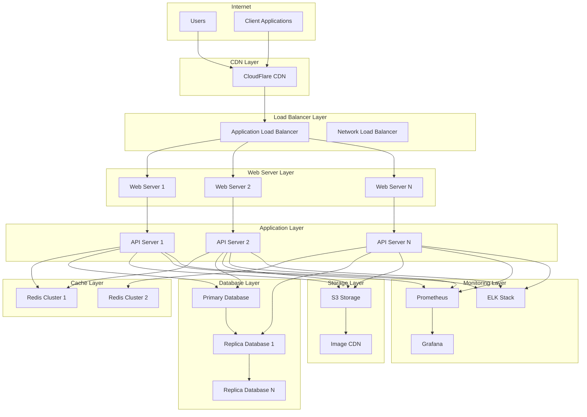

# WinKr API - Deployment Documentation

## Overview

This comprehensive deployment documentation covers all aspects of deploying the WinKr API, from development environments to production-scale deployments. It includes infrastructure requirements, configuration management, monitoring setup, and scaling strategies.

## Table of Contents

1. [Deployment Architecture](#deployment-architecture)
2. [Environment Requirements](#environment-requirements)
3. [Infrastructure Setup](#infrastructure-setup)
4. [Configuration Management](#configuration-management)
5. [Database Deployment](#database-deployment)
6. [Application Deployment](#application-deployment)
7. [Load Balancing](#load-balancing)
8. [Monitoring Setup](#monitoring-setup)
9. [Scaling Guidelines](#scaling-guidelines)
10. [Security Configuration](#security-configuration)
11. [Backup and Recovery](#backup-and-recovery)
12. [Deployment Automation](#deployment-automation)
13. [Troubleshooting Deployment](#troubleshooting-deployment)

## Deployment Architecture

### High-Level Architecture



### Environment Tiers

| Environment | Purpose | Instances | Database | Cache | Monitoring |
|-------------|---------|-----------|---------|--------|-----------|
| **Development** | Local development | 1 | SQLite | Local Redis | Basic logging |
| **Staging** | Pre-production testing | 2-3 | PostgreSQL | Redis Cluster | Full monitoring |
| **Production** | Live service | 5+ | PostgreSQL HA | Redis Cluster | Full monitoring + alerts |

## Environment Requirements

### System Requirements

#### Minimum Requirements (Development)
- **CPU**: 2 cores
- **Memory**: 4GB RAM
- **Storage**: 20GB SSD
- **Network**: 100 Mbps
- **OS**: Ubuntu 20.04+ / CentOS 8+ / Docker

#### Recommended Requirements (Staging)
- **CPU**: 4 cores
- **Memory**: 8GB RAM
- **Storage**: 50GB SSD
- **Network**: 1 Gbps
- **OS**: Ubuntu 20.04 LTS
- **Database**: PostgreSQL 13+
- **Cache**: Redis 6+

#### Production Requirements
- **CPU**: 8+ cores per instance
- **Memory**: 16GB+ RAM per instance
- **Storage**: 100GB+ SSD per instance
- **Network**: 10 Gbps
- **OS**: Ubuntu 20.04 LTS
- **Database**: PostgreSQL 13+ (HA setup)
- **Cache**: Redis 6+ (Cluster setup)

### Software Dependencies

```bash
# Core dependencies
Go 1.21+
PostgreSQL 13+
Redis 6+
Nginx 1.18+

# Development tools
Git
Docker 20.10+
Docker Compose 2.0+
Make

# Monitoring and logging
Prometheus
Grafana
ELK Stack (Elasticsearch, Logstash, Kibana)

# Security
Let's Encrypt (certbot)
Fail2ban
UFW (Uncomplicated Firewall)
```

### Environment Variables

```bash
# Application Configuration
APP_ENV=production
APP_PORT=8080
APP_HOST=0.0.0.0
APP_LOG_LEVEL=info

# Database Configuration
DB_HOST=localhost
DB_PORT=5432
DB_NAME=winkr_prod
DB_USER=winkr_user
DB_PASSWORD=secure_password
DB_SSL_MODE=require
DB_MAX_CONNECTIONS=100
DB_MAX_IDLE_CONNECTIONS=10
DB_CONNECTION_MAX_LIFETIME=3600

# Redis Configuration
REDIS_HOST=localhost
REDIS_PORT=6379
REDIS_PASSWORD=redis_password
REDIS_DB=0
REDIS_POOL_SIZE=50

# JWT Configuration
JWT_SECRET=your_jwt_secret_key_here
JWT_EXPIRY=24h
JWT_REFRESH_EXPIRY=168h

# File Storage Configuration
STORAGE_TYPE=s3
AWS_ACCESS_KEY_ID=your_aws_access_key
AWS_SECRET_ACCESS_KEY=your_aws_secret_key
AWS_REGION=us-west-2
AWS_S3_BUCKET=winkr-files
AWS_S3_CDN_DOMAIN=cdn.winkr.com

# Email Configuration
SMTP_HOST=smtp.gmail.com
SMTP_PORT=587
SMTP_USER=your_email@gmail.com
SMTP_PASSWORD=your_email_password
SMTP_FROM=noreply@winkr.com

# Payment Configuration
STRIPE_SECRET_KEY=sk_test_your_stripe_secret_key
STRIPE_WEBHOOK_SECRET=whsec_your_webhook_secret

# Security Configuration
CORS_ORIGINS=https://winkr.com,https://www.winkr.com
RATE_LIMIT_REQUESTS_PER_MINUTE=100
RATE_LIMIT_BURST=200

# Monitoring Configuration
PROMETHEUS_ENABLED=true
PROMETHEUS_PORT=9090
GRAFANA_ENABLED=true
GRAFANA_PORT=3000

# Feature Flags
FEATURE_EPHEMERAL_PHOTOS=true
FEATURE_AI_MATCHING=true
FEATURE_VIDEO_CALLS=false
```

## Infrastructure Setup

### Docker Deployment

```dockerfile
# Dockerfile
FROM golang:1.21-alpine AS builder

WORKDIR /app
COPY go.mod go.sum ./
RUN go mod download

COPY . .
RUN CGO_ENABLED=0 GOOS=linux go build -a -installsuffix cgo -o main cmd/api/main.go

FROM alpine:latest
RUN apk --no-cache add ca-certificates tzdata
WORKDIR /root/

COPY --from=builder /app/main .
COPY --from=builder /app/migrations ./migrations

EXPOSE 8080
CMD ["./main"]
```

```yaml
# docker-compose.yml
version: '3.8'

services:
  api:
    build: .
    ports:
      - "8080:8080"
    environment:
      - APP_ENV=production
      - DB_HOST=postgres
      - REDIS_HOST=redis
    depends_on:
      - postgres
      - redis
    volumes:
      - ./logs:/app/logs
    restart: unless-stopped

  postgres:
    image: postgres:13
    environment:
      POSTGRES_DB: winkr
      POSTGRES_USER: winkr_user
      POSTGRES_PASSWORD: winkr_password
    volumes:
      - postgres_data:/var/lib/postgresql/data
      - ./init.sql:/docker-entrypoint-initdb.d/init.sql
    ports:
      - "5432:5432"
    restart: unless-stopped

  redis:
    image: redis:6-alpine
    command: redis-server --requirepass redis_password
    ports:
      - "6379:6379"
    volumes:
      - redis_data:/data
    restart: unless-stopped

  nginx:
    image: nginx:alpine
    ports:
      - "80:80"
      - "443:443"
    volumes:
      - ./nginx.conf:/etc/nginx/nginx.conf
      - ./ssl:/etc/nginx/ssl
    depends_on:
      - api
    restart: unless-stopped

  prometheus:
    image: prom/prometheus
    ports:
      - "9090:9090"
    volumes:
      - ./prometheus.yml:/etc/prometheus/prometheus.yml
      - prometheus_data:/prometheus
    restart: unless-stopped

  grafana:
    image: grafana/grafana
    ports:
      - "3000:3000"
    environment:
      - GF_SECURITY_ADMIN_PASSWORD=admin
    volumes:
      - grafana_data:/var/lib/grafana
    restart: unless-stopped

volumes:
  postgres_data:
  redis_data:
  prometheus_data:
  grafana_data:
```

### Kubernetes Deployment

```yaml
# k8s/namespace.yaml
apiVersion: v1
kind: Namespace
metadata:
  name: winkr-api

---
# k8s/configmap.yaml
apiVersion: v1
kind: ConfigMap
metadata:
  name: winkr-config
  namespace: winkr-api
data:
  APP_ENV: "production"
  APP_PORT: "8080"
  DB_HOST: "postgres-service"
  DB_PORT: "5432"
  DB_NAME: "winkr"
  REDIS_HOST: "redis-service"
  REDIS_PORT: "6379"

---
# k8s/secret.yaml
apiVersion: v1
kind: Secret
metadata:
  name: winkr-secrets
  namespace: winkr-api
type: Opaque
data:
  DB_PASSWORD: d2lua3JfcGFzc3dvcmQ=  # base64 encoded
  REDIS_PASSWORD: cmVkaXNfcGFzc3dvcmQ=
  JWT_SECRET: eW91cl9qd3Rfc2VjcmV0X2tleQ==

---
# k8s/deployment.yaml
apiVersion: apps/v1
kind: Deployment
metadata:
  name: winkr-api
  namespace: winkr-api
spec:
  replicas: 3
  selector:
    matchLabels:
      app: winkr-api
  template:
    metadata:
      labels:
        app: winkr-api
    spec:
      containers:
      - name: winkr-api
        image: winkr/api:latest
        ports:
        - containerPort: 8080
        envFrom:
        - configMapRef:
            name: winkr-config
        - secretRef:
            name: winkr-secrets
        resources:
          requests:
            memory: "256Mi"
            cpu: "250m"
          limits:
            memory: "512Mi"
            cpu: "500m"
        livenessProbe:
          httpGet:
            path: /health
            port: 8080
          initialDelaySeconds: 30
          periodSeconds: 10
        readinessProbe:
          httpGet:
            path: /ready
            port: 8080
          initialDelaySeconds: 5
          periodSeconds: 5

---
# k8s/service.yaml
apiVersion: v1
kind: Service
metadata:
  name: winkr-api-service
  namespace: winkr-api
spec:
  selector:
    app: winkr-api
  ports:
  - protocol: TCP
    port: 80
    targetPort: 8080
  type: ClusterIP

---
# k8s/ingress.yaml
apiVersion: networking.k8s.io/v1
kind: Ingress
metadata:
  name: winkr-api-ingress
  namespace: winkr-api
  annotations:
    kubernetes.io/ingress.class: nginx
    cert-manager.io/cluster-issuer: letsencrypt-prod
    nginx.ingress.kubernetes.io/rate-limit: "100"
spec:
  tls:
  - hosts:
    - api.winkr.com
    secretName: winkr-api-tls
  rules:
  - host: api.winkr.com
    http:
      paths:
      - path: /
        pathType: Prefix
        backend:
          service:
            name: winkr-api-service
            port:
              number: 80

---
# k8s/hpa.yaml
apiVersion: autoscaling/v2
kind: HorizontalPodAutoscaler
metadata:
  name: winkr-api-hpa
  namespace: winkr-api
spec:
  scaleTargetRef:
    apiVersion: apps/v1
    kind: Deployment
    name: winkr-api
  minReplicas: 3
  maxReplicas: 10
  metrics:
  - type: Resource
    resource:
      name: cpu
      target:
        type: Utilization
        averageUtilization: 70
  - type: Resource
    resource:
      name: memory
      target:
        type: Utilization
        averageUtilization: 80
```

## Configuration Management

### Environment Configuration

```javascript
// Configuration management system
class ConfigurationManager {
  constructor() {
    this.config = {
      development: this.loadDevelopmentConfig(),
      staging: this.loadStagingConfig(),
      production: this.loadProductionConfig()
    };
    
    this.currentEnv = process.env.APP_ENV || 'development';
    this.currentConfig = this.config[this.currentEnv];
  }

  loadDevelopmentConfig() {
    return {
      app: {
        name: 'WinKr API',
        version: '1.0.0',
        env: 'development',
        port: 8080,
        host: 'localhost',
        logLevel: 'debug'
      },
      database: {
        host: 'localhost',
        port: 5432,
        name: 'winkr_dev',
        user: 'winkr_dev',
        password: 'dev_password',
        sslMode: 'disable',
        maxConnections: 10,
        maxIdleConnections: 5,
        connectionMaxLifetime: 300
      },
      redis: {
        host: 'localhost',
        port: 6379,
        password: '',
        db: 0,
        poolSize: 10
      },
      jwt: {
        secret: 'dev_jwt_secret_key',
        expiry: '24h',
        refreshExpiry: '168h'
      },
      storage: {
        type: 'local',
        localPath: './uploads'
      },
      features: {
        ephemeralPhotos: true,
        aiMatching: true,
        videoCalls: true
      }
    };
  }

  loadStagingConfig() {
    return {
      app: {
        name: 'WinKr API',
        version: '1.0.0',
        env: 'staging',
        port: 8080,
        host: '0.0.0.0',
        logLevel: 'info'
      },
      database: {
        host: process.env.DB_HOST || 'staging-db.winkr.com',
        port: parseInt(process.env.DB_PORT) || 5432,
        name: process.env.DB_NAME || 'winkr_staging',
        user: process.env.DB_USER || 'winkr_staging',
        password: process.env.DB_PASSWORD || 'staging_password',
        sslMode: 'require',
        maxConnections: 50,
        maxIdleConnections: 10,
        connectionMaxLifetime: 1800
      },
      redis: {
        host: process.env.REDIS_HOST || 'staging-redis.winkr.com',
        port: parseInt(process.env.REDIS_PORT) || 6379,
        password: process.env.REDIS_PASSWORD || 'staging_redis_password',
        db: 0,
        poolSize: 25
      },
      jwt: {
        secret: process.env.JWT_SECRET || 'staging_jwt_secret_key',
        expiry: '24h',
        refreshExpiry: '168h'
      },
      storage: {
        type: 's3',
        aws: {
          accessKeyId: process.env.AWS_ACCESS_KEY_ID,
          secretAccessKey: process.env.AWS_SECRET_ACCESS_KEY,
          region: process.env.AWS_REGION || 'us-west-2',
          bucket: process.env.AWS_S3_BUCKET || 'winkr-staging-files'
        }
      },
      features: {
        ephemeralPhotos: true,
        aiMatching: true,
        videoCalls: false
      }
    };
  }

  loadProductionConfig() {
    return {
      app: {
        name: 'WinKr API',
        version: '1.0.0',
        env: 'production',
        port: parseInt(process.env.APP_PORT) || 8080,
        host: process.env.APP_HOST || '0.0.0.0',
        logLevel: process.env.APP_LOG_LEVEL || 'info'
      },
      database: {
        host: process.env.DB_HOST,
        port: parseInt(process.env.DB_PORT) || 5432,
        name: process.env.DB_NAME,
        user: process.env.DB_USER,
        password: process.env.DB_PASSWORD,
        sslMode: process.env.DB_SSL_MODE || 'require',
        maxConnections: parseInt(process.env.DB_MAX_CONNECTIONS) || 100,
        maxIdleConnections: parseInt(process.env.DB_MAX_IDLE_CONNECTIONS) || 20,
        connectionMaxLifetime: parseInt(process.env.DB_CONNECTION_MAX_LIFETIME) || 3600
      },
      redis: {
        host: process.env.REDIS_HOST,
        port: parseInt(process.env.REDIS_PORT) || 6379,
        password: process.env.REDIS_PASSWORD,
        db: parseInt(process.env.REDIS_DB) || 0,
        poolSize: parseInt(process.env.REDIS_POOL_SIZE) || 50
      },
      jwt: {
        secret: process.env.JWT_SECRET,
        expiry: process.env.JWT_EXPIRY || '24h',
        refreshExpiry: process.env.JWT_REFRESH_EXPIRY || '168h'
      },
      storage: {
        type: process.env.STORAGE_TYPE || 's3',
        aws: {
          accessKeyId: process.env.AWS_ACCESS_KEY_ID,
          secretAccessKey: process.env.AWS_SECRET_ACCESS_KEY,
          region: process.env.AWS_REGION || 'us-west-2',
          bucket: process.env.AWS_S3_BUCKET,
          cdnDomain: process.env.AWS_S3_CDN_DOMAIN
        }
      },
      email: {
        smtp: {
          host: process.env.SMTP_HOST,
          port: parseInt(process.env.SMTP_PORT) || 587,
          user: process.env.SMTP_USER,
          password: process.env.SMTP_PASSWORD,
          from: process.env.SMTP_FROM
        }
      },
      payment: {
        stripe: {
          secretKey: process.env.STRIPE_SECRET_KEY,
          webhookSecret: process.env.STRIPE_WEBHOOK_SECRET
        }
      },
      security: {
        corsOrigins: process.env.CORS_ORIGINS ? process.env.CORS_ORIGINS.split(',') : [],
        rateLimit: {
          requestsPerMinute: parseInt(process.env.RATE_LIMIT_REQUESTS_PER_MINUTE) || 100,
          burst: parseInt(process.env.RATE_LIMIT_BURST) || 200
        }
      },
      monitoring: {
        prometheus: {
          enabled: process.env.PROMETHEUS_ENABLED === 'true',
          port: parseInt(process.env.PROMETHEUS_PORT) || 9090
        },
        grafana: {
          enabled: process.env.GRAFANA_ENABLED === 'true',
          port: parseInt(process.env.GRAFANA_PORT) || 3000
        }
      },
      features: {
        ephemeralPhotos: process.env.FEATURE_EPHEMERAL_PHOTOS === 'true',
        aiMatching: process.env.FEATURE_AI_MATCHING === 'true',
        videoCalls: process.env.FEATURE_VIDEO_CALLS === 'true'
      }
    };
  }

  get(key) {
    const keys = key.split('.');
    let value = this.currentConfig;
    
    for (const k of keys) {
      if (value && typeof value === 'object' && k in value) {
        value = value[k];
      } else {
        return undefined;
      }
    }
    
    return value;
  }

  set(key, value) {
    const keys = key.split('.');
    let current = this.currentConfig;
    
    for (let i = 0; i < keys.length - 1; i++) {
      const k = keys[i];
      if (!current[k] || typeof current[k] !== 'object') {
        current[k] = {};
      }
      current = current[k];
    }
    
    current[keys[keys.length - 1]] = value;
  }

  validate() {
    const errors = [];
    
    // Validate required fields
    const requiredFields = [
      'database.host',
      'database.name',
      'database.user',
      'database.password',
      'jwt.secret'
    ];
    
    for (const field of requiredFields) {
      if (!this.get(field)) {
        errors.push(`Missing required configuration: ${field}`);
      }
    }
    
    // Validate numeric fields
    const numericFields = [
      'app.port',
      'database.port',
      'database.maxConnections'
    ];
    
    for (const field of numericFields) {
      const value = this.get(field);
      if (value && (isNaN(value) || value <= 0)) {
        errors.push(`Invalid numeric value for ${field}: ${value}`);
      }
    }
    
    return {
      valid: errors.length === 0,
      errors: errors
    };
  }

  export() {
    return {
      environment: this.currentEnv,
      config: this.currentConfig,
      validation: this.validate()
    };
  }
}
```

### Configuration Validation

```javascript
// Configuration validation system
class ConfigValidator {
  constructor() {
    this.schemas = {
      app: {
        port: { type: 'number', min: 1, max: 65535, required: true },
        logLevel: { type: 'string', enum: ['debug', 'info', 'warn', 'error'], required: true }
      },
      database: {
        host: { type: 'string', required: true },
        port: { type: 'number', min: 1, max: 65535, required: true },
        name: { type: 'string', required: true },
        user: { type: 'string', required: true },
        password: { type: 'string', required: true },
        maxConnections: { type: 'number', min: 1, max: 1000, required: true }
      },
      redis: {
        host: { type: 'string', required: true },
        port: { type: 'number', min: 1, max: 65535, required: true },
        poolSize: { type: 'number', min: 1, max: 1000, required: true }
      },
      jwt: {
        secret: { type: 'string', minLength: 32, required: true },
        expiry: { type: 'string', pattern: /^\d+[smhd]$/, required: true }
      }
    };
  }

  validate(config) {
    const errors = [];
    const warnings = [];

    for (const [section, schema] of Object.entries(this.schemas)) {
      if (!config[section]) {
        errors.push(`Missing configuration section: ${section}`);
        continue;
      }

      const sectionErrors = this.validateSection(config[section], schema, section);
      errors.push(...sectionErrors);
    }

    // Additional validation checks
    const additionalChecks = this.performAdditionalValidation(config);
    errors.push(...additionalChecks.errors);
    warnings.push(...additionalChecks.warnings);

    return {
      valid: errors.length === 0,
      errors: errors,
      warnings: warnings
    };
  }

  validateSection(section, schema, sectionName) {
    const errors = [];

    for (const [field, rules] of Object.entries(schema)) {
      const value = section[field];
      const fieldPath = `${sectionName}.${field}`;

      if (rules.required && (value === undefined || value === null || value === '')) {
        errors.push(`Required field missing: ${fieldPath}`);
        continue;
      }

      if (value !== undefined && value !== null && value !== '') {
        const fieldErrors = this.validateField(value, rules, fieldPath);
        errors.push(...fieldErrors);
      }
    }

    return errors;
  }

  validateField(value, rules, fieldPath) {
    const errors = [];

    // Type validation
    if (rules.type && typeof value !== rules.type) {
      errors.push(`${fieldPath} must be of type ${rules.type}`);
    }

    // String validation
    if (typeof value === 'string') {
      if (rules.minLength && value.length < rules.minLength) {
        errors.push(`${fieldPath} must be at least ${rules.minLength} characters long`);
      }

      if (rules.maxLength && value.length > rules.maxLength) {
        errors.push(`${fieldPath} must be at most ${rules.maxLength} characters long`);
      }

      if (rules.pattern && !rules.pattern.test(value)) {
        errors.push(`${fieldPath} does not match required pattern`);
      }

      if (rules.enum && !rules.enum.includes(value)) {
        errors.push(`${fieldPath} must be one of: ${rules.enum.join(', ')}`);
      }
    }

    // Number validation
    if (typeof value === 'number') {
      if (rules.min !== undefined && value < rules.min) {
        errors.push(`${fieldPath} must be at least ${rules.min}`);
      }

      if (rules.max !== undefined && value > rules.max) {
        errors.push(`${fieldPath} must be at most ${rules.max}`);
      }
    }

    return errors;
  }

  performAdditionalValidation(config) {
    const errors = [];
    const warnings = [];

    // Check database connection limits
    if (config.database && config.database.maxConnections) {
      if (config.database.maxConnections < 10) {
        warnings.push('Database max_connections is very low, may cause connection issues');
      }

      if (config.database.maxConnections > 500) {
        warnings.push('Database max_connections is very high, may impact database performance');
      }
    }

    // Check JWT secret strength
    if (config.jwt && config.jwt.secret) {
      if (config.jwt.secret.length < 64) {
        warnings.push('JWT secret should be at least 64 characters for better security');
      }

      if (config.jwt.secret === 'dev_jwt_secret_key' || config.jwt.secret === 'staging_jwt_secret_key') {
        errors.push('JWT secret appears to be a default value, which is insecure for production');
      }
    }

    // Check Redis configuration
    if (config.redis && config.database) {
      if (config.redis.poolSize > config.database.maxConnections) {
        warnings.push('Redis pool size is larger than database max connections, may be inefficient');
      }
    }

    // Check storage configuration
    if (config.storage && config.storage.type === 's3') {
      if (!config.storage.aws || !config.storage.aws.accessKeyId || !config.storage.aws.secretAccessKey) {
        errors.push('S3 storage configuration is incomplete');
      }
    }

    return { errors, warnings };
  }
}
```

## Database Deployment

### PostgreSQL Setup

```bash
#!/bin/bash
# scripts/setup-postgres.sh

set -e

# Variables
DB_NAME=${DB_NAME:-"winkr"}
DB_USER=${DB_USER:-"winkr_user"}
DB_PASSWORD=${DB_PASSWORD:-"secure_password"}
DB_VERSION=${DB_VERSION:-"13"}

echo "Setting up PostgreSQL ${DB_VERSION}..."

# Install PostgreSQL
sudo apt-get update
sudo apt-get install -y postgresql-${DB_VERSION} postgresql-client-${DB_VERSION}

# Start PostgreSQL service
sudo systemctl start postgresql
sudo systemctl enable postgresql

# Create database and user
sudo -u postgres psql -c "CREATE DATABASE ${DB_NAME};"
sudo -u postgres psql -c "CREATE USER ${DB_USER} WITH PASSWORD '${DB_PASSWORD}';"
sudo -u postgres psql -c "GRANT ALL PRIVILEGES ON DATABASE ${DB_NAME} TO ${DB_USER};"

# Configure PostgreSQL
sudo tee /etc/postgresql/${DB_VERSION}/main/postgresql.conf > /dev/null <<EOF
# Connection settings
listen_addresses = '*'
port = 5432
max_connections = 200

# Memory settings
shared_buffers = 256MB
effective_cache_size = 1GB
work_mem = 4MB
maintenance_work_mem = 64MB

# WAL settings
wal_level = replica
max_wal_size = 1GB
min_wal_size = 80MB

# Checkpoint settings
checkpoint_completion_target = 0.9
checkpoint_timeout = 10min

# Logging settings
log_destination = 'stderr'
logging_collector = on
log_directory = 'log'
log_filename = 'postgresql-%Y-%m-%d_%H%M%S.log'
log_statement = 'all'
log_min_duration_statement = 1000

# Performance settings
random_page_cost = 1.1
effective_io_concurrency = 200
EOF

sudo tee /etc/postgresql/${DB_VERSION}/main/pg_hba.conf > /dev/null <<EOF
# TYPE  DATABASE        USER            ADDRESS                 METHOD

# IPv4 local connections:
host    all             all             127.0.0.1/32            md5
host    all             all             10.0.0.0/8               md5
host    all             all             172.16.0.0/12             md5
host    all             all             192.168.0.0/16            md5

# IPv6 local connections:
host    all             all             ::1/128                   md5

# Allow replication connections from localhost
host    replication     replicator      127.0.0.1/32            md5
EOF

# Restart PostgreSQL
sudo systemctl restart postgresql

echo "PostgreSQL setup completed!"
echo "Database: ${DB_NAME}"
echo "User: ${DB_USER}"
echo "Port: 5432"
```

### Database Migration

```go
// cmd/migrate/main.go
package main

import (
	"database/sql"
	"fmt"
	"log"
	"os"

	_ "github.com/lib/pq"
	"github.com/golang-migrate/migrate/v4"
	"github.com/golang-migrate/migrate/v4/database/postgres"
	_ "github.com/golang-migrate/migrate/v4/source/file"
)

func main() {
	if len(os.Args) < 2 {
		log.Fatal("Usage: migrate [up|down|version|force <version>]")
	}

	command := os.Args[1]

	dbURL := os.Getenv("DATABASE_URL")
	if dbURL == "" {
		dbURL = fmt.Sprintf("postgres://%s:%s@%s:%d/%s?sslmode=%s",
			os.Getenv("DB_USER"),
			os.Getenv("DB_PASSWORD"),
			os.Getenv("DB_HOST"),
			getEnvInt("DB_PORT", 5432),
			os.Getenv("DB_NAME"),
			getEnvString("DB_SSL_MODE", "disable"),
		)
	}

	db, err := sql.Open("postgres", dbURL)
	if err != nil {
		log.Fatal("Failed to connect to database:", err)
	}
	defer db.Close()

	driver, err := postgres.WithInstance(db, &postgres.Config{})
	if err != nil {
		log.Fatal("Failed to create database driver:", err)
	}

	m, err := migrate.NewWithDatabaseInstance(
		"file://migrations",
		"postgres", 
		driver,
	)
	if err != nil {
		log.Fatal("Failed to create migration instance:", err)
	}

	switch command {
	case "up":
		if err := m.Up(); err != nil && err != migrate.ErrNoChange {
			log.Fatal("Migration up failed:", err)
		}
		fmt.Println("Migrations applied successfully")

	case "down":
		if err := m.Down(); err != nil && err != migrate.ErrNoChange {
			log.Fatal("Migration down failed:", err)
		}
		fmt.Println("Migrations rolled back successfully")

	case "version":
		version, dirty, err := m.Version()
		if err != nil {
			log.Fatal("Failed to get migration version:", err)
		}
		fmt.Printf("Current version: %d, dirty: %v\n", version, dirty)

	case "force":
		if len(os.Args) < 3 {
			log.Fatal("Usage: migrate force <version>")
		}
		version := parseInt(os.Args[2])
		if err := m.Force(version); err != nil {
			log.Fatal("Failed to force migration version:", err)
		}
		fmt.Printf("Forced migration version to: %d\n", version)

	default:
		log.Fatal("Unknown command:", command)
	}
}

func getEnvInt(key string, defaultValue int) int {
	if value := os.Getenv(key); value != "" {
		if intValue, err := strconv.Atoi(value); err == nil {
			return intValue
		}
	}
	return defaultValue
}

func getEnvString(key, defaultValue string) string {
	if value := os.Getenv(key); value != "" {
		return value
	}
	return defaultValue
}

func parseInt(s string) int {
	var result int
	fmt.Sscanf(s, "%d", &result)
	return result
}
```

### Database Backup and Recovery

```bash
#!/bin/bash
# scripts/backup-database.sh

set -e

# Configuration
DB_HOST=${DB_HOST:-"localhost"}
DB_PORT=${DB_PORT:-5432}
DB_NAME=${DB_NAME:-"winkr"}
DB_USER=${DB_USER:-"winkr_user"}
DB_PASSWORD=${DB_PASSWORD:-"secure_password"}
BACKUP_DIR=${BACKUP_DIR:-"/backups"}
RETENTION_DAYS=${RETENTION_DAYS:-7}

# Create backup directory
mkdir -p ${BACKUP_DIR}

# Generate backup filename with timestamp
TIMESTAMP=$(date +"%Y%m%d_%H%M%S")
BACKUP_FILE="${BACKUP_DIR}/${DB_NAME}_backup_${TIMESTAMP}.sql"

echo "Starting database backup..."
echo "Database: ${DB_NAME}"
echo "Backup file: ${BACKUP_FILE}"

# Create backup
PGPASSWORD=${DB_PASSWORD} pg_dump \
  --host=${DB_HOST} \
  --port=${DB_PORT} \
  --username=${DB_USER} \
  --dbname=${DB_NAME} \
  --verbose \
  --clean \
  --if-exists \
  --create \
  --format=custom \
  --compress=9 \
  --file=${BACKUP_FILE}

# Compress backup
gzip ${BACKUP_FILE}
BACKUP_FILE="${BACKUP_FILE}.gz"

echo "Backup completed: ${BACKUP_FILE}"

# Clean up old backups
echo "Cleaning up backups older than ${RETENTION_DAYS} days..."
find ${BACKUP_DIR} -name "${DB_NAME}_backup_*.sql.gz" -mtime +${RETENTION_DAYS} -delete

# Verify backup
echo "Verifying backup..."
if gzip -t ${BACKUP_FILE}; then
    echo "Backup verification successful"
else
    echo "Backup verification failed!"
    exit 1
fi

echo "Backup process completed successfully!"
```

```bash
#!/bin/bash
# scripts/restore-database.sh

set -e

# Check arguments
if [ $# -eq 0 ]; then
    echo "Usage: $0 <backup_file>"
    echo "Example: $0 /backups/winkr_backup_20251201_120000.sql.gz"
    exit 1
fi

BACKUP_FILE=$1

# Configuration
DB_HOST=${DB_HOST:-"localhost"}
DB_PORT=${DB_PORT:-5432}
DB_NAME=${DB_NAME:-"winkr"}
DB_USER=${DB_USER:-"winkr_user"}
DB_PASSWORD=${DB_PASSWORD:-"secure_password"}

# Check if backup file exists
if [ ! -f "${BACKUP_FILE}" ]; then
    echo "Error: Backup file not found: ${BACKUP_FILE}"
    exit 1
fi

echo "Starting database restore..."
echo "Backup file: ${BACKUP_FILE}"
echo "Database: ${DB_NAME}"

# Confirm restore operation
read -p "This will replace the existing database. Are you sure? (y/N): " -n 1 -r
echo
if [[ ! $REPLY =~ ^[Yy]$ ]]; then
    echo "Restore cancelled."
    exit 1
fi

# Drop existing database
echo "Dropping existing database..."
PGPASSWORD=${DB_PASSWORD} dropdb \
  --host=${DB_HOST} \
  --port=${DB_PORT} \
  --username=${DB_USER} \
  --if-exists \
  ${DB_NAME}

# Create new database
echo "Creating new database..."
PGPASSWORD=${DB_PASSWORD} createdb \
  --host=${DB_HOST} \
  --port=${DB_PORT} \
  --username=${DB_USER} \
  ${DB_NAME}

# Restore backup
echo "Restoring database..."
if [[ ${BACKUP_FILE} == *.gz ]]; then
    gunzip -c ${BACKUP_FILE} | PGPASSWORD=${DB_PASSWORD} psql \
      --host=${DB_HOST} \
      --port=${DB_PORT} \
      --username=${DB_USER} \
      --dbname=${DB_NAME}
else
    PGPASSWORD=${DB_PASSWORD} psql \
      --host=${DB_HOST} \
      --port=${DB_PORT} \
      --username=${DB_USER} \
      --dbname=${DB_NAME} \
      --file=${BACKUP_FILE}
fi

echo "Database restore completed successfully!"
```

## Application Deployment

### Deployment Script

```bash
#!/bin/bash
# scripts/deploy.sh

set -e

# Configuration
ENVIRONMENT=${ENVIRONMENT:-"staging"}
APP_NAME="winkr-api"
DEPLOY_USER=${DEPLOY_USER:-"deploy"}
DEPLOY_PATH="/opt/${APP_NAME}"
BACKUP_PATH="/opt/backups/${APP_NAME}"
HEALTH_CHECK_URL="http://localhost:8080/health"
MAX_RETRIES=30
RETRY_DELAY=5

echo "Starting deployment of ${APP_NAME} to ${ENVIRONMENT} environment..."

# Create backup of current version
if [ -d "${DEPLOY_PATH}" ]; then
    echo "Creating backup of current version..."
    sudo mkdir -p ${BACKUP_PATH}
    sudo cp -r ${DEPLOY_PATH} ${BACKUP_PATH}/$(date +%Y%m%d_%H%M%S)
fi

# Create deployment directory
sudo mkdir -p ${DEPLOY_PATH}
sudo chown ${DEPLOY_USER}:${DEPLOY_USER} ${DEPLOY_PATH}

# Download latest version
echo "Downloading latest version..."
cd /tmp
wget -O ${APP_NAME}.tar.gz https://releases.winkr.com/${APP_NAME}/latest.tar.gz

# Extract application
echo "Extracting application..."
tar -xzf ${APP_NAME}.tar.gz
cd ${APP_NAME}

# Install dependencies
echo "Installing dependencies..."
go mod download
go build -o ${APP_NAME} cmd/api/main.go

# Copy files to deployment directory
echo "Copying files to deployment directory..."
sudo cp ${APP_NAME} ${DEPLOY_PATH}/
sudo cp -r migrations ${DEPLOY_PATH}/
sudo cp -r config ${DEPLOY_PATH}/
sudo cp scripts/*.sh ${DEPLOY_PATH}/

# Set permissions
sudo chown -R ${DEPLOY_USER}:${DEPLOY_USER} ${DEPLOY_PATH}
sudo chmod +x ${DEPLOY_PATH}/${APP_NAME}

# Run database migrations
echo "Running database migrations..."
cd ${DEPLOY_PATH}
sudo -u ${DEPLOY_USER} ./${APP_NAME} migrate up

# Restart application
echo "Restarting application..."
sudo systemctl restart ${APP_NAME}

# Health check
echo "Performing health check..."
for i in $(seq 1 ${MAX_RETRIES}); do
    if curl -f ${HEALTH_CHECK_URL} > /dev/null 2>&1; then
        echo "Health check passed!"
        break
    else
        echo "Health check failed, retrying in ${RETRY_DELAY} seconds... (${i}/${MAX_RETRIES})"
        sleep ${RETRY_DELAY}
    fi
    
    if [ $i -eq ${MAX_RETRIES} ]; then
        echo "Health check failed after ${MAX_RETRIES} attempts!"
        echo "Rolling back deployment..."
        
        # Rollback logic here
        exit 1
    fi
done

# Cleanup
echo "Cleaning up..."
rm -rf /tmp/${APP_NAME}
rm -f /tmp/${APP_NAME}.tar.gz

echo "Deployment completed successfully!"
echo "Application is running at: http://localhost:8080"
```

### Systemd Service

```ini
# /etc/systemd/system/winkr-api.service
[Unit]
Description=WinKr API Service
After=network.target postgresql.service redis.service
Wants=postgresql.service redis.service

[Service]
Type=simple
User=winkr
Group=winkr
WorkingDirectory=/opt/winkr-api
ExecStart=/opt/winkr-api/winkr-api
ExecReload=/bin/kill -HUP $MAINPID
Restart=always
RestartSec=10
Environment=APP_ENV=production
EnvironmentFile=/opt/winkr-api/.env

# Security settings
NoNewPrivileges=true
PrivateTmp=true
ProtectSystem=strict
ProtectHome=true
ReadWritePaths=/opt/winkr-api/logs /opt/winkr-api/uploads

# Resource limits
LimitNOFILE=65536
LimitNPROC=4096

[Install]
WantedBy=multi-user.target
```

### Nginx Configuration

```nginx
# /etc/nginx/sites-available/winkr-api
upstream winkr_api {
    least_conn;
    server 127.0.0.1:8080 max_fails=3 fail_timeout=30s;
    server 127.0.0.1:8081 max_fails=3 fail_timeout=30s;
    server 127.0.0.1:8082 max_fails=3 fail_timeout=30s;
}

# Rate limiting
limit_req_zone $binary_remote_addr zone=api_limit:10m rate=10r/s;
limit_req_zone $binary_remote_addr zone=auth_limit:10m rate=5r/s;

server {
    listen 80;
    server_name api.winkr.com;
    return 301 https://$server_name$request_uri;
}

server {
    listen 443 ssl http2;
    server_name api.winkr.com;

    # SSL configuration
    ssl_certificate /etc/ssl/certs/winkr-api.crt;
    ssl_certificate_key /etc/ssl/private/winkr-api.key;
    ssl_protocols TLSv1.2 TLSv1.3;
    ssl_ciphers ECDHE-RSA-AES256-GCM-SHA512:DHE-RSA-AES256-GCM-SHA512:ECDHE-RSA-AES256-GCM-SHA384:DHE-RSA-AES256-GCM-SHA384;
    ssl_prefer_server_ciphers off;
    ssl_session_cache shared:SSL:10m;
    ssl_session_timeout 10m;

    # Security headers
    add_header X-Frame-Options DENY;
    add_header X-Content-Type-Options nosniff;
    add_header X-XSS-Protection "1; mode=block";
    add_header Strict-Transport-Security "max-age=31536000; includeSubDomains" always;

    # Logging
    access_log /var/log/nginx/winkr-api.access.log;
    error_log /var/log/nginx/winkr-api.error.log;

    # Client configuration
    client_max_body_size 10M;
    client_body_timeout 60s;
    client_header_timeout 60s;

    # API routes
    location /api/v1/auth/ {
        limit_req zone=auth_limit burst=20 nodelay;
        proxy_pass http://winkr_api;
        proxy_set_header Host $host;
        proxy_set_header X-Real-IP $remote_addr;
        proxy_set_header X-Forwarded-For $proxy_add_x_forwarded_for;
        proxy_set_header X-Forwarded-Proto $scheme;
        proxy_connect_timeout 30s;
        proxy_send_timeout 30s;
        proxy_read_timeout 30s;
    }

    location /api/v1/ {
        limit_req zone=api_limit burst=50 nodelay;
        proxy_pass http://winkr_api;
        proxy_set_header Host $host;
        proxy_set_header X-Real-IP $remote_addr;
        proxy_set_header X-Forwarded-For $proxy_add_x_forwarded_for;
        proxy_set_header X-Forwarded-Proto $scheme;
        proxy_connect_timeout 30s;
        proxy_send_timeout 30s;
        proxy_read_timeout 30s;
    }

    # Health check endpoint
    location /health {
        proxy_pass http://winkr_api;
        access_log off;
    }

    # Static files
    location /static/ {
        alias /opt/winkr-api/static/;
        expires 1y;
        add_header Cache-Control "public, immutable";
    }

    # File uploads
    location /uploads/ {
        alias /opt/winkr-api/uploads/;
        expires 1M;
        add_header Cache-Control "public";
    }
}
```

## Monitoring Setup

### Prometheus Configuration

```yaml
# prometheus.yml
global:
  scrape_interval: 15s
  evaluation_interval: 15s

rule_files:
  - "alert_rules.yml"

alerting:
  alertmanagers:
    - static_configs:
        - targets:
          - alertmanager:9093

scrape_configs:
  - job_name: 'winkr-api'
    static_configs:
      - targets: ['localhost:8080']
    metrics_path: '/metrics'
    scrape_interval: 10s

  - job_name: 'postgres'
    static_configs:
      - targets: ['postgres-exporter:9187']

  - job_name: 'redis'
    static_configs:
      - targets: ['redis-exporter:9121']

  - job_name: 'nginx'
    static_configs:
      - targets: ['nginx-exporter:9113']

  - job_name: 'node'
    static_configs:
      - targets: ['node-exporter:9100']
```

### Grafana Dashboard

```json
{
  "dashboard": {
    "id": null,
    "title": "WinKr API Dashboard",
    "tags": ["winkr", "api"],
    "timezone": "browser",
    "panels": [
      {
        "id": 1,
        "title": "Request Rate",
        "type": "graph",
        "targets": [
          {
            "expr": "rate(http_requests_total[5m])",
            "legendFormat": "{{method}} {{endpoint}}"
          }
        ],
        "yAxes": [
          {
            "label": "Requests/sec"
          }
        ]
      },
      {
        "id": 2,
        "title": "Response Time",
        "type": "graph",
        "targets": [
          {
            "expr": "histogram_quantile(0.95, rate(http_request_duration_seconds_bucket[5m]))",
            "legendFormat": "95th percentile"
          },
          {
            "expr": "histogram_quantile(0.50, rate(http_request_duration_seconds_bucket[5m]))",
            "legendFormat": "50th percentile"
          }
        ],
        "yAxes": [
          {
            "label": "Seconds"
          }
        ]
      },
      {
        "id": 3,
        "title": "Error Rate",
        "type": "graph",
        "targets": [
          {
            "expr": "rate(http_requests_total{status=~\"5..\"}[5m]) / rate(http_requests_total[5m])",
            "legendFormat": "Error Rate"
          }
        ],
        "yAxes": [
          {
            "label": "Percentage",
            "max": 1,
            "min": 0
          }
        ]
      },
      {
        "id": 4,
        "title": "Database Connections",
        "type": "graph",
        "targets": [
          {
            "expr": "pg_stat_database_numbackends",
            "legendFormat": "Active Connections"
          }
        ],
        "yAxes": [
          {
            "label": "Connections"
          }
        ]
      },
      {
        "id": 5,
        "title": "Memory Usage",
        "type": "graph",
        "targets": [
          {
            "expr": "process_resident_memory_bytes",
            "legendFormat": "RSS Memory"
          }
        ],
        "yAxes": [
          {
            "label": "Bytes"
          }
        ]
      }
    ],
    "time": {
      "from": "now-1h",
      "to": "now"
    },
    "refresh": "30s"
  }
}
```

## Scaling Guidelines

### Horizontal Scaling

```yaml
# k8s/hpa.yaml
apiVersion: autoscaling/v2
kind: HorizontalPodAutoscaler
metadata:
  name: winkr-api-hpa
  namespace: winkr-api
spec:
  scaleTargetRef:
    apiVersion: apps/v1
    kind: Deployment
    name: winkr-api
  minReplicas: 3
  maxReplicas: 20
  metrics:
  - type: Resource
    resource:
      name: cpu
      target:
        type: Utilization
        averageUtilization: 70
  - type: Resource
    resource:
      name: memory
      target:
        type: Utilization
        averageUtilization: 80
  behavior:
    scaleDown:
      stabilizationWindowSeconds: 300
      policies:
      - type: Percent
        value: 10
        periodSeconds: 60
    scaleUp:
      stabilizationWindowSeconds: 60
      policies:
      - type: Percent
        value: 50
        periodSeconds: 60
```

### Vertical Scaling

```yaml
# k8s/vpa.yaml
apiVersion: autoscaling.k8s.io/v1
kind: VerticalPodAutoscaler
metadata:
  name: winkr-api-vpa
  namespace: winkr-api
spec:
  targetRef:
    apiVersion: apps/v1
    kind: Deployment
    name: winkr-api
  updatePolicy:
    updateMode: "Auto"
  resourcePolicy:
    containerPolicies:
    - containerName: winkr-api
      maxAllowed:
        cpu: 2
        memory: 4Gi
      minAllowed:
        cpu: 100m
        memory: 128Mi
```

### Database Scaling

```sql
-- Read replica setup
-- On primary server
CREATE USER replicator REPLICATION LOGIN CONNECTION LIMIT 3 ENCRYPTED PASSWORD 'replicator_password';

-- In pg_hba.conf on primary
host replication replicator <replica_ip>/32 md5

-- In postgresql.conf on primary
wal_level = replica
max_wal_senders = 3
max_replication_slots = 3
wal_keep_segments = 64

-- On replica server
-- Create recovery.conf
standby_mode = 'on'
primary_conninfo = 'host=<primary_ip> port=5432 user=replicator password=replicator_password'
restore_command = 'cp /var/lib/postgresql/wal_archive/%f %p'
```

## Security Configuration

### SSL/TLS Setup

```bash
#!/bin/bash
# scripts/setup-ssl.sh

DOMAIN="api.winkr.com"
EMAIL="admin@winkr.com"

# Install certbot
sudo apt-get update
sudo apt-get install -y certbot python3-certbot-nginx

# Generate SSL certificate
sudo certbot --nginx -d ${DOMAIN} --email ${EMAIL} --agree-tos --non-interactive

# Setup auto-renewal
sudo crontab -l | { cat; echo "0 12 * * * /usr/bin/certbot renew --quiet"; } | sudo crontab -

echo "SSL certificate setup completed for ${DOMAIN}"
```

### Firewall Configuration

```bash
#!/bin/bash
# scripts/setup-firewall.sh

# Reset firewall rules
sudo ufw --force reset

# Default policies
sudo ufw default deny incoming
sudo ufw default allow outgoing

# Allow SSH
sudo ufw allow ssh

# Allow HTTP/HTTPS
sudo ufw allow 80/tcp
sudo ufw allow 443/tcp

# Allow application port (internal)
sudo ufw allow from 10.0.0.0/8 to any port 8080
sudo ufw allow from 172.16.0.0/12 to any port 8080
sudo ufw allow from 192.168.0.0/16 to any port 8080

# Enable firewall
sudo ufw --force enable

echo "Firewall configuration completed"
sudo ufw status verbose
```

## Backup and Recovery

### Automated Backup Script

```bash
#!/bin/bash
# scripts/backup-system.sh

set -e

# Configuration
BACKUP_DIR="/backups"
RETENTION_DAYS=30
S3_BUCKET="winkr-backups"
TIMESTAMP=$(date +"%Y%m%d_%H%M%S")

# Create backup directory
mkdir -p ${BACKUP_DIR}/${TIMESTAMP}

echo "Starting system backup..."

# Backup database
echo "Backing up database..."
./scripts/backup-database.sh
mv /backups/winkr_backup_*.sql.gz ${BACKUP_DIR}/${TIMESTAMP}/

# Backup application files
echo "Backing up application files..."
tar -czf ${BACKUP_DIR}/${TIMESTAMP}/application.tar.gz /opt/winkr-api

# Backup configuration files
echo "Backing up configuration..."
tar -czf ${BACKUP_DIR}/${TIMESTAMP}/config.tar.gz /etc/nginx/sites-available/winkr-api /etc/systemd/system/winkr-api.service

# Upload to S3
echo "Uploading backup to S3..."
aws s3 sync ${BACKUP_DIR}/${TIMESTAMP} s3://${S3_BUCKET}/${TIMESTAMP}/

# Clean up local backup
rm -rf ${BACKUP_DIR}/${TIMESTAMP}

# Clean up old backups
echo "Cleaning up old backups..."
find ${BACKUP_DIR} -type d -mtime +${RETENTION_DAYS} -exec rm -rf {} +

# Clean up old S3 backups
aws s3 ls s3://${S3_BUCKET}/ | while read -r line; do
    createDate=$(echo $line | awk '{print $1" "$2}')
    createDate=$(date -d "$createDate" +%s)
    olderThan=$(date -d "$RETENTION_DAYS days ago" +%s)
    
    if [[ $createDate -lt $olderThan ]]; then
        fileName=$(echo $line | awk '{print $4}')
        if [[ $fileName != "" ]]; then
            aws s3 rm s3://${S3_BUCKET}/$fileName --recursive
        fi
    fi
done

echo "System backup completed successfully!"
```

## Deployment Automation

### CI/CD Pipeline

```yaml
# .github/workflows/deploy.yml
name: Deploy to Production

on:
  push:
    branches: [main]

jobs:
  test:
    runs-on: ubuntu-latest
    steps:
    - uses: actions/checkout@v3
    
    - name: Set up Go
      uses: actions/setup-go@v3
      with:
        go-version: '1.21'
    
    - name: Run tests
      run: |
        go test -v -race -coverprofile=coverage.out ./...
        go tool cover -html=coverage.out -o coverage.html
    
    - name: Upload coverage
      uses: codecov/codecov-action@v3
      with:
        file: ./coverage.out

  build:
    needs: test
    runs-on: ubuntu-latest
    steps:
    - uses: actions/checkout@v3
    
    - name: Build Docker image
      run: |
        docker build -t winkr/api:${{ github.sha }} .
        docker tag winkr/api:${{ github.sha }} winkr/api:latest
    
    - name: Push to registry
      run: |
        echo ${{ secrets.DOCKER_PASSWORD }} | docker login -u ${{ secrets.DOCKER_USERNAME }} --password-stdin
        docker push winkr/api:${{ github.sha }}
        docker push winkr/api:latest

  deploy:
    needs: build
    runs-on: ubuntu-latest
    steps:
    - uses: actions/checkout@v3
    
    - name: Deploy to production
      run: |
        # SSH into production server
        ssh -o StrictHostKeyChecking=no ${{ secrets.PROD_USER }}@${{ secrets.PROD_HOST }} << 'EOF'
          # Pull latest image
          docker pull winkr/api:latest
          
          # Stop old container
          docker stop winkr-api || true
          docker rm winkr-api || true
          
          # Start new container
          docker run -d \
            --name winkr-api \
            --restart unless-stopped \
            -p 8080:8080 \
            --env-file /opt/winkr-api/.env \
            winkr/api:latest
          
          # Run health check
          sleep 10
          curl -f http://localhost:8080/health || exit 1
        EOF

  notify:
    needs: deploy
    runs-on: ubuntu-latest
    if: always()
    steps:
    - name: Notify Slack
      uses: 8398a7/action-slack@v3
      with:
        status: ${{ job.status }}
        channel: '#deployments'
        webhook_url: ${{ secrets.SLACK_WEBHOOK }}
```

---

For additional deployment support or questions, contact our DevOps team at devops@winkr.com.