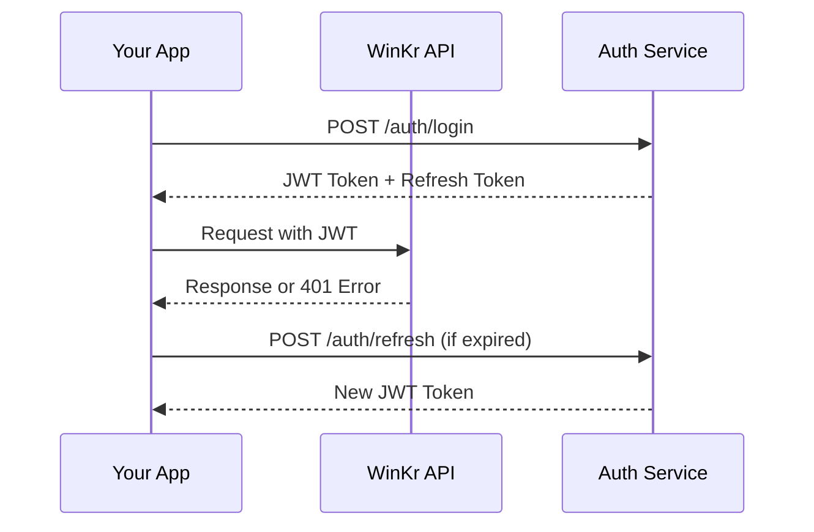
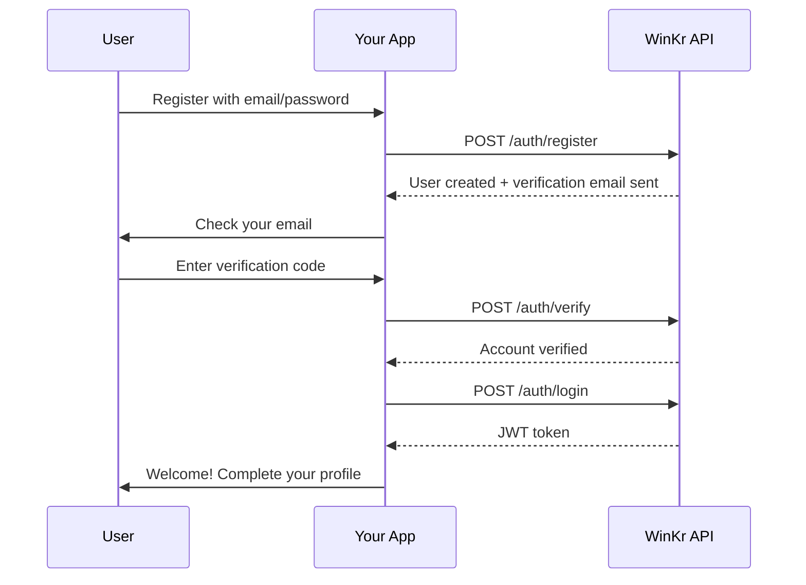
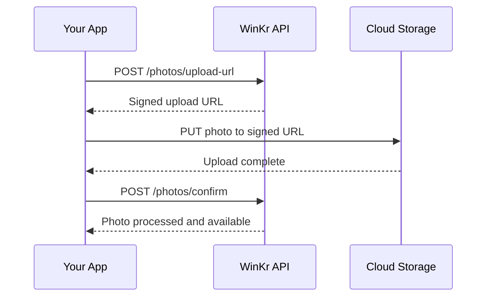
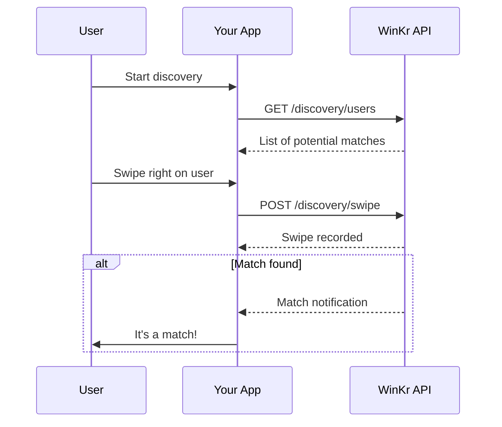

# WinKr API - Getting Started Guide

## Overview

The WinKr Dating App API provides comprehensive access to all platform features including user management, matching, messaging, payments, and administrative functions. This guide will help you get started with integrating your applications with our platform.

## Table of Contents

1. [Quick Start](#quick-start)
2. [Authentication](#authentication)
3. [API Structure](#api-structure)
4. [Rate Limiting](#rate-limiting)
5. [Error Handling](#error-handling)
6. [SDKs and Tools](#sdks-and-tools)
7. [First API Call](#first-api-call)
8. [Common Workflows](#common-workflows)
9. [Best Practices](#best-practices)
10. [Support](#support)

## Quick Start

### Prerequisites

- **API Key**: Contact api-support@winkr.com to obtain your API credentials
- **HTTPS**: All API calls must be made over HTTPS
- **JSON**: All requests and responses use JSON format
- **UTF-8**: All text data should be UTF-8 encoded

### Basic Setup

```bash
# Set your API credentials
export WINRK_API_KEY="your_api_key_here"
export WINRK_BASE_URL="https://api.winkr.com/v1"

# Test connection
curl -H "Authorization: Bearer $WINRK_API_KEY" \
     -H "Content-Type: application/json" \
     "$WINRK_BASE_URL/health"
```

### Your First Integration

1. **Register your application** at [WinKr Developer Portal](https://developers.winkr.com)
2. **Get API credentials** (Client ID and Secret)
3. **Make your first API call** using the authentication endpoint
4. **Implement error handling** for production use
5. **Set up webhooks** for real-time notifications

## Authentication

### JWT Token Authentication

The WinKr API uses JSON Web Tokens (JWT) for authentication. You'll need to obtain a token by authenticating with your credentials.

#### Authentication Flow



#### Token Structure

```json
{
  "token": "eyJhbGciOiJIUzI1NiIsInR5cCI6IkpXVCJ9...",
  "refresh_token": "eyJhbGciOiJIUzI1NiIsInR5cCI6IkpXVCJ9...",
  "expires_in": 3600,
  "token_type": "Bearer",
  "scope": ["read", "write"]
}
```

#### Using the Token

```javascript
// JavaScript/Node.js
const axios = require('axios');

const apiClient = axios.create({
  baseURL: 'https://api.winkr.com/v1',
  headers: {
    'Authorization': `Bearer ${token}`,
    'Content-Type': 'application/json'
  }
});

// Token will be automatically included in all requests
```

```python
# Python
import requests

headers = {
    'Authorization': f'Bearer {token}',
    'Content-Type': 'application/json'
}

response = requests.get(
    'https://api.winkr.com/v1/me/profile',
    headers=headers
)
```

#### Token Refresh

```javascript
// Automatic token refresh
const refreshAccessToken = async () => {
  try {
    const response = await axios.post('/auth/refresh', {
      refresh_token: localStorage.getItem('refresh_token')
    });
    
    localStorage.setItem('access_token', response.data.token);
    return response.data.token;
  } catch (error) {
    // Handle refresh failure - redirect to login
    window.location.href = '/login';
  }
};
```

### Admin Authentication

Admin endpoints require additional permissions and use a separate authentication flow:

```javascript
// Admin login
const adminLogin = async (email, password) => {
  const response = await axios.post('/admin/auth/login', {
    email,
    password,
    remember_me: false
  });
  
  return response.data; // Contains admin token and permissions
};
```

## API Structure

### Base URLs

- **Production**: `https://api.winkr.com/v1`
- **Staging**: `https://staging-api.winkr.com/v1`
- **Development**: `http://localhost:8080/v1`

### Endpoint Categories

| Category | Base Path | Description |
|----------|------------|-------------|
| Authentication | `/auth` | User authentication and token management |
| Profile | `/me`, `/users` | User profile management |
| Photos | `/photos` | Photo upload and management |
| Discovery | `/discovery` | User matching and discovery |
| Chat | `/chat` | Messaging and conversations |
| Verification | `/verification` | Identity verification |
| Payments | `/payment`, `/subscribe` | Subscription and billing |
| Moderation | `/report`, `/block` | Content moderation |
| Admin | `/admin` | Administrative functions |

### Request Format

All API requests should follow this structure:

```json
{
  "method": "POST|GET|PUT|DELETE",
  "headers": {
    "Authorization": "Bearer JWT_TOKEN",
    "Content-Type": "application/json",
    "X-Client-Version": "1.0.0"
  },
  "body": {
    // Request payload
  }
}
```

### Response Format

All API responses follow this structure:

```json
{
  "success": true,
  "data": {
    // Response data
  },
  "message": "Operation completed successfully",
  "timestamp": "2025-01-01T12:00:00Z",
  "request_id": "req_123456789"
}
```

#### Error Response Format

```json
{
  "success": false,
  "error": {
    "code": "VALIDATION_ERROR",
    "message": "Invalid request parameters",
    "details": {
      "field": "email",
      "issue": "Invalid email format"
    }
  },
  "timestamp": "2025-01-01T12:00:00Z",
  "request_id": "req_123456789"
}
```

## Rate Limiting

### Rate Limit Headers

All API responses include rate limiting headers:

```
X-RateLimit-Limit: 1000
X-RateLimit-Remaining: 999
X-RateLimit-Reset: 1640995200
X-RateLimit-Retry-After: 60
```

### Rate Limits by Endpoint

| Endpoint Category | Requests/Minute | Requests/Hour | Requests/Day |
|------------------|-----------------|----------------|---------------|
| Authentication | 10 | 100 | 1000 |
| Profile Operations | 30 | 500 | 5000 |
| Photo Upload | 5 | 50 | 200 |
| Discovery | 60 | 1000 | 10000 |
| Chat | 100 | 2000 | 20000 |
| Payments | 5 | 50 | 500 |
| Admin Operations | 20 | 500 | 5000 |

### Handling Rate Limits

```javascript
// Rate limiting middleware
const rateLimitHandler = (error) => {
  if (error.response?.status === 429) {
    const retryAfter = error.response.headers['x-ratelimit-retry-after'];
    const resetTime = error.response.headers['x-ratelimit-reset'];
    
    console.log(`Rate limited. Retry after ${retryAfter} seconds`);
    
    // Implement exponential backoff
    setTimeout(() => {
      // Retry the request
    }, retryAfter * 1000);
  }
};
```

## Error Handling

### HTTP Status Codes

| Status Code | Meaning | Action |
|-------------|---------|--------|
| 200 | Success | Process response |
| 201 | Created | Process response |
| 400 | Bad Request | Fix request parameters |
| 401 | Unauthorized | Re-authenticate |
| 403 | Forbidden | Check permissions |
| 404 | Not Found | Verify resource exists |
| 409 | Conflict | Resolve conflict |
| 429 | Rate Limited | Implement backoff |
| 500 | Server Error | Retry with backoff |

### Common Error Codes

| Error Code | Description | Solution |
|------------|-------------|----------|
| `INVALID_TOKEN` | JWT token is invalid | Re-authenticate |
| `TOKEN_EXPIRED` | JWT token has expired | Refresh token |
| `INSUFFICIENT_PERMISSIONS` | User lacks required permissions | Check user role |
| `VALIDATION_ERROR` | Request validation failed | Fix request parameters |
| `RESOURCE_NOT_FOUND` | Requested resource doesn't exist | Verify resource ID |
| `RATE_LIMIT_EXCEEDED` | Rate limit exceeded | Implement backoff |
| `PAYMENT_REQUIRED` | Payment required for feature | Process payment |
| `ACCOUNT_SUSPENDED` | User account is suspended | Contact support |

### Error Handling Best Practices

```javascript
// Comprehensive error handling
const apiCall = async (endpoint, options = {}) => {
  try {
    const response = await apiClient.post(endpoint, options);
    return response.data;
  } catch (error) {
    if (error.response) {
      const { status, data } = error.response;
      
      switch (status) {
        case 401:
          // Handle authentication error
          await refreshToken();
          return apiCall(endpoint, options);
          
        case 429:
          // Handle rate limiting
          return handleRateLimit(error.response);
          
        case 500:
          // Handle server error
          return handleServerError(error.response);
          
        default:
          // Handle other errors
          throw new Error(data.error?.message || 'API Error');
      }
    } else {
      // Handle network errors
      throw new Error('Network error');
    }
  }
};
```

## SDKs and Tools

### Official SDKs

| Language | SDK | Installation |
|----------|-----|-------------|
| JavaScript | `@winkr/api-client` | `npm install @winkr/api-client` |
| Python | `winkr-api` | `pip install winkr-api` |
| Java | `com.winkr:api-client` | Maven/Gradle |
| Swift | `WinkrAPI` | CocoaPods/SPM |
| Kotlin | `com.winkr:api-client` | Gradle |

### Third-Party Tools

- **Postman Collection**: [Download](./collections/winkr-api.postman_collection.json)
- **OpenAPI Specification**: [Download](./complete.yaml)
- **API Documentation**: [View Online](https://docs.winkr.com/api)

### Using the JavaScript SDK

```javascript
import { WinkrAPI } from '@winkr/api-client';

const client = new WinkrAPI({
  baseURL: 'https://api.winkr.com/v1',
  apiKey: 'your_api_key',
  timeout: 10000
});

// Authentication
await client.auth.login({
  email: 'user@example.com',
  password: 'password'
});

// Get user profile
const profile = await client.profiles.getMe();

// Upload photo
const photo = await client.photos.upload({
  file: photoFile,
  isPrimary: true
});
```

## First API Call

### Step 1: Authenticate

```bash
curl -X POST https://api.winkr.com/v1/auth/login \
  -H "Content-Type: application/json" \
  -d '{
    "email": "your_email@example.com",
    "password": "your_password"
  }'
```

### Step 2: Get User Profile

```bash
curl -X GET https://api.winkr.com/v1/me/profile \
  -H "Authorization: Bearer YOUR_JWT_TOKEN"
```

### Step 3: Update Profile

```bash
curl -X PUT https://api.winkr.com/v1/me/profile \
  -H "Authorization: Bearer YOUR_JWT_TOKEN" \
  -H "Content-Type: application/json" \
  -d '{
    "bio": "Passionate developer and coffee enthusiast",
    "location": {
      "city": "San Francisco",
      "country": "USA"
    }
  }'
```

## Common Workflows

### User Registration Flow



### Photo Upload Flow



### Matching Flow



## Best Practices

### Security

1. **Never expose API keys** in client-side code
2. **Use HTTPS** for all API calls
3. **Validate all input** before sending to API
4. **Implement proper error handling** to avoid exposing sensitive information
5. **Use short-lived tokens** and implement refresh logic
6. **Log API calls** for debugging and monitoring

### Performance

1. **Implement caching** for frequently accessed data
2. **Use pagination** for large datasets
3. **Compress requests** when sending large payloads
4. **Batch operations** when possible
5. **Implement retry logic** with exponential backoff
6. **Monitor API performance** and optimize accordingly

### Reliability

1. **Handle network failures** gracefully
2. **Implement offline support** for critical features
3. **Use webhooks** for real-time updates
4. **Implement idempotency** for critical operations
5. **Monitor API status** and handle downtime
6. **Provide fallback behavior** for API failures

### Code Examples

#### Robust API Client

```javascript
class WinkrAPIClient {
  constructor(apiKey, baseURL = 'https://api.winkr.com/v1') {
    this.apiKey = apiKey;
    this.baseURL = baseURL;
    this.token = null;
    this.refreshToken = null;
  }

  async request(method, endpoint, data = null) {
    const url = `${this.baseURL}${endpoint}`;
    const headers = {
      'Content-Type': 'application/json',
      'X-Client-Version': '1.0.0'
    };

    if (this.token) {
      headers['Authorization'] = `Bearer ${this.token}`;
    }

    try {
      const response = await fetch(url, {
        method,
        headers,
        body: data ? JSON.stringify(data) : null
      });

      if (response.status === 401 && this.refreshToken) {
        await this.refreshAccessToken();
        return this.request(method, endpoint, data);
      }

      if (!response.ok) {
        throw new Error(`HTTP ${response.status}: ${response.statusText}`);
      }

      return await response.json();
    } catch (error) {
      console.error('API request failed:', error);
      throw error;
    }
  }

  async refreshAccessToken() {
    try {
      const response = await this.request('POST', '/auth/refresh', {
        refresh_token: this.refreshToken
      });
      
      this.token = response.token;
      localStorage.setItem('winkr_token', this.token);
    } catch (error) {
      console.error('Token refresh failed:', error);
      // Redirect to login
      window.location.href = '/login';
    }
  }
}
```

## Support

### Documentation

- **API Reference**: [Complete API Documentation](./README.md)
- **OpenAPI Spec**: [complete.yaml](./complete.yaml)
- **Error Reference**: [Error Codes](./errors.md)
- **Integration Guides**: [Integration Guides](./guides/)

### Community

- **Developer Forum**: [https://community.winkr.com](https://community.winkr.com)
- **Stack Overflow**: Tag questions with `winkr-api`
- **GitHub**: [https://github.com/winkr/api-examples](https://github.com/winkr/api-examples)

### Contact

- **API Support**: api-support@winkr.com
- **Status Page**: [https://status.winkr.com](https://status.winkr.com)
- **Security Issues**: security@winkr.com

### Resources

- **Postman Collection**: [Download](./collections/winkr-api.postman_collection.json)
- **SDK Documentation**: [SDK Reference](./sdks/)
- **Sample Applications**: [Examples Repository](https://github.com/winkr/examples)
- **Webhook Guide**: [Webhook Documentation](./webhooks.md)

---

## Next Steps

1. **Read the complete API documentation** to understand all available endpoints
2. **Choose your integration approach** (SDK, direct API, or webhooks)
3. **Set up your development environment** with proper authentication
4. **Implement your first feature** using the getting started examples
5. **Test thoroughly** in the staging environment
6. **Deploy to production** and monitor performance

Welcome to the WinKr API! We're excited to see what you build.