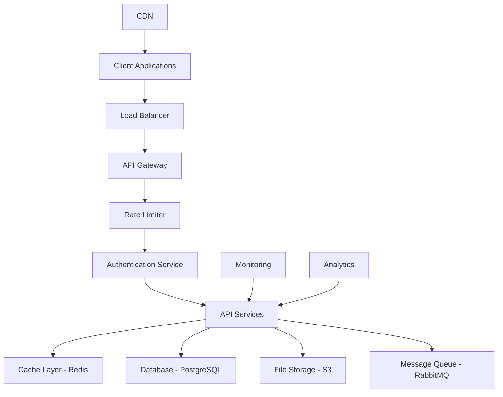

# WinKr API - Performance Documentation

## Overview

This comprehensive performance documentation covers all aspects of WinKr API performance, including optimization strategies, monitoring, caching, database performance, and scalability considerations. It provides detailed guidelines for achieving optimal performance and maintaining high availability.

## Table of Contents

1. [Performance Architecture](#performance-architecture)
2. [Response Time Expectations](#response-time-expectations)
3. [Caching Strategies](#caching-strategies)
4. [Database Performance](#database-performance)
5. [API Optimization](#api-optimization)
6. [Pagination Guidelines](#pagination-guidelines)
7. [Rate Limits and Throttling](#rate-limits-and-throttling)
8. [Monitoring and Metrics](#monitoring-and-metrics)
9. [Performance Testing](#performance-testing)
10. [Scalability Planning](#scalability-planning)
11. [Performance Best Practices](#performance-best-practices)
12. [Troubleshooting Performance Issues](#troubleshooting-performance-issues)

## Performance Architecture

### System Architecture Overview



### Performance Tiers

| Tier | Response Time | Throughput | Availability | Use Case |
|------|---------------|------------|--------------|----------|
| **Critical** | < 100ms | High | 99.99% | Authentication, Core API calls |
| **Standard** | < 300ms | Medium | 99.9% | Profile updates, Discovery |
| **Background** | < 1s | Low | 99.5% | Analytics, Reports |
| **Batch** | < 10s | Variable | 99% | Data exports, Bulk operations |

### Performance Targets

```javascript
// Performance targets and SLAs
const performanceTargets = {
  endpoints: {
    // Authentication endpoints
    'POST /auth/login': {
      averageResponseTime: 200, // ms
      p95ResponseTime: 500,
      p99ResponseTime: 1000,
      throughput: 1000, // requests per second
      errorRate: 0.01 // 1%
    },
    
    'POST /auth/register': {
      averageResponseTime: 300,
      p95ResponseTime: 600,
      p99ResponseTime: 1200,
      throughput: 500,
      errorRate: 0.02
    },
    
    // Profile endpoints
    'GET /me/profile': {
      averageResponseTime: 150,
      p95ResponseTime: 300,
      p99ResponseTime: 600,
      throughput: 2000,
      errorRate: 0.005
    },
    
    'PUT /me/profile': {
      averageResponseTime: 250,
      p95ResponseTime: 500,
      p99ResponseTime: 1000,
      throughput: 800,
      errorRate: 0.01
    },
    
    // Discovery endpoints
    'GET /discovery/users': {
      averageResponseTime: 400,
      p95ResponseTime: 800,
      p99ResponseTime: 1500,
      throughput: 1500,
      errorRate: 0.02
    },
    
    'POST /discovery/swipe': {
      averageResponseTime: 100,
      p95ResponseTime: 200,
      p99ResponseTime: 400,
      throughput: 3000,
      errorRate: 0.01
    },
    
    // Messaging endpoints
    'GET /matches/{id}/messages': {
      averageResponseTime: 200,
      p95ResponseTime: 400,
      p99ResponseTime: 800,
      throughput: 1000,
      errorRate: 0.01
    },
    
    'POST /messages': {
      averageResponseTime: 150,
      p95ResponseTime: 300,
      p99ResponseTime: 600,
      throughput: 2000,
      errorRate: 0.005
    },
    
    // Photo endpoints
    'GET /photos': {
      averageResponseTime: 300,
      p95ResponseTime: 600,
      p99ResponseTime: 1200,
      throughput: 800,
      errorRate: 0.02
    },
    
    'POST /photos': {
      averageResponseTime: 2000, // Includes upload time
      p95ResponseTime: 5000,
      p99ResponseTime: 10000,
      throughput: 100,
      errorRate: 0.05
    }
  },
  
  system: {
    cpuUtilization: 70, // percentage
    memoryUtilization: 80, // percentage
    diskUtilization: 85, // percentage
    networkBandwidth: 80, // percentage
    databaseConnections: 80, // percentage of max connections
    cacheHitRate: 90 // percentage
  }
};
```

## Response Time Expectations

### Response Time Categories

```javascript
// Response time classification and handling
class ResponseTimeAnalyzer {
  constructor() {
    this.thresholds = {
      excellent: 100,    // ms
      good: 200,         // ms
      acceptable: 500,    // ms
      slow: 1000,        // ms
      verySlow: 2000,    // ms
      timeout: 10000     // ms
    };
  }

  classifyResponseTime(responseTime) {
    if (responseTime <= this.thresholds.excellent) {
      return {
        category: 'excellent',
        color: 'green',
        description: 'Excellent performance',
        userExperience: 'Instantaneous'
      };
    } else if (responseTime <= this.thresholds.good) {
      return {
        category: 'good',
        color: 'blue',
        description: 'Good performance',
        userExperience: 'Fast'
      };
    } else if (responseTime <= this.thresholds.acceptable) {
      return {
        category: 'acceptable',
        color: 'yellow',
        description: 'Acceptable performance',
        userExperience: 'Noticeable but acceptable'
      };
    } else if (responseTime <= this.thresholds.slow) {
      return {
        category: 'slow',
        color: 'orange',
        description: 'Slow performance',
        userExperience: 'Slow, may cause frustration'
      };
    } else if (responseTime <= this.thresholds.verySlow) {
      return {
        category: 'very_slow',
        color: 'red',
        description: 'Very slow performance',
        userExperience: 'Very slow, likely to abandon'
      };
    } else {
      return {
        category: 'timeout',
        color: 'darkred',
        description: 'Timeout or extremely slow',
        userExperience: 'Failed or abandoned'
      };
    }
  }

  analyzeResponseTimes(responseTimes) {
    const analysis = {
      total: responseTimes.length,
      average: this.calculateAverage(responseTimes),
      median: this.calculateMedian(responseTimes),
      min: Math.min(...responseTimes),
      max: Math.max(...responseTimes),
      p50: this.calculatePercentile(responseTimes, 50),
      p90: this.calculatePercentile(responseTimes, 90),
      p95: this.calculatePercentile(responseTimes, 95),
      p99: this.calculatePercentile(responseTimes, 99),
      distribution: this.calculateDistribution(responseTimes)
    };

    return analysis;
  }

  calculateDistribution(responseTimes) {
    const distribution = {};
    
    Object.keys(this.thresholds).forEach(category => {
      distribution[category] = responseTimes.filter(time => {
        switch (category) {
          case 'excellent':
            return time <= this.thresholds.excellent;
          case 'good':
            return time > this.thresholds.excellent && time <= this.thresholds.good;
          case 'acceptable':
            return time > this.thresholds.good && time <= this.thresholds.acceptable;
          case 'slow':
            return time > this.thresholds.acceptable && time <= this.thresholds.slow;
          case 'very_slow':
            return time > this.thresholds.slow && time <= this.thresholds.verySlow;
          case 'timeout':
            return time > this.thresholds.verySlow;
          default:
            return false;
        }
      }).length;
    });

    return distribution;
  }

  calculateAverage(values) {
    return values.reduce((sum, value) => sum + value, 0) / values.length;
  }

  calculateMedian(values) {
    const sorted = [...values].sort((a, b) => a - b);
    const middle = Math.floor(sorted.length / 2);
    
    if (sorted.length % 2 === 0) {
      return (sorted[middle - 1] + sorted[middle]) / 2;
    } else {
      return sorted[middle];
    }
  }

  calculatePercentile(values, percentile) {
    const sorted = [...values].sort((a, b) => a - b);
    const index = Math.ceil((percentile / 100) * sorted.length) - 1;
    return sorted[index];
  }
}
```

### Performance Monitoring Implementation

```javascript
// Real-time performance monitoring
class PerformanceMonitor {
  constructor() {
    this.metrics = new Map();
    this.alerts = [];
    this.thresholds = {
      responseTime: {
        warning: 500,
        critical: 1000
      },
      errorRate: {
        warning: 0.05, // 5%
        critical: 0.1   // 10%
      },
      throughput: {
        warning: 100,   // requests per second
        critical: 50    // requests per second
      }
    };
  }

  recordRequest(endpoint, responseTime, statusCode, timestamp = Date.now()) {
    if (!this.metrics.has(endpoint)) {
      this.metrics.set(endpoint, {
        requestCount: 0,
        errorCount: 0,
        responseTimes: [],
        lastUpdated: timestamp
      });
    }

    const metric = this.metrics.get(endpoint);
    metric.requestCount++;
    metric.responseTimes.push(responseTime);
    metric.lastUpdated = timestamp;

    if (statusCode >= 400) {
      metric.errorCount++;
    }

    // Keep only last 1000 response times for memory efficiency
    if (metric.responseTimes.length > 1000) {
      metric.responseTimes = metric.responseTimes.slice(-1000);
    }

    // Check for performance alerts
    this.checkPerformanceAlerts(endpoint, metric);
  }

  checkPerformanceAlerts(endpoint, metric) {
    const averageResponseTime = this.calculateAverage(metric.responseTimes);
    const errorRate = metric.errorCount / metric.requestCount;

    // Check response time alerts
    if (averageResponseTime > this.thresholds.responseTime.critical) {
      this.triggerAlert('critical', 'response_time', endpoint, {
        value: averageResponseTime,
        threshold: this.thresholds.responseTime.critical
      });
    } else if (averageResponseTime > this.thresholds.responseTime.warning) {
      this.triggerAlert('warning', 'response_time', endpoint, {
        value: averageResponseTime,
        threshold: this.thresholds.responseTime.warning
      });
    }

    // Check error rate alerts
    if (errorRate > this.thresholds.errorRate.critical) {
      this.triggerAlert('critical', 'error_rate', endpoint, {
        value: errorRate,
        threshold: this.thresholds.errorRate.critical
      });
    } else if (errorRate > this.thresholds.errorRate.warning) {
      this.triggerAlert('warning', 'error_rate', endpoint, {
        value: errorRate,
        threshold: this.thresholds.errorRate.warning
      });
    }
  }

  triggerAlert(severity, type, endpoint, data) {
    const alert = {
      id: this.generateAlertId(),
      timestamp: Date.now(),
      severity: severity,
      type: type,
      endpoint: endpoint,
      data: data,
      acknowledged: false
    };

    this.alerts.push(alert);
    
    // Send alert to monitoring system
    this.sendAlert(alert);
  }

  sendAlert(alert) {
    console.log(`PERFORMANCE ALERT [${alert.severity.toUpperCase()}]:`, {
      type: alert.type,
      endpoint: alert.endpoint,
      data: alert.data
    });

    // In production, integrate with your alerting system
    // this.alertingService.send(alert);
  }

  generateAlertId() {
    return 'alert_' + Date.now() + '_' + Math.random().toString(36).substr(2, 9);
  }

  calculateAverage(values) {
    if (values.length === 0) return 0;
    return values.reduce((sum, value) => sum + value, 0) / values.length;
  }

  getPerformanceReport(endpoint) {
    const metric = this.metrics.get(endpoint);
    if (!metric) {
      return null;
    }

    const responseTimes = metric.responseTimes;
    const sortedTimes = [...responseTimes].sort((a, b) => a - b);

    return {
      endpoint: endpoint,
      requestCount: metric.requestCount,
      errorCount: metric.errorCount,
      errorRate: metric.errorCount / metric.requestCount,
      responseTime: {
        average: this.calculateAverage(responseTimes),
        min: Math.min(...responseTimes),
        max: Math.max(...responseTimes),
        p50: this.calculatePercentile(sortedTimes, 50),
        p95: this.calculatePercentile(sortedTimes, 95),
        p99: this.calculatePercentile(sortedTimes, 99)
      },
      lastUpdated: metric.lastUpdated
    };
  }

  calculatePercentile(sortedValues, percentile) {
    if (sortedValues.length === 0) return 0;
    const index = Math.ceil((percentile / 100) * sortedValues.length) - 1;
    return sortedValues[index];
  }

  getAllPerformanceReports() {
    const reports = {};
    
    for (const endpoint of this.metrics.keys()) {
      reports[endpoint] = this.getPerformanceReport(endpoint);
    }

    return reports;
  }
}
```

## Caching Strategies

### Multi-Level Caching Architecture

```javascript
// Comprehensive caching implementation
class CacheManager {
  constructor() {
    this.levels = {
      l1: new Map(), // In-memory cache
      l2: new RedisCache(), // Redis cache
      l3: new DatabaseCache() // Database query cache
    };
    
    this.policies = {
      userProfile: {
        ttl: 300, // 5 minutes
        strategy: 'write-through',
        levels: ['l1', 'l2']
      },
      discoveryUsers: {
        ttl: 60, // 1 minute
        strategy: 'write-behind',
        levels: ['l1', 'l2']
      },
      photos: {
        ttl: 3600, // 1 hour
        strategy: 'write-through',
        levels: ['l2', 'l3']
      },
      messages: {
        ttl: 30, // 30 seconds
        strategy: 'write-through',
        levels: ['l1']
      },
      matches: {
        ttl: 180, // 3 minutes
        strategy: 'write-behind',
        levels: ['l1', 'l2']
      }
    };
  }

  async get(key, type = 'default') {
    const policy = this.policies[type] || this.policies.default;
    
    // Try each cache level in order
    for (const levelName of policy.levels) {
      const level = this.levels[levelName];
      const value = await level.get(key);
      
      if (value !== null) {
        // Cache hit - promote to higher levels if needed
        await this.promoteToHigherLevels(key, value, levelName, policy);
        return value;
      }
    }
    
    // Cache miss
    return null;
  }

  async set(key, value, type = 'default') {
    const policy = this.policies[type] || this.policies.default;
    
    switch (policy.strategy) {
      case 'write-through':
        // Write to all levels immediately
        for (const levelName of policy.levels) {
          await this.levels[levelName].set(key, value, policy.ttl);
        }
        break;
        
      case 'write-behind':
        // Write to L1 immediately, others asynchronously
        await this.levels.l1.set(key, value, policy.ttl);
        
        // Async write to other levels
        setTimeout(async () => {
          for (let i = 1; i < policy.levels.length; i++) {
            const levelName = policy.levels[i];
            await this.levels[levelName].set(key, value, policy.ttl);
          }
        }, 0);
        break;
        
      case 'write-around':
        // Write only to L2 and higher, bypass L1
        for (let i = 1; i < policy.levels.length; i++) {
          const levelName = policy.levels[i];
          await this.levels[levelName].set(key, value, policy.ttl);
        }
        break;
    }
  }

  async invalidate(key, type = 'default') {
    const policy = this.policies[type] || this.policies.default;
    
    // Invalidate from all levels
    for (const levelName of policy.levels) {
      await this.levels[levelName].delete(key);
    }
  }

  async invalidatePattern(pattern, type = 'default') {
    const policy = this.policies[type] || this.policies.default;
    
    // Invalidate matching keys from all levels
    for (const levelName of policy.levels) {
      await this.levels[levelName].deletePattern(pattern);
    }
  }

  async promoteToHigherLevels(key, value, currentLevel, policy) {
    const currentIndex = policy.levels.indexOf(currentLevel);
    
    // Promote to higher levels (lower index)
    for (let i = 0; i < currentIndex; i++) {
      const levelName = policy.levels[i];
      await this.levels[levelName].set(key, value, policy.ttl);
    }
  }

  getCacheStats() {
    const stats = {};
    
    Object.keys(this.levels).forEach(levelName => {
      stats[levelName] = this.levels[levelName].getStats();
    });
    
    return stats;
  }
}

// In-memory cache implementation
class MemoryCache {
  constructor() {
    this.cache = new Map();
    this.timers = new Map();
    this.stats = {
      hits: 0,
      misses: 0,
      sets: 0,
      deletes: 0
    };
  }

  async get(key) {
    const item = this.cache.get(key);
    
    if (item === undefined) {
      this.stats.misses++;
      return null;
    }
    
    // Check if item has expired
    if (item.expiresAt && Date.now() > item.expiresAt) {
      this.cache.delete(key);
      this.timers.delete(key);
      this.stats.misses++;
      return null;
    }
    
    this.stats.hits++;
    return item.value;
  }

  async set(key, value, ttl = 300) {
    const expiresAt = ttl > 0 ? Date.now() + (ttl * 1000) : null;
    
    // Clear existing timer
    if (this.timers.has(key)) {
      clearTimeout(this.timers.get(key));
    }
    
    // Set new timer for expiration
    if (expiresAt) {
      const timer = setTimeout(() => {
        this.cache.delete(key);
        this.timers.delete(key);
      }, ttl * 1000);
      this.timers.set(key, timer);
    }
    
    this.cache.set(key, { value, expiresAt });
    this.stats.sets++;
  }

  async delete(key) {
    const deleted = this.cache.delete(key);
    
    if (this.timers.has(key)) {
      clearTimeout(this.timers.get(key));
      this.timers.delete(key);
    }
    
    if (deleted) {
      this.stats.deletes++;
    }
    
    return deleted;
  }

  async deletePattern(pattern) {
    const regex = new RegExp(pattern);
    const keysToDelete = [];
    
    for (const key of this.cache.keys()) {
      if (regex.test(key)) {
        keysToDelete.push(key);
      }
    }
    
    for (const key of keysToDelete) {
      await this.delete(key);
    }
  }

  getStats() {
    return {
      ...this.stats,
      size: this.cache.size,
      hitRate: this.stats.hits / (this.stats.hits + this.stats.misses) || 0
    };
  }
}

// Redis cache implementation
class RedisCache {
  constructor() {
    this.client = null; // Redis client instance
    this.stats = {
      hits: 0,
      misses: 0,
      sets: 0,
      deletes: 0
    };
  }

  async connect() {
    // Initialize Redis client
    // this.client = new Redis(process.env.REDIS_URL);
  }

  async get(key) {
    try {
      const value = await this.client.get(key);
      
      if (value === null) {
        this.stats.misses++;
        return null;
      }
      
      this.stats.hits++;
      return JSON.parse(value);
    } catch (error) {
      console.error('Redis get error:', error);
      this.stats.misses++;
      return null;
    }
  }

  async set(key, value, ttl = 300) {
    try {
      const serializedValue = JSON.stringify(value);
      
      if (ttl > 0) {
        await this.client.setex(key, ttl, serializedValue);
      } else {
        await this.client.set(key, serializedValue);
      }
      
      this.stats.sets++;
    } catch (error) {
      console.error('Redis set error:', error);
    }
  }

  async delete(key) {
    try {
      const result = await this.client.del(key);
      
      if (result > 0) {
        this.stats.deletes++;
      }
      
      return result > 0;
    } catch (error) {
      console.error('Redis delete error:', error);
      return false;
    }
  }

  async deletePattern(pattern) {
    try {
      const keys = await this.client.keys(pattern);
      
      if (keys.length > 0) {
        await this.client.del(...keys);
        this.stats.deletes += keys.length;
      }
      
      return keys.length;
    } catch (error) {
      console.error('Redis deletePattern error:', error);
      return 0;
    }
  }

  getStats() {
    return {
      ...this.stats,
      hitRate: this.stats.hits / (this.stats.hits + this.stats.misses) || 0
    };
  }
}
```

### Cache Warming Strategies

```javascript
// Cache warming and preloading
class CacheWarmer {
  constructor(cacheManager) {
    this.cacheManager = cacheManager;
    this.warmingJobs = new Map();
  }

  async warmUserProfile(userId) {
    const cacheKey = `user_profile:${userId}`;
    
    try {
      // Fetch user profile from database
      const userProfile = await this.fetchUserProfileFromDB(userId);
      
      // Cache the profile
      await this.cacheManager.set(cacheKey, userProfile, 'userProfile');
      
      console.log(`Warmed cache for user profile: ${userId}`);
      return userProfile;
    } catch (error) {
      console.error(`Failed to warm cache for user ${userId}:`, error);
      throw error;
    }
  }

  async warmDiscoveryUsers(userId, preferences) {
    const cacheKey = `discovery_users:${userId}:${JSON.stringify(preferences)}`;
    
    try {
      // Fetch discovery users from database
      const discoveryUsers = await this.fetchDiscoveryUsersFromDB(userId, preferences);
      
      // Cache the results
      await this.cacheManager.set(cacheKey, discoveryUsers, 'discoveryUsers');
      
      console.log(`Warmed cache for discovery users: ${userId}`);
      return discoveryUsers;
    } catch (error) {
      console.error(`Failed to warm discovery cache for user ${userId}:`, error);
      throw error;
    }
  }

  async warmUserPhotos(userId) {
    const cacheKey = `user_photos:${userId}`;
    
    try {
      // Fetch user photos from database
      const photos = await this.fetchUserPhotosFromDB(userId);
      
      // Cache the photos
      await this.cacheManager.set(cacheKey, photos, 'photos');
      
      console.log(`Warmed cache for user photos: ${userId}`);
      return photos;
    } catch (error) {
      console.error(`Failed to warm photos cache for user ${userId}:`, error);
      throw error;
    }
  }

  async scheduleWarmingJob(jobName, interval, warmingFunction, ...args) {
    // Clear existing job if it exists
    if (this.warmingJobs.has(jobName)) {
      clearInterval(this.warmingJobs.get(jobName));
    }

    // Schedule new warming job
    const job = setInterval(async () => {
      try {
        await warmingFunction(...args);
      } catch (error) {
        console.error(`Cache warming job ${jobName} failed:`, error);
      }
    }, interval);

    this.warmingJobs.set(jobName, job);
    
    // Run immediately
    try {
      await warmingFunction(...args);
    } catch (error) {
      console.error(`Initial cache warming job ${jobName} failed:`, error);
    }
  }

  async warmPopularContent() {
    // Warm cache for popular users
    const popularUsers = await this.getPopularUsers();
    
    for (const user of popularUsers) {
      await this.warmUserProfile(user.id);
      await this.warmUserPhotos(user.id);
    }

    // Warm cache for trending discovery preferences
    const trendingPreferences = await this.getTrendingPreferences();
    
    for (const preferences of trendingPreferences) {
      await this.warmDiscoveryUsers('sample_user', preferences);
    }
  }

  async warmActiveUserSessions() {
    // Get currently active users
    const activeUsers = await this.getActiveUsers();
    
    // Warm cache for active users
    for (const userId of activeUsers) {
      await this.warmUserProfile(userId);
      await this.warmUserPhotos(userId);
    }
  }

  stopWarmingJob(jobName) {
    if (this.warmingJobs.has(jobName)) {
      clearInterval(this.warmingJobs.get(jobName));
      this.warmingJobs.delete(jobName);
      console.log(`Stopped cache warming job: ${jobName}`);
    }
  }

  stopAllWarmingJobs() {
    for (const jobName of this.warmingJobs.keys()) {
      this.stopWarmingJob(jobName);
    }
  }

  // Helper methods (would connect to your actual data sources)
  async fetchUserProfileFromDB(userId) {
    // Implement database query
    return { id: userId, name: 'Test User' };
  }

  async fetchDiscoveryUsersFromDB(userId, preferences) {
    // Implement database query
    return [];
  }

  async fetchUserPhotosFromDB(userId) {
    // Implement database query
    return [];
  }

  async getPopularUsers() {
    // Implement logic to get popular users
    return [];
  }

  async getTrendingPreferences() {
    // Implement logic to get trending preferences
    return [];
  }

  async getActiveUsers() {
    // Implement logic to get active users
    return [];
  }
}
```

## Database Performance

### Database Optimization Strategies

```javascript
// Database performance monitoring and optimization
class DatabasePerformanceManager {
  constructor() {
    this.connectionPool = null;
    this.queryCache = new Map();
    this.slowQueryThreshold = 1000; // ms
    this.metrics = {
      queryCount: 0,
      slowQueries: 0,
      averageQueryTime: 0,
      connectionPoolUsage: 0
    };
  }

  async executeQuery(query, params = [], options = {}) {
    const startTime = Date.now();
    
    try {
      // Check query cache first
      const cacheKey = this.generateQueryCacheKey(query, params);
      if (this.queryCache.has(cacheKey) && !options.skipCache) {
        return this.queryCache.get(cacheKey);
      }

      // Execute query
      const result = await this.connectionPool.query(query, params);
      
      const queryTime = Date.now() - startTime;
      this.recordQueryMetrics(query, queryTime, params);
      
      // Cache result if appropriate
      if (this.shouldCacheQuery(query, result)) {
        this.queryCache.set(cacheKey, result);
      }
      
      return result;
    } catch (error) {
      const queryTime = Date.now() - startTime;
      this.recordQueryMetrics(query, queryTime, params, error);
      throw error;
    }
  }

  generateQueryCacheKey(query, params) {
    const queryHash = this.hashString(query);
    const paramsHash = this.hashString(JSON.stringify(params));
    return `${queryHash}_${paramsHash}`;
  }

  hashString(str) {
    let hash = 0;
    for (let i = 0; i < str.length; i++) {
      const char = str.charCodeAt(i);
      hash = ((hash << 5) - hash) + char;
      hash = hash & hash; // Convert to 32-bit integer
    }
    return hash.toString(36);
  }

  shouldCacheQuery(query, result) {
    // Cache SELECT queries with small result sets
    const isSelect = query.trim().toUpperCase().startsWith('SELECT');
    const smallResult = result.rows && result.rows.length < 100;
    
    return isSelect && smallResult;
  }

  recordQueryMetrics(query, queryTime, params, error = null) {
    this.metrics.queryCount++;
    
    if (queryTime > this.slowQueryThreshold) {
      this.metrics.slowQueries++;
      this.logSlowQuery(query, params, queryTime, error);
    }
    
    // Update average query time
    this.metrics.averageQueryTime = 
      (this.metrics.averageQueryTime * (this.metrics.queryCount - 1) + queryTime) / 
      this.metrics.queryCount;
  }

  logSlowQuery(query, params, queryTime, error) {
    console.warn('SLOW QUERY DETECTED:', {
      query: query,
      params: params,
      executionTime: queryTime,
      error: error ? error.message : null,
      timestamp: new Date().toISOString()
    });
    
    // In production, send to monitoring system
    // this.monitoringService.logSlowQuery(query, params, queryTime, error);
  }

  async analyzeQueryPerformance() {
    const analysis = {
      slowQueries: await this.getSlowQueries(),
      missingIndexes: await this.findMissingIndexes(),
      tableStatistics: await this.getTableStatistics(),
      connectionPoolStats: this.getConnectionPoolStats()
    };

    return analysis;
  }

  async getSlowQueries() {
    // Get slow queries from database logs
    const slowQueryLog = await this.executeQuery(`
      SELECT query, mean_time, calls, total_time
      FROM pg_stat_statements 
      WHERE mean_time > $1
      ORDER BY mean_time DESC
      LIMIT 20
    `, [this.slowQueryThreshold]);

    return slowQueryLog.rows;
  }

  async findMissingIndexes() {
    // Find queries that could benefit from indexes
    const missingIndexes = await this.executeQuery(`
      SELECT schemaname, tablename, attname, n_distinct, correlation
      FROM pg_stats 
      WHERE schemaname = 'public'
      AND n_distinct > 100
      ORDER BY n_distinct DESC
    `);

    return missingIndexes.rows;
  }

  async getTableStatistics() {
    const tableStats = await this.executeQuery(`
      SELECT 
        schemaname,
        tablename,
        n_tup_ins as inserts,
        n_tup_upd as updates,
        n_tup_del as deletes,
        n_live_tup as live_tuples,
        n_dead_tup as dead_tuples,
        last_vacuum,
        last_autovacuum,
        last_analyze,
        last_autoanalyze
      FROM pg_stat_user_tables
      ORDER BY n_live_tup DESC
    `);

    return tableStats.rows;
  }

  getConnectionPoolStats() {
    return {
      totalConnections: this.connectionPool.totalCount,
      activeConnections: this.connectionPool.idleCount,
      waitingClients: this.connectionPool.waitingCount,
      maxConnections: this.connectionPool.options.max
    };
  }

  async optimizeDatabase() {
    const recommendations = [];
    
    // Analyze slow queries
    const slowQueries = await this.getSlowQueries();
    for (const query of slowQueries) {
      if (query.mean_time > 2000) {
        recommendations.push({
          type: 'slow_query',
          priority: 'high',
          description: `Query averaging ${query.mean_time}ms needs optimization`,
          query: query.query,
          suggestion: 'Consider adding indexes or rewriting the query'
        });
      }
    }

    // Check for missing indexes
    const missingIndexes = await this.findMissingIndexes();
    for (const index of missingIndexes) {
      recommendations.push({
        type: 'missing_index',
        priority: 'medium',
        description: `Table ${index.tablename} column ${index.attname} may need indexing`,
        table: index.tablename,
        column: index.attname,
        suggestion: `CREATE INDEX idx_${index.tablename}_${index.attname} ON ${index.tablename}(${index.attname})`
      });
    }

    // Check table statistics
    const tableStats = await this.getTableStatistics();
    for (const table of tableStats) {
      const deadTupleRatio = table.dead_tuples / (table.live_tuples + table.dead_tuples);
      
      if (deadTupleRatio > 0.2) {
        recommendations.push({
          type: 'table_maintenance',
          priority: 'medium',
          description: `Table ${table.tablename} has ${deadTupleRatio.toFixed(2)} dead tuples`,
          table: table.tablename,
          suggestion: 'Run VACUUM ANALYZE on this table'
        });
      }
    }

    return recommendations;
  }

  async createRecommendedIndexes(recommendations) {
    const indexRecommendations = recommendations.filter(r => r.type === 'missing_index');
    
    for (const rec of indexRecommendations) {
      try {
        await this.executeQuery(rec.suggestion);
        console.log(`Created index: ${rec.suggestion}`);
      } catch (error) {
        console.error(`Failed to create index: ${rec.suggestion}`, error);
      }
    }
  }

  async runMaintenance() {
    console.log('Starting database maintenance...');
    
    // Update table statistics
    await this.executeQuery('ANALYZE');
    
    // Clean up dead tuples
    await this.executeQuery('VACUUM');
    
    // Clear query cache
    this.queryCache.clear();
    
    console.log('Database maintenance completed');
  }

  getPerformanceMetrics() {
    return {
      ...this.metrics,
      cacheSize: this.queryCache.size,
      connectionPoolUsage: this.getConnectionPoolStats()
    };
  }
}
```

### Database Connection Pooling

```javascript
// Advanced connection pool management
class ConnectionPoolManager {
  constructor(config) {
    this.config = {
      min: 2,
      max: 20,
      acquireTimeoutMillis: 30000,
      createTimeoutMillis: 30000,
      destroyTimeoutMillis: 5000,
      idleTimeoutMillis: 30000,
      reapIntervalMillis: 1000,
      createRetryIntervalMillis: 200,
      ...config
    };
    
    this.pool = null;
    this.metrics = {
      totalConnections: 0,
      activeConnections: 0,
      idleConnections: 0,
      waitingClients: 0,
      totalAcquires: 0,
      totalReleases: 0,
      totalCreateTime: 0,
      averageAcquireTime: 0
    };
  }

  async initialize() {
    // Initialize connection pool
    const { Pool } = require('pg');
    
    this.pool = new Pool({
      host: process.env.DB_HOST,
      port: process.env.DB_PORT,
      database: process.env.DB_NAME,
      user: process.env.DB_USER,
      password: process.env.DB_PASSWORD,
      min: this.config.min,
      max: this.config.max,
      idleTimeoutMillis: this.config.idleTimeoutMillis,
      connectionTimeoutMillis: this.config.acquireTimeoutMillis
    });

    // Set up event listeners
    this.pool.on('connect', (client) => {
      this.metrics.totalConnections++;
      console.log('New database connection established');
    });

    this.pool.on('acquire', (client) => {
      this.metrics.activeConnections++;
      this.metrics.totalAcquires++;
    });

    this.pool.on('release', (err, client) => {
      this.metrics.activeConnections--;
      this.metrics.totalReleases++;
    });

    this.pool.on('remove', (client) => {
      this.metrics.totalConnections--;
      console.log('Database connection removed');
    });

    // Start metrics collection
    this.startMetricsCollection();
  }

  async acquire() {
    const startTime = Date.now();
    
    try {
      const client = await this.pool.connect();
      const acquireTime = Date.now() - startTime;
      
      this.updateAverageAcquireTime(acquireTime);
      
      return client;
    } catch (error) {
      console.error('Failed to acquire database connection:', error);
      throw error;
    }
  }

  async release(client) {
    try {
      await client.release();
    } catch (error) {
      console.error('Failed to release database connection:', error);
      throw error;
    }
  }

  async executeWithConnection(callback) {
    const client = await this.acquire();
    
    try {
      const result = await callback(client);
      return result;
    } finally {
      await this.release(client);
    }
  }

  updateAverageAcquireTime(acquireTime) {
    this.metrics.totalCreateTime += acquireTime;
    this.metrics.averageAcquireTime = 
      this.metrics.totalCreateTime / this.metrics.totalAcquires;
  }

  startMetricsCollection() {
    setInterval(() => {
      this.updateMetrics();
    }, 5000); // Update every 5 seconds
  }

  updateMetrics() {
    this.metrics.idleConnections = this.pool.idleCount;
    this.metrics.waitingClients = this.pool.waitingCount;
  }

  getMetrics() {
    return {
      ...this.metrics,
      poolUtilization: (this.metrics.activeConnections / this.config.max) * 100,
      averageWaitTime: this.metrics.averageAcquireTime
    };
  }

  async healthCheck() {
    try {
      const client = await this.acquire();
      const result = await client.query('SELECT 1 as health_check');
      await this.release(client);
      
      return {
        healthy: true,
        timestamp: new Date().toISOString(),
        metrics: this.getMetrics()
      };
    } catch (error) {
      return {
        healthy: false,
        timestamp: new Date().toISOString(),
        error: error.message,
        metrics: this.getMetrics()
      };
    }
  }

  async close() {
    if (this.pool) {
      await this.pool.end();
      console.log('Database connection pool closed');
    }
  }
}
```

## API Optimization

### Request Optimization

```javascript
// API request optimization middleware
class APIOptimizer {
  constructor() {
    this.compressionEnabled = true;
    this.minificationEnabled = true;
    this.responseTimeThresholds = {
      warning: 500,
      critical: 1000
    };
  }

  // Compression middleware
  compressionMiddleware() {
    return (req, res, next) => {
      if (!this.compressionEnabled) {
        return next();
      }

      // Check if client accepts compression
      const acceptEncoding = req.headers['accept-encoding'] || '';
      
      if (acceptEncoding.includes('gzip')) {
        res.setHeader('Content-Encoding', 'gzip');
        // Enable gzip compression
      } else if (acceptEncoding.includes('deflate')) {
        res.setHeader('Content-Encoding', 'deflate');
        // Enable deflate compression
      }

      next();
    };
  }

  // Response time monitoring middleware
  responseTimeMiddleware() {
    return (req, res, next) => {
      const startTime = Date.now();
      
      // Override res.end to measure response time
      const originalEnd = res.end;
      res.end = function(chunk, encoding) {
        const responseTime = Date.now() - startTime;
        
        // Add response time header
        res.setHeader('X-Response-Time', `${responseTime}ms`);
        
        // Log slow responses
        if (responseTime > this.responseTimeThresholds.critical) {
          console.error('CRITICAL SLOW RESPONSE:', {
            method: req.method,
            url: req.url,
            responseTime: responseTime,
            statusCode: res.statusCode
          });
        } else if (responseTime > this.responseTimeThresholds.warning) {
          console.warn('SLOW RESPONSE:', {
            method: req.method,
            url: req.url,
            responseTime: responseTime,
            statusCode: res.statusCode
          });
        }
        
        // Call original end
        originalEnd.call(this, chunk, encoding);
      }.bind(this);
      
      next();
    };
  }

  // Request size limiting middleware
  requestSizeMiddleware(maxSize = '10mb') {
    return (req, res, next) => {
      const contentLength = req.headers['content-length'];
      
      if (contentLength) {
        const sizeInBytes = parseInt(contentLength);
        const maxSizeInBytes = this.parseSize(maxSize);
        
        if (sizeInBytes > maxSizeInBytes) {
          return res.status(413).json({
            error: 'request_too_large',
            message: `Request size exceeds maximum allowed size of ${maxSize}`
          });
        }
      }
      
      next();
    };
  }

  // Response optimization middleware
  responseOptimizationMiddleware() {
    return (req, res, next) => {
      // Set cache headers for static responses
      if (this.isCacheableRequest(req)) {
        const maxAge = this.getCacheMaxAge(req.path);
        res.setHeader('Cache-Control', `public, max-age=${maxAge}`);
        res.setHeader('ETag', this.generateETag(req));
      }

      // Minify JSON responses
      const originalJson = res.json;
      res.json = function(data) {
        if (this.minificationEnabled && typeof data === 'object') {
          data = this.minifyJSON(data);
        }
        return originalJson.call(this, data);
      }.bind(this);

      next();
    };
  }

  // Database query optimization
  async optimizeQuery(query, params = []) {
    const optimizations = [];

    // Check for missing WHERE clauses
    if (query.toUpperCase().includes('SELECT') && !query.toUpperCase().includes('WHERE')) {
      optimizations.push({
        type: 'missing_where',
        suggestion: 'Consider adding WHERE clause to limit result set'
      });
    }

    // Check for SELECT *
    if (query.includes('SELECT *')) {
      optimizations.push({
        type: 'select_star',
        suggestion: 'Specify specific columns instead of using SELECT *'
      });
    }

    // Check for missing LIMIT
    if (query.toUpperCase().includes('SELECT') && !query.toUpperCase().includes('LIMIT')) {
      optimizations.push({
        type: 'missing_limit',
        suggestion: 'Consider adding LIMIT clause for large result sets'
      });
    }

    // Check for ORDER BY without index
    if (query.toUpperCase().includes('ORDER BY')) {
      optimizations.push({
        type: 'order_by_optimization',
        suggestion: 'Ensure ORDER BY columns are indexed'
      });
    }

    return optimizations;
  }

  // Response compression
  compressResponse(data) {
    if (typeof data === 'string') {
      // Implement compression logic
      return data; // Placeholder
    }
    return data;
  }

  // JSON minification
  minifyJSON(data) {
    return JSON.stringify(data);
  }

  // Cache helpers
  isCacheableRequest(req) {
    const cacheableMethods = ['GET', 'HEAD'];
    const cacheablePaths = ['/api/v1/discovery/users', '/api/v1/photos'];
    
    return cacheableMethods.includes(req.method) && 
           cacheablePaths.some(path => req.path.startsWith(path));
  }

  getCacheMaxAge(path) {
    const cacheDurations = {
      '/api/v1/discovery/users': 60, // 1 minute
      '/api/v1/photos': 3600, // 1 hour
      '/api/v1/me/profile': 300 // 5 minutes
    };

    for (const [cachePath, duration] of Object.entries(cacheDurations)) {
      if (path.startsWith(cachePath)) {
        return duration;
      }
    }

    return 0; // No caching by default
  }

  generateETag(req) {
    // Generate ETag based on request and content
    return `"${Date.now()}-${req.path}"`;
  }

  parseSize(size) {
    const units = {
      'b': 1,
      'kb': 1024,
      'mb': 1024 * 1024,
      'gb': 1024 * 1024 * 1024
    };

    const match = size.toLowerCase().match(/^(\d+)(b|kb|mb|gb)$/);
    if (!match) {
      throw new Error(`Invalid size format: ${size}`);
    }

    const [, value, unit] = match;
    return parseInt(value) * units[unit];
  }
}
```

### Response Optimization

```javascript
// Response optimization and formatting
class ResponseOptimizer {
  constructor() {
    this.compressionThreshold = 1024; // bytes
    this.defaultFields = ['id', 'createdAt', 'updatedAt'];
  }

  // Optimize response based on request
  optimizeResponse(data, req) {
    let optimizedData = data;

    // Field selection
    if (req.query.fields) {
      optimizedData = this.selectFields(optimizedData, req.query.fields);
    }

    // Data transformation
    if (req.query.transform) {
      optimizedData = this.transformData(optimizedData, req.query.transform);
    }

    // Pagination metadata
    if (req.query.page && req.query.limit) {
      optimizedData = this.addPaginationMetadata(optimizedData, req.query);
    }

    // Compression
    if (this.shouldCompress(optimizedData, req)) {
      optimizedData = this.compressData(optimizedData);
    }

    return optimizedData;
  }

  // Field selection optimization
  selectFields(data, fields) {
    const requestedFields = fields.split(',').map(f => f.trim());
    
    if (Array.isArray(data)) {
      return data.map(item => this.selectObjectFields(item, requestedFields));
    } else if (typeof data === 'object' && data !== null) {
      return this.selectObjectFields(data, requestedFields);
    }
    
    return data;
  }

  selectObjectFields(obj, fields) {
    const selected = {};
    
    // Always include default fields
    [...this.defaultFields, ...fields].forEach(field => {
      if (obj.hasOwnProperty(field)) {
        selected[field] = obj[field];
      }
    });
    
    return selected;
  }

  // Data transformation
  transformData(data, transform) {
    switch (transform) {
      case 'camelCase':
        return this.toCamelCase(data);
      case 'snakeCase':
        return this.toSnakeCase(data);
      case 'flatten':
        return this.flattenData(data);
      case 'expand':
        return this.expandData(data);
      default:
        return data;
    }
  }

  toCamelCase(data) {
    if (Array.isArray(data)) {
      return data.map(item => this.toCamelCase(item));
    } else if (typeof data === 'object' && data !== null) {
      const camelCased = {};
      for (const [key, value] of Object.entries(data)) {
        const camelKey = key.replace(/_([a-z])/g, (match, letter) => letter.toUpperCase());
        camelCased[camelKey] = this.toCamelCase(value);
      }
      return camelCased;
    }
    return data;
  }

  toSnakeCase(data) {
    if (Array.isArray(data)) {
      return data.map(item => this.toSnakeCase(item));
    } else if (typeof data === 'object' && data !== null) {
      const snakeCased = {};
      for (const [key, value] of Object.entries(data)) {
        const snakeKey = key.replace(/[A-Z]/g, letter => `_${letter.toLowerCase()}`);
        snakeCased[snakeKey] = this.toSnakeCase(value);
      }
      return snakeCased;
    }
    return data;
  }

  flattenData(data) {
    if (Array.isArray(data)) {
      return data.map(item => this.flattenObject(item));
    } else if (typeof data === 'object' && data !== null) {
      return this.flattenObject(data);
    }
    return data;
  }

  flattenObject(obj, prefix = '') {
    const flattened = {};
    
    for (const [key, value] of Object.entries(obj)) {
      const newKey = prefix ? `${prefix}.${key}` : key;
      
      if (typeof value === 'object' && value !== null && !Array.isArray(value)) {
        Object.assign(flattened, this.flattenObject(value, newKey));
      } else {
        flattened[newKey] = value;
      }
    }
    
    return flattened;
  }

  expandData(data) {
    if (Array.isArray(data)) {
      return data.map(item => this.expandObject(item));
    } else if (typeof data === 'object' && data !== null) {
      return this.expandObject(data);
    }
    return data;
  }

  expandObject(obj) {
    const expanded = {};
    
    for (const [key, value] of Object.entries(obj)) {
      if (key.includes('.')) {
        const keys = key.split('.');
        let current = expanded;
        
        for (let i = 0; i < keys.length - 1; i++) {
          if (!current[keys[i]]) {
            current[keys[i]] = {};
          }
          current = current[keys[i]];
        }
        
        current[keys[keys.length - 1]] = value;
      } else {
        expanded[key] = value;
      }
    }
    
    return expanded;
  }

  // Add pagination metadata
  addPaginationMetadata(data, query) {
    const page = parseInt(query.page) || 1;
    const limit = parseInt(query.limit) || 20;
    const offset = (page - 1) * limit;
    
    const total = Array.isArray(data) ? data.length : 0;
    const totalPages = Math.ceil(total / limit);
    const hasNext = page < totalPages;
    const hasPrev = page > 1;
    
    let paginatedData = data;
    if (Array.isArray(data)) {
      paginatedData = data.slice(offset, offset + limit);
    }
    
    return {
      data: paginatedData,
      pagination: {
        page: page,
        limit: limit,
        total: total,
        totalPages: totalPages,
        hasNext: hasNext,
        hasPrev: hasPrev,
        next: hasNext ? page + 1 : null,
        prev: hasPrev ? page - 1 : null
      }
    };
  }

  // Compression decision
  shouldCompress(data, req) {
    const acceptEncoding = req.headers['accept-encoding'] || '';
    const dataSize = JSON.stringify(data).length;
    
    return acceptEncoding.includes('gzip') && 
           dataSize > this.compressionThreshold;
  }

  // Data compression
  compressData(data) {
    // Implement compression logic
    // This would use zlib or similar compression library
    return data;
  }

  // Response formatting
  formatResponse(data, format = 'json') {
    switch (format.toLowerCase()) {
      case 'json':
        return JSON.stringify(data);
      case 'xml':
        return this.toXML(data);
      case 'csv':
        return this.toCSV(data);
      default:
        return JSON.stringify(data);
    }
  }

  toXML(data) {
    // Simple XML conversion
    let xml = '<?xml version="1.0" encoding="UTF-8"?>\n';
    xml += this.objectToXML(data, 'root');
    return xml;
  }

  objectToXML(obj, rootName) {
    let xml = `<${rootName}>`;
    
    if (Array.isArray(obj)) {
      obj.forEach(item => {
        xml += this.objectToXML(item, 'item');
      });
    } else if (typeof obj === 'object' && obj !== null) {
      for (const [key, value] of Object.entries(obj)) {
        xml += this.objectToXML(value, key);
      }
    } else {
      xml += this.escapeXML(obj.toString());
    }
    
    xml += `</${rootName}>`;
    return xml;
  }

  escapeXML(str) {
    return str
      .replace(/&/g, '&')
      .replace(/</g, '<')
      .replace(/>/g, '>')
      .replace(/"/g, '"')
      .replace(/'/g, ''');
  }

  toCSV(data) {
    if (!Array.isArray(data) || data.length === 0) {
      return '';
    }
    
    const headers = Object.keys(data[0]);
    const csvRows = [headers.join(',')];
    
    data.forEach(row => {
      const values = headers.map(header => {
        const value = row[header];
        return typeof value === 'string' && value.includes(',') 
          ? `"${value.replace(/"/g, '""')}"` 
          : value;
      });
      csvRows.push(values.join(','));
    });
    
    return csvRows.join('\n');
  }
}
```

## Pagination Guidelines

### Efficient Pagination Implementation

```javascript
// Advanced pagination implementation
class PaginationManager {
  constructor() {
    this.defaultLimit = 20;
    this.maxLimit = 100;
    this.defaultSort = 'createdAt';
    this.defaultOrder = 'desc';
  }

  // Parse pagination parameters
  parsePaginationParams(query) {
    const page = parseInt(query.page) || 1;
    const limit = Math.min(parseInt(query.limit) || this.defaultLimit, this.maxLimit);
    const offset = (page - 1) * limit;
    
    const sort = query.sort || this.defaultSort;
    const order = query.order || this.defaultOrder;
    
    // Validate sort field
    const allowedSortFields = this.getAllowedSortFields(query.endpoint);
    const validatedSort = allowedSortFields.includes(sort) ? sort : this.defaultSort;
    
    // Validate order
    const validatedOrder = ['asc', 'desc'].includes(order.toLowerCase()) ? order : this.defaultOrder;
    
    return {
      page,
      limit,
      offset,
      sort: validatedSort,
      order: validatedOrder
    };
  }

  // Build pagination query
  buildPaginationQuery(baseQuery, paginationParams) {
    const { limit, offset, sort, order } = paginationParams;
    
    let query = baseQuery;
    
    // Add ORDER BY
    query += ` ORDER BY ${sort} ${order.toUpperCase()}`;
    
    // Add LIMIT and OFFSET
    query += ` LIMIT ${limit} OFFSET ${offset}`;
    
    return query;
  }

  // Get total count for pagination
  async getTotalCount(baseQuery, connection) {
    const countQuery = `SELECT COUNT(*) as total FROM (${baseQuery}) as subquery`;
    const result = await connection.query(countQuery);
    return parseInt(result.rows[0].total);
  }

  // Execute paginated query
  async executePaginatedQuery(baseQuery, paginationParams, connection) {
    const paginatedQuery = this.buildPaginationQuery(baseQuery, paginationParams);
    const totalCount = await this.getTotalCount(baseQuery, connection);
    
    const result = await connection.query(paginatedQuery);
    
    return {
      data: result.rows,
      pagination: this.buildPaginationMetadata(paginationParams, totalCount)
    };
  }

  // Build pagination metadata
  buildPaginationMetadata(paginationParams, totalCount) {
    const { page, limit } = paginationParams;
    const totalPages = Math.ceil(totalCount / limit);
    
    return {
      currentPage: page,
      totalPages: totalPages,
      totalItems: totalCount,
      itemsPerPage: limit,
      hasNextPage: page < totalPages,
      hasPreviousPage: page > 1,
      nextPage: page < totalPages ? page + 1 : null,
      previousPage: page > 1 ? page - 1 : null,
      firstPage: 1,
      lastPage: totalPages
    };
  }

  // Cursor-based pagination for better performance
  async executeCursorPagination(baseQuery, cursorParams, connection) {
    const { limit, cursor, direction } = cursorParams;
    
    let query = baseQuery;
    
    // Add cursor condition
    if (cursor) {
      const cursorCondition = this.buildCursorCondition(cursor, direction);
      query += ` AND ${cursorCondition}`;
    }
    
    // Add ORDER BY
    query += ` ORDER BY ${cursorParams.sort} ${cursorParams.order}`;
    
    // Add LIMIT
    query += ` LIMIT ${limit + 1}`; // +1 to check if there are more results
    
    const result = await connection.query(query);
    const hasMore = result.rows.length > limit;
    
    if (hasMore) {
      result.rows.pop(); // Remove the extra row
    }
    
    const nextCursor = result.rows.length > 0 
      ? this.extractCursor(result.rows[result.rows.length - 1], cursorParams.sort)
      : null;
    
    return {
      data: result.rows,
      pagination: {
        hasMore: hasMore,
        nextCursor: nextCursor,
        limit: limit
      }
    };
  }

  buildCursorCondition(cursor, direction) {
    const { field, value } = cursor;
    const operator = direction === 'forward' ? '>' : '<';
    return `${field} ${operator} '${value}'`;
  }

  extractCursor(row, sortField) {
    return {
      field: sortField,
      value: row[sortField]
    };
  }

  // Get allowed sort fields for different endpoints
  getAllowedSortFields(endpoint) {
    const sortFields = {
      '/users': ['id', 'createdAt', 'updatedAt', 'firstName', 'age'],
      '/photos': ['id', 'createdAt', 'updatedAt', 'isPrimary'],
      '/messages': ['id', 'createdAt', 'updatedAt'],
      '/matches': ['id', 'createdAt', 'updatedAt'],
      '/discovery/users': ['id', 'createdAt', 'distance', 'compatibility']
    };
    
    return sortFields[endpoint] || ['id', 'createdAt', 'updatedAt'];
  }

  // Generate pagination links for REST APIs
  generatePaginationLinks(req, paginationMetadata) {
    const baseUrl = `${req.protocol}://${req.get('host')}${req.path}`;
    const { currentPage, totalPages, limit } = paginationMetadata;
    
    const links = {
      self: `${baseUrl}?page=${currentPage}&limit=${limit}`,
      first: `${baseUrl}?page=1&limit=${limit}`,
      last: `${baseUrl}?page=${totalPages}&limit=${limit}`
    };
    
    if (currentPage > 1) {
      links.prev = `${baseUrl}?page=${currentPage - 1}&limit=${limit}`;
    }
    
    if (currentPage < totalPages) {
      links.next = `${baseUrl}?page=${currentPage + 1}&limit=${limit}`;
    }
    
    return links;
  }

  // Optimize pagination for large datasets
  optimizeForLargeDataset(query, paginationParams) {
    const { page, limit } = paginationParams;
    
    // For very large page numbers, use keyset pagination
    if (page > 1000) {
      return this.convertToKeysetPagination(query, paginationParams);
    }
    
    return query;
  }

  convertToKeysetPagination(query, paginationParams) {
    // Convert offset-based pagination to keyset pagination
    // This is more efficient for large offsets
    
    const { sort, order } = paginationParams;
    const offset = (paginationParams.page - 1) * paginationParams.limit;
    
    // Find the keyset value for the offset
    const keysetQuery = `
      SELECT ${sort} 
      FROM (${query}) as subquery 
      ORDER BY ${sort} ${order} 
      LIMIT 1 OFFSET ${offset}
    `;
    
    return {
      type: 'keyset',
      baseQuery: query,
      keysetQuery: keysetQuery,
      sort: sort,
      order: order,
      limit: paginationParams.limit
    };
  }
}
```

## Monitoring and Metrics

### Performance Metrics Collection

```javascript
// Comprehensive performance metrics collection
class PerformanceMetricsCollector {
  constructor() {
    this.metrics = {
      requests: new Map(),
      responseTimes: [],
      errorRates: new Map(),
      throughput: [],
      resourceUsage: [],
      cachePerformance: new Map(),
      databasePerformance: new Map()
    };
    
    this.collectionInterval = 60000; // 1 minute
    this.retentionPeriod = 24 * 60 * 60 * 1000; // 24 hours
  }

  startCollection() {
    // Start periodic metrics collection
    this.metricsCollector = setInterval(() => {
      this.collectMetrics();
    }, this.collectionInterval);
    
    // Start cleanup of old metrics
    this.cleanupInterval = setInterval(() => {
      this.cleanupOldMetrics();
    }, this.retentionPeriod);
  }

  stopCollection() {
    if (this.metricsCollector) {
      clearInterval(this.metricsCollector);
    }
    
    if (this.cleanupInterval) {
      clearInterval(this.cleanupInterval);
    }
  }

  // Record request metrics
  recordRequest(endpoint, method, statusCode, responseTime, timestamp = Date.now()) {
    const key = `${method}:${endpoint}`;
    
    if (!this.metrics.requests.has(key)) {
      this.metrics.requests.set(key, {
        count: 0,
        responseTimes: [],
        statusCodes: new Map(),
        lastUpdated: timestamp
      });
    }
    
    const requestMetric = this.metrics.requests.get(key);
    requestMetric.count++;
    requestMetric.responseTimes.push(responseTime);
    requestMetric.lastUpdated = timestamp;
    
    // Track status codes
    const statusCodeCount = requestMetric.statusCodes.get(statusCode) || 0;
    requestMetric.statusCodes.set(statusCode, statusCodeCount + 1);
    
    // Keep only last 1000 response times for memory efficiency
    if (requestMetric.responseTimes.length > 1000) {
      requestMetric.responseTimes = requestMetric.responseTimes.slice(-1000);
    }
    
    // Add to global response times
    this.metrics.responseTimes.push({
      endpoint: key,
      responseTime: responseTime,
      statusCode: statusCode,
      timestamp: timestamp
    });
  }

  // Record error metrics
  recordError(endpoint, method, errorType, errorMessage, timestamp = Date.now()) {
    const key = `${method}:${endpoint}`;
    
    if (!this.metrics.errorRates.has(key)) {
      this.metrics.errorRates.set(key, {
        totalErrors: 0,
        errorTypes: new Map(),
        lastUpdated: timestamp
      });
    }
    
    const errorMetric = this.metrics.errorRates.get(key);
    errorMetric.totalErrors++;
    errorMetric.lastUpdated = timestamp;
    
    const errorTypeCount = errorMetric.errorTypes.get(errorType) || 0;
    errorMetric.errorTypes.set(errorType, errorTypeCount + 1);
  }

  // Record throughput metrics
  recordThroughput(requestsPerSecond, timestamp = Date.now()) {
    this.metrics.throughput.push({
      requestsPerSecond: requestsPerSecond,
      timestamp: timestamp
    });
    
    // Keep only last 1000 throughput measurements
    if (this.metrics.throughput.length > 1000) {
      this.metrics.throughput = this.metrics.throughput.slice(-1000);
    }
  }

  // Record resource usage
  recordResourceUsage(timestamp = Date.now()) {
    const usage = process.memoryUsage();
    const cpuUsage = process.cpuUsage();
    
    this.metrics.resourceUsage.push({
      timestamp: timestamp,
      memory: {
        rss: usage.rss,
        heapUsed: usage.heapUsed,
        heapTotal: usage.heapTotal,
        external: usage.external
      },
      cpu: {
        user: cpuUsage.user,
        system: cpuUsage.system
      }
    });
    
    // Keep only last 1000 resource usage measurements
    if (this.metrics.resourceUsage.length > 1000) {
      this.metrics.resourceUsage = this.metrics.resourceUsage.slice(-1000);
    }
  }

  // Record cache performance
  recordCachePerformance(cacheName, operation, hit, responseTime, timestamp = Date.now()) {
    if (!this.metrics.cachePerformance.has(cacheName)) {
      this.metrics.cachePerformance.set(cacheName, {
        hits: 0,
        misses: 0,
        operations: 0,
        totalResponseTime: 0,
        lastUpdated: timestamp
      });
    }
    
    const cacheMetric = this.metrics.cachePerformance.get(cacheName);
    cacheMetric.operations++;
    cacheMetric.totalResponseTime += responseTime;
    cacheMetric.lastUpdated = timestamp;
    
    if (hit) {
      cacheMetric.hits++;
    } else {
      cacheMetric.misses++;
    }
  }

  // Record database performance
  recordDatabasePerformance(operation, queryTime, success, timestamp = Date.now()) {
    if (!this.metrics.databasePerformance.has(operation)) {
      this.metrics.databasePerformance.set(operation, {
        totalQueries: 0,
        successfulQueries: 0,
        failedQueries: 0,
        totalQueryTime: 0,
        slowQueries: 0,
        lastUpdated: timestamp
      });
    }
    
    const dbMetric = this.metrics.databasePerformance.get(operation);
    dbMetric.totalQueries++;
    dbMetric.totalQueryTime += queryTime;
    dbMetric.lastUpdated = timestamp;
    
    if (success) {
      dbMetric.successfulQueries++;
    } else {
      dbMetric.failedQueries++;
    }
    
    if (queryTime > 1000) { // Slow query threshold
      dbMetric.slowQueries++;
    }
  }

  // Collect periodic metrics
  collectMetrics() {
    this.recordResourceUsage();
    
    // Calculate throughput for the last minute
    const now = Date.now();
    const oneMinuteAgo = now - 60000;
    
    const recentRequests = this.metrics.responseTimes.filter(
      r => r.timestamp > oneMinuteAgo
    );
    
    const throughput = recentRequests.length / 60; // requests per second
    this.recordThroughput(throughput, now);
  }

  // Clean up old metrics
  cleanupOldMetrics() {
    const cutoffTime = Date.now() - this.retentionPeriod;
    
    // Clean up response times
    this.metrics.responseTimes = this.metrics.responseTimes.filter(
      r => r.timestamp > cutoffTime
    );
    
    // Clean up throughput
    this.metrics.throughput = this.metrics.throughput.filter(
      t => t.timestamp > cutoffTime
    );
    
    // Clean up resource usage
    this.metrics.resourceUsage = this.metrics.resourceUsage.filter(
      r => r.timestamp > cutoffTime
    );
  }

  // Generate performance report
  generateReport(timeRange = '1h') {
    const now = Date.now();
    const startTime = this.getStartTimeRange(now, timeRange);
    
    return {
      timeRange: timeRange,
      startTime: new Date(startTime).toISOString(),
      endTime: new Date(now).toISOString(),
      summary: this.generateSummary(startTime),
      endpoints: this.generateEndpointReport(startTime),
      system: this.generateSystemReport(startTime),
      cache: this.generateCacheReport(startTime),
      database: this.generateDatabaseReport(startTime)
    };
  }

  getStartTimeRange(now, timeRange) {
    const ranges = {
      '1h': now - 60 * 60 * 1000,
      '6h': now - 6 * 60 * 60 * 1000,
      '24h': now - 24 * 60 * 60 * 1000,
      '7d': now - 7 * 24 * 60 * 60 * 1000
    };
    
    return ranges[timeRange] || ranges['1h'];
  }

  generateSummary(startTime) {
    const recentResponseTimes = this.metrics.responseTimes.filter(
      r => r.timestamp > startTime
    );
    
    const recentThroughput = this.metrics.throughput.filter(
      t => t.timestamp > startTime
    );
    
    const totalRequests = recentResponseTimes.length;
    const errorCount = recentResponseTimes.filter(r => r.statusCode >= 400).length;
    const errorRate = totalRequests > 0 ? (errorCount / totalRequests) * 100 : 0;
    
    const responseTimes = recentResponseTimes.map(r => r.responseTime);
    const avgResponseTime = responseTimes.length > 0 
      ? responseTimes.reduce((sum, time) => sum + time, 0) / responseTimes.length 
      : 0;
    
    const avgThroughput = recentThroughput.length > 0
      ? recentThroughput.reduce((sum, t) => sum + t.requestsPerSecond, 0) / recentThroughput.length
      : 0;
    
    return {
      totalRequests: totalRequests,
      errorCount: errorCount,
      errorRate: errorRate.toFixed(2) + '%',
      averageResponseTime: avgResponseTime.toFixed(2) + 'ms',
      averageThroughput: avgThroughput.toFixed(2) + ' req/s'
    };
  }

  generateEndpointReport(startTime) {
    const endpointReport = {};
    
    for (const [endpoint, metric] of this.metrics.requests) {
      if (metric.lastUpdated < startTime) continue;
      
      const responseTimes = metric.responseTimes;
      const avgResponseTime = responseTimes.length > 0
        ? responseTimes.reduce((sum, time) => sum + time, 0) / responseTimes.length
        : 0;
      
      const errorCount = Array.from(metric.statusCodes.entries())
        .filter(([code]) => code >= 400)
        .reduce((sum, [, count]) => sum + count, 0);
      
      const errorRate = metric.count > 0 ? (errorCount / metric.count) * 100 : 0;
      
      endpointReport[endpoint] = {
        requestCount: metric.count,
        errorCount: errorCount,
        errorRate: errorRate.toFixed(2) + '%',
        averageResponseTime: avgResponseTime.toFixed(2) + 'ms',
        statusCodes: Object.fromEntries(metric.statusCodes)
      };
    }
    
    return endpointReport;
  }

  generateSystemReport(startTime) {
    const recentResourceUsage = this.metrics.resourceUsage.filter(
      r => r.timestamp > startTime
    );
    
    if (recentResourceUsage.length === 0) {
      return { message: 'No resource usage data available' };
    }
    
    const memoryUsage = recentResourceUsage.map(r => r.memory.heapUsed);
    const avgMemory = memoryUsage.reduce((sum, mem) => sum + mem, 0) / memoryUsage.length;
    const maxMemory = Math.max(...memoryUsage);
    
    return {
      memory: {
        average: (avgMemory / 1024 / 1024).toFixed(2) + ' MB',
        peak: (maxMemory / 1024 / 1024).toFixed(2) + ' MB'
      },
      uptime: process.uptime(),
      nodeVersion: process.version
    };
  }

  generateCacheReport(startTime) {
    const cacheReport = {};
    
    for (const [cacheName, metric] of this.metrics.cachePerformance) {
      if (metric.lastUpdated < startTime) continue;
      
      const hitRate = metric.operations > 0 
        ? (metric.hits / metric.operations) * 100 
        : 0;
      
      const avgResponseTime = metric.operations > 0
        ? metric.totalResponseTime / metric.operations
        : 0;
      
      cacheReport[cacheName] = {
        hitRate: hitRate.toFixed(2) + '%',
        operations: metric.operations,
        averageResponseTime: avgResponseTime.toFixed(2) + 'ms'
      };
    }
    
    return cacheReport;
  }

  generateDatabaseReport(startTime) {
    const dbReport = {};
    
    for (const [operation, metric] of this.metrics.databasePerformance) {
      if (metric.lastUpdated < startTime) continue;
      
      const successRate = metric.totalQueries > 0
        ? (metric.successfulQueries / metric.totalQueries) * 100
        : 0;
      
      const avgQueryTime = metric.totalQueries > 0
        ? metric.totalQueryTime / metric.totalQueries
        : 0;
      
      const slowQueryRate = metric.totalQueries > 0
        ? (metric.slowQueries / metric.totalQueries) * 100
        : 0;
      
      dbReport[operation] = {
        totalQueries: metric.totalQueries,
        successRate: successRate.toFixed(2) + '%',
        averageQueryTime: avgQueryTime.toFixed(2) + 'ms',
        slowQueryRate: slowQueryRate.toFixed(2) + '%'
      };
    }
    
    return dbReport;
  }
}
```

---

For additional performance support or questions, contact our performance team at performance@winkr.com.