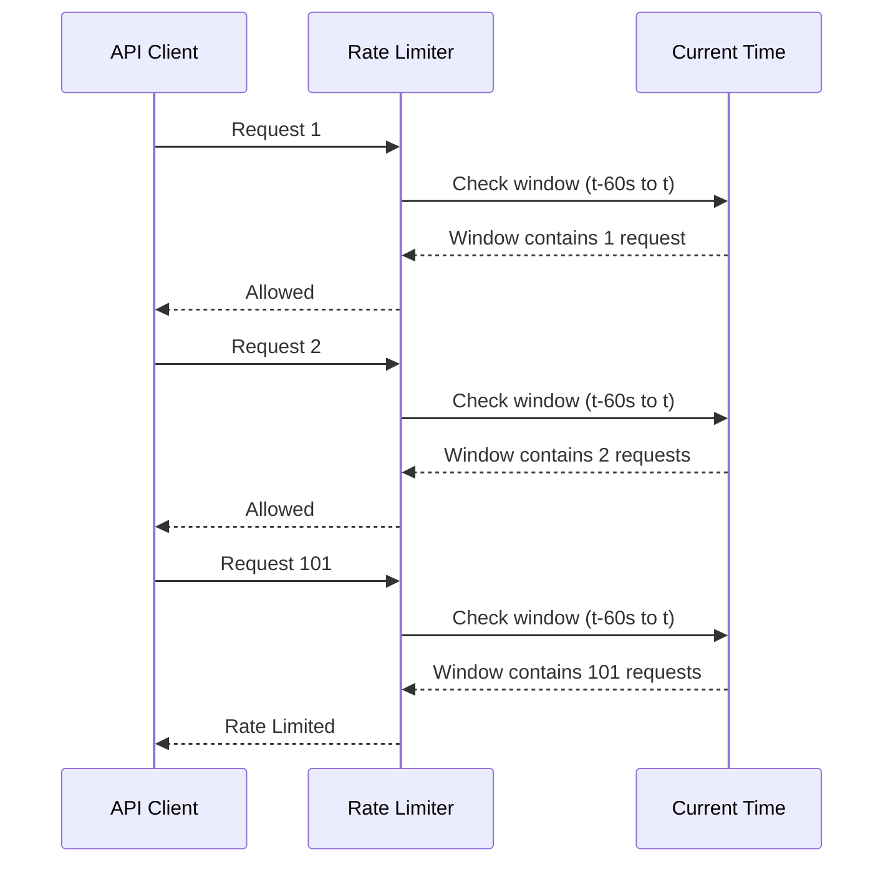
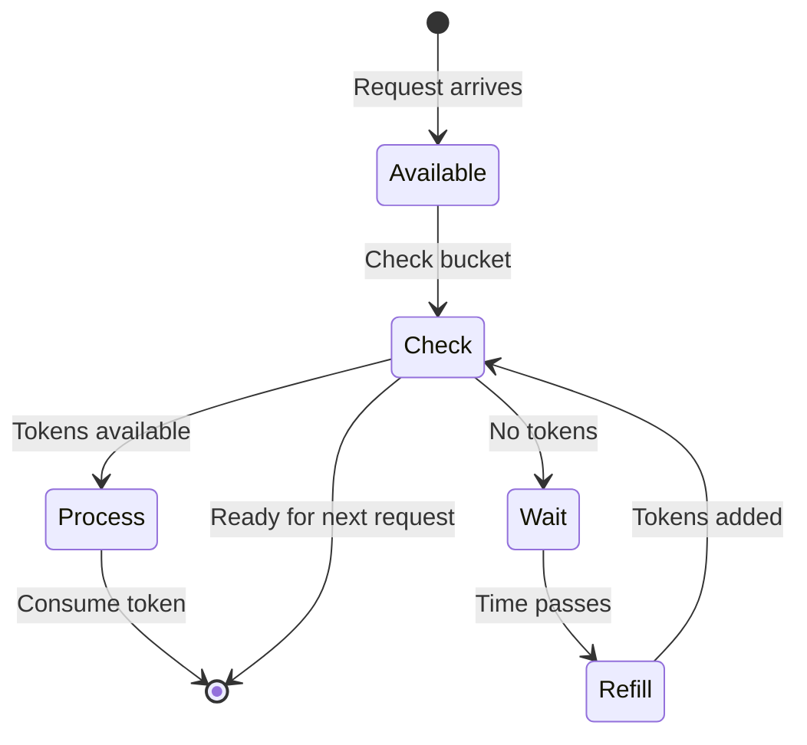

# WinKr API - Rate Limiting Guide

## Overview

The WinKr API implements a comprehensive rate limiting system to ensure fair usage, prevent abuse, and maintain system stability. This guide covers all aspects of rate limiting including limits, headers, strategies, and best practices.

## Table of Contents

1. [Rate Limiting Basics](#rate-limiting-basics)
2. [Limits by Endpoint](#limits-by-endpoint)
3. [Rate Limit Headers](#rate-limit-headers)
4. [Rate Limiting Strategies](#rate-limiting-strategies)
5. [Handling Rate Limits](#handling-rate-limits)
6. [Best Practices](#best-practices)
7. [Code Examples](#code-examples)
8. [Troubleshooting](#troubleshooting)

## Rate Limiting Basics

### What is Rate Limiting?

Rate limiting controls the number of API requests a client can make within a specific time period. This helps:

- **Prevent abuse** and protect against DDoS attacks
- **Ensure fair usage** among all API consumers
- **Maintain system stability** and performance
- **Provide predictable scaling** for infrastructure

### Rate Limiting Types

| Type | Description | Example |
|------|-------------|---------|
| **Fixed Window** | Reset at fixed intervals (hourly, daily) | 1000 requests per hour |
| **Sliding Window** | Rolling time window | 100 requests per minute |
| **Burst Limit** | Allow short bursts above average | 10 requests per second for 30 seconds |
| **Concurrent Limit** | Limit simultaneous requests | 50 concurrent connections |

### Rate Limiting Tiers

| Tier | Description | Typical Limits |
|------|-------------|---------------|
| **Free/Trial** | Development and testing | 100 requests/hour |
| **Basic** | Standard applications | 1000 requests/hour |
| **Premium** | High-volume applications | 5000 requests/hour |
| **Enterprise** | Custom agreements | Custom limits |

## Limits by Endpoint

### Authentication Endpoints

| Endpoint | Rate Limit | Window | Burst |
|----------|-------------|--------|-------|
| `POST /auth/login` | 10/minute | 5/second |
| `POST /auth/register` | 5/minute | 2/second |
| `POST /auth/refresh` | 20/minute | 10/second |
| `POST /auth/forgot-password` | 3/minute | 1/second |
| `POST /auth/reset-password` | 5/minute | 2/second |

### Profile Management

| Endpoint | Rate Limit | Window | Notes |
|----------|-------------|--------|-------|
| `GET /me/profile` | 60/minute | 1000/hour | Cached data |
| `PUT /me/profile` | 30/minute | 500/hour | Validation heavy |
| `POST /me/photos` | 10/minute | 100/hour | File upload |
| `DELETE /me/photos/{id}` | 20/minute | 500/hour | |
| `GET /users/{id}` | 100/minute | 5000/hour | Public data |

### Discovery & Matching

| Endpoint | Rate Limit | Window | Notes |
|----------|-------------|--------|-------|
| `GET /discovery/users` | 60/minute | 2000/hour | Algorithm intensive |
| `POST /discovery/swipe` | 120/minute | 5000/hour | Core feature |
| `POST /discovery/like` | 60/minute | 2000/hour | |
| `GET /discovery/matches` | 30/minute | 1000/hour | |

### Messaging

| Endpoint | Rate Limit | Window | Notes |
|----------|-------------|--------|-------|
| `GET /chat/conversations` | 30/minute | 1000/hour | |
| `POST /chat/messages` | 60/minute | 2000/hour | Per conversation |
| `GET /chat/messages/{conversationId}` | 120/minute | 5000/hour | |
| `POST /chat/typing` | 30/minute | 1000/hour | Per conversation |

### Content & Media

| Endpoint | Rate Limit | Window | Notes |
|----------|-------------|--------|-------|
| `POST /photos/upload` | 5/minute | 50/hour | File processing |
| `GET /photos/{id}/download` | 30/minute | 500/hour | Bandwidth intensive |
| `POST /ephemeral-photos` | 3/minute | 30/hour | Temporary content |
| `GET /ephemeral-photos/{id}` | 10/minute | 100/hour | View tracking |

### Payment & Subscription

| Endpoint | Rate Limit | Window | Notes |
|----------|-------------|--------|-------|
| `POST /subscribe` | 5/minute | 50/hour | Financial operations |
| `POST /payment/methods` | 10/minute | 100/hour | |
| `GET /payment/history` | 20/minute | 500/hour | |
| `POST /payment/webhook` | 1000/minute | 10000/hour | Server-to-server |

### Administrative

| Endpoint | Rate Limit | Window | Notes |
|----------|-------------|--------|-------|
| `GET /admin/users` | 20/minute | 500/hour | Admin access |
| `POST /admin/users/{id}/ban` | 5/minute | 100/hour | Sensitive operations |
| `GET /admin/analytics` | 30/minute | 1000/hour | Data intensive |
| `POST /admin/system/maintenance` | 2/minute | 20/hour | Critical operations |

## Rate Limit Headers

### Standard Headers

All API responses include rate limiting information in HTTP headers:

```http
X-RateLimit-Limit: 1000
X-RateLimit-Remaining: 999
X-RateLimit-Reset: 1640995200
X-RateLimit-Retry-After: 60
X-RateLimit-Burst-Limit: 10
X-RateLimit-Burst-Remaining: 8
```

### Header Descriptions

| Header | Description | Example |
|---------|-------------|---------|
| `X-RateLimit-Limit` | Maximum requests allowed in the window | `1000` |
| `X-RateLimit-Remaining` | Requests remaining in current window | `999` |
| `X-RateLimit-Reset` | Unix timestamp when window resets | `1640995200` |
| `X-RateLimit-Retry-After` | Seconds to wait before retrying | `60` |
| `X-RateLimit-Burst-Limit` | Burst limit for short-term requests | `10` |
| `X-RateLimit-Burst-Remaining` | Remaining burst capacity | `8` |
| `X-RateLimit-Policy` | Rate limiting policy applied | `fixed_window` |

### Advanced Headers

```http
X-RateLimit-Window-Size: 3600
X-RateLimit-Window-Type: sliding
X-RateLimit-Priority: normal
X-RateLimit-Quota-Used: 850
X-RateLimit-Quota-Remaining: 150
```

## Rate Limiting Strategies

### Fixed Window Strategy

Requests are counted in fixed time windows that reset at specific intervals:

```mermaid
gantt
    title Fixed Window Rate Limiting
    dateFormat X
    axisFormat %s
    
    section Hour 1
    Requests : 0, 1000
    section Hour 2  
    Requests : 0, 1000
    section Hour 3
    Requests : 0, 1000
```



**Implementation:**
```javascript
class FixedWindowRateLimiter {
  constructor(limit, windowMs) {
    this.limit = limit;
    this.windowMs = windowMs;
    this.requests = new Map();
  }

  isAllowed(clientId) {
    const now = Date.now();
    const windowStart = Math.floor(now / this.windowMs) * this.windowMs;
    
    if (!this.requests.has(clientId)) {
      this.requests.set(clientId, []);
    }
    
    const clientRequests = this.requests.get(clientId);
    const validRequests = clientRequests.filter(req => req >= windowStart);
    
    if (validRequests.length >= this.limit) {
      return {
        allowed: false,
        resetTime: windowStart + this.windowMs
      };
    }
    
    clientRequests.push(now);
    return { allowed: true };
  }
}
```

### Sliding Window Strategy

Requests are counted in a rolling time window:



**Implementation:**
```javascript
class SlidingWindowRateLimiter {
  constructor(limit, windowMs) {
    this.limit = limit;
    this.windowMs = windowMs;
    this.requests = new Map();
  }

  isAllowed(clientId) {
    const now = Date.now();
    const windowStart = now - this.windowMs;
    
    if (!this.requests.has(clientId)) {
      this.requests.set(clientId, []);
    }
    
    const clientRequests = this.requests.get(clientId);
    const validRequests = clientRequests.filter(req => req >= windowStart);
    
    this.requests.set(clientId, validRequests);
    
    return {
      allowed: validRequests.length < this.limit,
      remaining: Math.max(0, this.limit - validRequests.length),
      resetTime: now + this.windowMs
    };
  }
}
```

### Token Bucket Strategy

Uses a token bucket algorithm for smooth rate limiting:



**Implementation:**
```javascript
class TokenBucketRateLimiter {
  constructor(capacity, refillRate, refillInterval) {
    this.capacity = capacity;
    this.refillRate = refillRate;
    this.refillInterval = refillInterval;
    this.buckets = new Map();
    
    // Start refill timer
    setInterval(() => this.refillAll(), refillInterval);
  }

  isAllowed(clientId, tokens = 1) {
    const now = Date.now();
    
    if (!this.buckets.has(clientId)) {
      this.buckets.set(clientId, {
        tokens: this.capacity,
        lastRefill: now
      });
    }
    
    const bucket = this.buckets.get(clientId);
    
    if (bucket.tokens >= tokens) {
      bucket.tokens -= tokens;
      return { allowed: true, remaining: bucket.tokens };
    }
    
    return {
      allowed: false,
      remaining: bucket.tokens,
      retryAfter: this.refillInterval
    };
  }

  refillAll() {
    const now = Date.now();
    for (const [clientId, bucket] of this.buckets) {
      bucket.tokens = Math.min(
        this.capacity,
        bucket.tokens + this.refillRate
      );
      bucket.lastRefill = now;
    }
  }
}
```

## Handling Rate Limits

### Detecting Rate Limits

```javascript
// Axios interceptor for rate limit detection
const rateLimitInterceptor = (response) => {
  const rateLimitHeaders = {
    limit: response.headers['x-ratelimit-limit'],
    remaining: response.headers['x-ratelimit-remaining'],
    reset: response.headers['x-ratelimit-reset'],
    retryAfter: response.headers['x-ratelimit-retry-after']
  };

  // Store rate limit info for client-side tracking
  if (rateLimitHeaders.limit) {
    localStorage.setItem('rate_limit_info', JSON.stringify(rateLimitHeaders));
  }

  return response;
};

// Error handling for rate limits
const handleRateLimitError = (error) => {
  if (error.response?.status === 429) {
    const retryAfter = error.response.headers['x-ratelimit-retry-after'] || 60;
    const resetTime = error.response.headers['x-ratelimit-reset'];
    
    console.warn(`Rate limited. Retry after ${retryAfter} seconds`);
    
    // Implement exponential backoff
    return {
      shouldRetry: true,
      retryAfter: retryAfter * 1000,
      resetTime: resetTime
    };
  }
  
  return { shouldRetry: false };
};
```

### Exponential Backoff

```javascript
class ExponentialBackoff {
  constructor(maxRetries = 5, baseDelay = 1000, maxDelay = 30000) {
    this.maxRetries = maxRetries;
    this.baseDelay = baseDelay;
    this.maxDelay = maxDelay;
  }

  async executeWithRetry(requestFn, context = {}) {
    let lastError;
    
    for (let attempt = 0; attempt <= this.maxRetries; attempt++) {
      try {
        return await requestFn();
      } catch (error) {
        lastError = error;
        
        const rateLimitInfo = handleRateLimitError(error);
        if (!rateLimitInfo.shouldRetry) {
          throw error; // Not a rate limit error
        }
        
        if (attempt === this.maxRetries) {
          throw new Error(`Max retries exceeded: ${error.message}`);
        }
        
        const delay = this.calculateDelay(attempt, rateLimitInfo.retryAfter);
        console.log(`Retry attempt ${attempt + 1} after ${delay}ms`);
        
        await this.sleep(delay);
      }
    }
  }

  calculateDelay(attempt, retryAfter) {
    const exponentialDelay = this.baseDelay * Math.pow(2, attempt);
    const jitter = Math.random() * 0.1 * exponentialDelay; // Add 10% jitter
    
    return Math.min(
      Math.max(retryAfter * 1000, exponentialDelay + jitter),
      this.maxDelay
    );
  }

  sleep(ms) {
    return new Promise(resolve => setTimeout(resolve, ms));
  }
}
```

### Client-Side Rate Limiting

```javascript
class ClientRateLimiter {
  constructor() {
    this.requestHistory = new Map();
    this.rateLimitInfo = this.loadRateLimitInfo();
  }

  async makeRequest(requestFn, endpoint) {
    const clientId = this.getClientId();
    const limits = this.getEndpointLimits(endpoint);
    
    // Check client-side rate limiting first
    if (!this.isAllowedClientSide(clientId, limits)) {
      throw new Error('Client-side rate limit exceeded');
    }
    
    try {
      const response = await requestFn();
      this.updateRateLimitInfo(response);
      return response;
    } catch (error) {
      if (error.response?.status === 429) {
        this.handleRateLimitError(error.response);
      }
      throw error;
    }
  }

  isAllowedClientSide(clientId, limits) {
    const now = Date.now();
    const windowStart = now - (limits.window * 1000);
    
    if (!this.requestHistory.has(clientId)) {
      this.requestHistory.set(clientId, []);
    }
    
    const history = this.requestHistory.get(clientId);
    const recentRequests = history.filter(req => req >= windowStart);
    
    return recentRequests.length < limits.limit;
  }

  updateRateLimitInfo(response) {
    const headers = response.headers;
    if (headers['x-ratelimit-limit']) {
      this.rateLimitInfo = {
        limit: parseInt(headers['x-ratelimit-limit']),
        remaining: parseInt(headers['x-ratelimit-remaining']),
        reset: parseInt(headers['x-ratelimit-reset']),
        retryAfter: parseInt(headers['x-ratelimit-retry-after']) || null
      };
      
      localStorage.setItem('rate_limit_info', JSON.stringify(this.rateLimitInfo));
    }
  }

  getEndpointLimits(endpoint) {
    const limits = {
      '/auth/login': { limit: 10, window: 60 },
      '/discovery/users': { limit: 60, window: 60 },
      '/chat/messages': { limit: 60, window: 60 },
      '/photos/upload': { limit: 5, window: 60 }
    };
    
    return limits[endpoint] || { limit: 100, window: 60 };
  }

  getClientId() {
    // Generate unique client identifier
    let clientId = localStorage.getItem('client_id');
    if (!clientId) {
      clientId = 'client_' + Math.random().toString(36).substr(2, 9);
      localStorage.setItem('client_id', clientId);
    }
    return clientId;
  }
}
```

## Best Practices

### Design Principles

1. **Graceful Degradation**
   - Implement fallback behavior when rate limited
   - Queue important requests for retry
   - Provide user feedback about limits

2. **Efficient API Usage**
   - Use caching to reduce redundant requests
   - Batch operations when possible
   - Optimize request payloads

3. **User Experience**
   - Show remaining quota to users
   - Provide clear error messages
   - Implement progressive loading

4. **Monitoring & Alerting**
   - Track rate limit violations
   - Monitor API performance
   - Set up alerts for unusual patterns

### Implementation Guidelines

#### Request Batching

```javascript
// Batch multiple operations
const batchOperations = async (operations) => {
  const batchSize = 10;
  const batches = [];
  
  for (let i = 0; i < operations.length; i += batchSize) {
    batches.push(operations.slice(i, i + batchSize));
  }
  
  const results = [];
  for (const batch of batches) {
    try {
      const result = await apiClient.post('/batch', { operations: batch });
      results.push(...result.data.results);
    } catch (error) {
      if (error.response?.status === 429) {
        await waitForRateLimitReset();
        continue; // Retry this batch
      }
      throw error;
    }
  }
  
  return results;
};
```

#### Intelligent Caching

```javascript
class SmartCache {
  constructor(ttl = 300000) { // 5 minutes default
    this.cache = new Map();
    this.ttl = ttl;
  }

  get(key) {
    const item = this.cache.get(key);
    if (!item || Date.now() > item.expiry) {
      return null;
    }
    return item.data;
  }

  set(key, data, customTtl = null) {
    const expiry = Date.now() + (customTtl || this.ttl);
    this.cache.set(key, { data, expiry });
  }

  // Cache rate limit responses
  getCachedRateLimit(endpoint) {
    return this.get(`rate_limit_${endpoint}`);
  }

  setCachedRateLimit(endpoint, limitInfo) {
    const ttl = limitInfo.resetTime - Date.now();
    this.set(`rate_limit_${endpoint}`, limitInfo, ttl);
  }
}
```

#### Request Prioritization

```javascript
class PriorityRequestQueue {
  constructor() {
    this.queue = [];
    this.processing = false;
  }

  add(request, priority = 'normal') {
    this.queue.push({
      request,
      priority,
      timestamp: Date.now()
    });
    
    this.queue.sort((a, b) => {
      const priorityOrder = { 'critical': 0, 'high': 1, 'normal': 2, 'low': 3 };
      return priorityOrder[a.priority] - priorityOrder[b.priority];
    });
    
    this.processQueue();
  }

  async processQueue() {
    if (this.processing || this.queue.length === 0) return;
    
    this.processing = true;
    
    while (this.queue.length > 0) {
      const item = this.queue.shift();
      
      try {
        await item.request();
      } catch (error) {
        if (error.response?.status === 429) {
          // Put back in queue with delay
          setTimeout(() => {
            this.queue.unshift(item);
            this.processQueue();
          }, error.response.headers['x-ratelimit-retry-after'] * 1000);
          break;
        }
      }
    }
    
    this.processing = false;
  }
}
```

## Code Examples

### Complete Rate Limiting Client

```javascript
class WinKrAPIClient {
  constructor(apiKey, baseURL = 'https://api.winkr.com/v1') {
    this.apiKey = apiKey;
    this.baseURL = baseURL;
    this.rateLimiter = new ClientRateLimiter();
    this.cache = new SmartCache();
    this.backoff = new ExponentialBackoff();
  }

  async request(method, endpoint, data = null, options = {}) {
    const url = `${this.baseURL}${endpoint}`;
    const cacheKey = this.getCacheKey(method, endpoint, data);
    
    // Check cache first for GET requests
    if (method === 'GET') {
      const cached = this.cache.get(cacheKey);
      if (cached) return cached;
    }

    const requestFn = () => this.makeRequest(method, url, data, options);
    
    try {
      const response = await this.rateLimiter.makeRequest(requestFn, endpoint);
      
      // Cache successful GET responses
      if (method === 'GET' && response.status === 200) {
        this.cache.set(cacheKey, response.data);
      }
      
      return response.data;
    } catch (error) {
      console.error(`API request failed: ${method} ${endpoint}`, error);
      throw error;
    }
  }

  async makeRequest(method, url, data, options) {
    const config = {
      method,
      url,
      headers: {
        'Authorization': `Bearer ${this.apiKey}`,
        'Content-Type': 'application/json',
        'X-Client-Version': '1.0.0',
        ...options.headers
      },
      ...options
    };

    if (data) {
      config.data = data;
    }

    return this.backoff.executeWithRetry(() => axios(config));
  }

  getCacheKey(method, endpoint, data) {
    if (method !== 'GET') return null;
    return `${endpoint}:${JSON.stringify(data)}`;
  }

  // High-level methods with built-in rate limiting
  async getProfile(userId) {
    return this.request('GET', `/users/${userId}`);
  }

  async updateProfile(userId, profileData) {
    return this.request('PUT', `/users/${userId}`, profileData);
  }

  async sendMessage(conversationId, message) {
    return this.request('POST', `/chat/conversations/${conversationId}/messages`, {
      content: message,
      type: 'text'
    });
  }

  async getDiscoveryUsers(filters = {}) {
    return this.request('GET', '/discovery/users', null, {
      params: filters
    });
  }
}
```

### Rate Limit Monitoring Dashboard

```javascript
class RateLimitMonitor {
  constructor() {
    this.metrics = {
      totalRequests: 0,
      rateLimitedRequests: 0,
      successfulRequests: 0,
      errors: {},
      endpoints: {}
    };
    
    this.startMonitoring();
  }

  startMonitoring() {
    // Track request metrics
    setInterval(() => {
      this.reportMetrics();
    }, 60000); // Report every minute
  }

  trackRequest(endpoint, status, responseTime) {
    this.metrics.totalRequests++;
    
    if (!this.metrics.endpoints[endpoint]) {
      this.metrics.endpoints[endpoint] = {
        requests: 0,
        rateLimits: 0,
        avgResponseTime: 0
      };
    }
    
    const endpointMetrics = this.metrics.endpoints[endpoint];
    endpointMetrics.requests++;
    
    if (status === 429) {
      this.metrics.rateLimitedRequests++;
      endpointMetrics.rateLimits++;
    } else if (status >= 200 && status < 300) {
      this.metrics.successfulRequests++;
    }
    
    // Update average response time
    endpointMetrics.avgResponseTime = 
      (endpointMetrics.avgResponseTime + responseTime) / 2;
  }

  reportMetrics() {
    const report = {
      timestamp: new Date().toISOString(),
      totalRequests: this.metrics.totalRequests,
      rateLimitedRequests: this.metrics.rateLimitedRequests,
      successRate: (this.metrics.successfulRequests / this.metrics.totalRequests * 100).toFixed(2) + '%',
      topEndpoints: this.getTopEndpoints(),
      recommendations: this.getRecommendations()
    };
    
    console.log('Rate Limit Metrics:', report);
    
    // Send to monitoring service
    this.sendToMonitoring(report);
  }

  getTopEndpoints() {
    return Object.entries(this.metrics.endpoints)
      .sort(([,a], [,b]) => b.requests - a.requests)
      .slice(0, 5)
      .map(([endpoint, metrics]) => ({
        endpoint,
        requests: metrics.requests,
        rateLimitRate: (metrics.rateLimits / metrics.requests * 100).toFixed(2) + '%'
      }));
  }

  getRecommendations() {
    const recommendations = [];
    
    if (this.metrics.rateLimitedRequests / this.metrics.totalRequests > 0.1) {
      recommendations.push({
        type: 'high_rate_limit',
        message: 'Consider implementing better caching or request batching',
        priority: 'high'
      });
    }
    
    return recommendations;
  }

  sendToMonitoring(report) {
    // Send to your monitoring service
    fetch('/api/monitoring/rate-limits', {
      method: 'POST',
      headers: { 'Content-Type': 'application/json' },
      body: JSON.stringify(report)
    }).catch(console.error);
  }
}
```

## Troubleshooting

### Common Issues

#### Unexpected Rate Limits

**Symptoms:**
- Getting rate limited on low-traffic endpoints
- Rate limits seem inconsistent

**Solutions:**
1. Check if multiple clients are sharing the same API key
2. Verify client-side rate limiting is working correctly
3. Check for accidental request loops
4. Review server-side rate limit configuration

#### Rate Limit Headers Missing

**Symptoms:**
- No rate limit headers in responses
- Unable to track remaining quota

**Solutions:**
1. Verify API version supports rate limiting headers
2. Check for proxy servers stripping headers
3. Ensure CORS configuration allows custom headers
4. Contact support if headers should be present

#### Reset Time Issues

**Symptoms:**
- Reset time seems incorrect
- Requests still blocked after reset time

**Solutions:**
1. Check time zone synchronization
2. Verify server and client clock sync
3. Use server time from response headers
4. Implement clock skew compensation

### Debug Tools

#### Rate Limit Analyzer

```javascript
class RateLimitAnalyzer {
  analyzeRequestHistory(history) {
    const windows = this.groupByTimeWindow(history, 60); // 1-minute windows
    
    return {
      peakRequests: Math.max(...windows.map(w => w.length)),
      averageRequests: windows.reduce((sum, w) => sum + w.length, 0) / windows.length,
      violations: windows.filter(w => w.length > 100).length, // Assuming 100 req/min limit
      patterns: this.detectPatterns(windows),
      recommendations: this.generateRecommendations(windows)
    };
  }

  detectPatterns(windows) {
    const patterns = [];
    
    // Detect burst patterns
    const bursts = windows.filter(w => w.length > 80);
    if (bursts.length > 0) {
      patterns.push({
        type: 'burst',
        frequency: bursts.length / windows.length,
        severity: bursts.length > windows.length * 0.5 ? 'high' : 'medium'
      });
    }
    
    return patterns;
  }

  generateRecommendations(windows) {
    const recommendations = [];
    const avgRequests = windows.reduce((sum, w) => sum + w.length, 0) / windows.length;
    
    if (avgRequests > 80) {
      recommendations.push({
        type: 'reduce_frequency',
        message: 'Consider reducing request frequency or implementing caching',
        impact: 'high'
      });
    }
    
    return recommendations;
  }
}
```

### Performance Monitoring

```javascript
// Monitor rate limiting impact on performance
const performanceMonitor = {
  trackRequest: async (requestFn) => {
    const startTime = performance.now();
    let rateLimited = false;
    
    try {
      const result = await requestFn();
      return result;
    } catch (error) {
      if (error.response?.status === 429) {
        rateLimited = true;
      }
      throw error;
    } finally {
      const endTime = performance.now();
      const duration = endTime - startTime;
      
      // Send to analytics
      analytics.track('api_request_performance', {
        duration,
        rateLimited,
        userAgent: navigator.userAgent,
        timestamp: Date.now()
      });
    }
  }
};
```

---

For additional rate limiting support or questions, contact our development team at api-support@winkr.com.