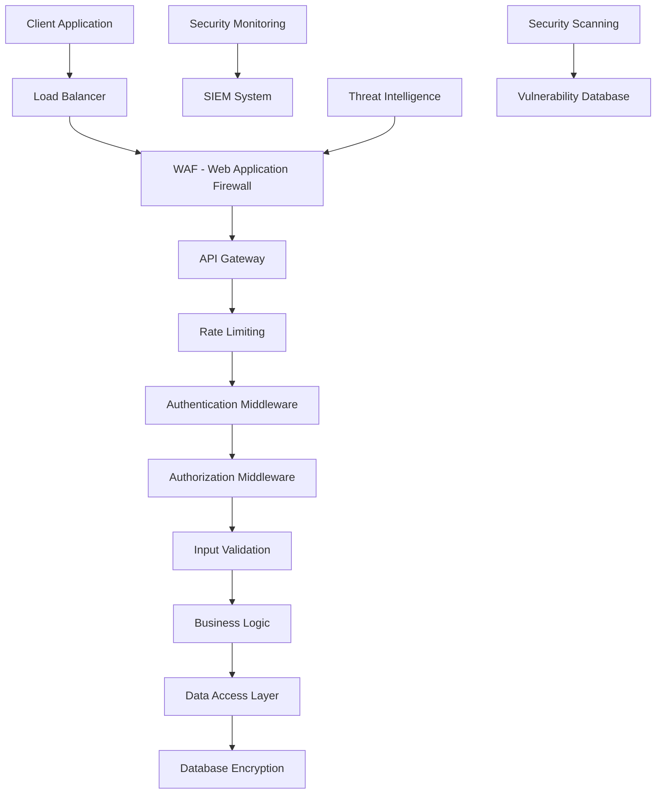

# WinKr API - Security Documentation

## Overview

The WinKr API implements comprehensive security measures to protect user data, prevent unauthorized access, and ensure the integrity of the platform. This guide covers all security aspects including authentication, authorization, data protection, and best practices for secure integration.

## Table of Contents

1. [Security Architecture](#security-architecture)
2. [Authentication Security](#authentication-security)
3. [Authorization & Access Control](#authorization--access-control)
4. [Data Protection](#data-protection)
5. [API Security Features](#api-security-features)
6. [Rate Limiting & DDoS Protection](#rate-limiting--ddos-protection)
7. [Input Validation & Sanitization](#input-validation--sanitization)
8. [Secure Communication](#secure-communication)
9. [Security Headers](#security-headers)
10. [Monitoring & Logging](#monitoring--logging)
11. [Security Best Practices](#security-best-practices)
12. [Vulnerability Management](#vulnerability-management)
13. [Compliance & Standards](#compliance--standards)
14. [Security Tools & Resources](#security-tools--resources)

## Security Architecture

### Defense in Depth



### Security Layers

| Layer | Protection | Implementation |
|-------|------------|----------------|
| **Network** | DDoS protection, Network segmentation | Cloudflare, AWS Shield |
| **Application** | WAF, Input validation, Rate limiting | OWASP rules, Custom middleware |
| **Authentication** | JWT, MFA, Device fingerprinting | OAuth 2.0, TOTP, Device tracking |
| **Authorization** | RBAC, Scope-based access | Role-based permissions |
| **Data** | Encryption at rest and in transit | AES-256, TLS 1.3 |
| **Monitoring** | Real-time threat detection | SIEM, Anomaly detection |

## Authentication Security

### Multi-Factor Authentication (MFA)

#### Supported MFA Methods

```javascript
// MFA enrollment flow
class MFAEnrollment {
  async enrollMFA(userId, method) {
    const enrollmentData = {
      user_id: userId,
      method: method, // 'totp', 'sms', 'email', 'push'
      device_info: this.getDeviceInfo()
    };

    switch (method) {
      case 'totp':
        return this.enrollTOTP(enrollmentData);
      case 'sms':
        return this.enrollSMS(enrollmentData);
      case 'push':
        return this.enrollPush(enrollmentData);
      default:
        throw new Error('Unsupported MFA method');
    }
  }

  async enrollTOTP(enrollmentData) {
    // Generate TOTP secret
    const response = await fetch('/api/v1/auth/mfa/totp/enroll', {
      method: 'POST',
      headers: {
        'Authorization': `Bearer ${this.getAuthToken()}`,
        'Content-Type': 'application/json'
      },
      body: JSON.stringify(enrollmentData)
    });

    const data = await response.json();
    
    // Display QR code for user to scan
    this.displayTOTPQRCode(data.qr_code, data.secret);
    
    return data;
  }

  async verifyTOTP(userId, code) {
    const response = await fetch('/api/v1/auth/mfa/totp/verify', {
      method: 'POST',
      headers: {
        'Authorization': `Bearer ${this.getAuthToken()}`,
        'Content-Type': 'application/json'
      },
      body: JSON.stringify({
        user_id: userId,
        code: code
      })
    });

    return response.json();
  }

  displayTOTPQRCode(qrCode, secret) {
    // Display QR code for authenticator app
    const qrContainer = document.getElementById('mfa-qr');
    qrContainer.innerHTML = ``;
    
    // Show backup codes
    this.showBackupCodes(secret);
  }
}
```

#### Device Fingerprinting

```javascript
// Device fingerprinting for enhanced security
class DeviceFingerprint {
  constructor() {
    this.fingerprint = null;
  }

  async generateFingerprint() {
    const components = {
      // Browser information
      userAgent: navigator.userAgent,
      language: navigator.language,
      platform: navigator.platform,
      
      // Screen information
      screenResolution: `${screen.width}x${screen.height}`,
      colorDepth: screen.colorDepth,
      pixelRatio: window.devicePixelRatio,
      
      // Hardware information
      hardwareConcurrency: navigator.hardwareConcurrency,
      deviceMemory: navigator.deviceMemory,
      
      // Timezone
      timezone: Intl.DateTimeFormat().resolvedOptions().timeZone,
      
      // Canvas fingerprint
      canvas: await this.getCanvasFingerprint(),
      
      // WebGL fingerprint
      webgl: this.getWebGLFingerprint()
    };

    this.fingerprint = await this.hashComponents(components);
    return this.fingerprint;
  }

  async getCanvasFingerprint() {
    const canvas = document.createElement('canvas');
    const ctx = canvas.getContext('2d');
    
    // Draw text with specific styling
    ctx.textBaseline = 'top';
    ctx.font = '14px Arial';
    ctx.fillStyle = '#f60';
    ctx.fillRect(125, 1, 62, 20);
    ctx.fillStyle = '#069';
    ctx.fillText('WinKr Security', 2, 15);
    ctx.fillStyle = 'rgba(102, 204, 0, 0.7)';
    ctx.fillText('WinKr Security', 4, 17);
    
    return canvas.toDataURL();
  }

  getWebGLFingerprint() {
    const canvas = document.createElement('canvas');
    const gl = canvas.getContext('webgl');
    
    if (!gl) return null;
    
    const debugInfo = gl.getExtension('WEBGL_debug_renderer_info');
    return {
      vendor: gl.getParameter(debugInfo.UNMASKED_VENDOR_WEBGL),
      renderer: gl.getParameter(debugInfo.UNMASKED_RENDERER_WEBGL)
    };
  }

  async hashComponents(components) {
    const componentString = JSON.stringify(components, Object.keys(components).sort());
    const encoder = new TextEncoder();
    const data = encoder.encode(componentString);
    
    const hashBuffer = await crypto.subtle.digest('SHA-256', data);
    const hashArray = Array.from(new Uint8Array(hashBuffer));
    
    return hashArray.map(b => b.toString(16).padStart(2, '0')).join('');
  }

  async registerDevice(userId) {
    const fingerprint = await this.generateFingerprint();
    
    const response = await fetch('/api/v1/auth/devices/register', {
      method: 'POST',
      headers: {
        'Authorization': `Bearer ${this.getAuthToken()}`,
        'Content-Type': 'application/json'
      },
      body: JSON.stringify({
        user_id: userId,
        fingerprint: fingerprint,
        device_info: {
          name: this.getDeviceName(),
          type: this.getDeviceType(),
          trusted: false
        }
      })
    });

    return response.json();
  }
}
```

### Session Security

#### Secure Session Management

```javascript
class SecureSessionManager {
  constructor() {
    this.sessionTimeout = 30 * 60 * 1000; // 30 minutes
    this.refreshThreshold = 5 * 60 * 1000; // 5 minutes before expiry
    this.activityTimer = null;
  }

  startSession(token) {
    this.token = token;
    this.lastActivity = Date.now();
    this.scheduleRefresh();
    this.startActivityMonitoring();
  }

  scheduleRefresh() {
    const tokenData = this.parseJWT(this.token);
    const expiryTime = tokenData.exp * 1000;
    const refreshTime = expiryTime - this.refreshThreshold;
    
    const delay = refreshTime - Date.now();
    
    if (delay > 0) {
      setTimeout(() => this.refreshToken(), delay);
    }
  }

  startActivityMonitoring() {
    // Monitor user activity
    const events = ['mousedown', 'mousemove', 'keypress', 'scroll', 'touchstart'];
    
    events.forEach(event => {
      document.addEventListener(event, () => this.recordActivity(), true);
    });

    // Check for inactivity
    setInterval(() => this.checkInactivity(), 60000); // Check every minute
  }

  recordActivity() {
    this.lastActivity = Date.now();
    
    // Reset inactivity timer
    if (this.activityTimer) {
      clearTimeout(this.activityTimer);
    }
    
    this.activityTimer = setTimeout(() => {
      this.handleInactivity();
    }, this.sessionTimeout);
  }

  checkInactivity() {
    const inactiveTime = Date.now() - this.lastActivity;
    
    if (inactiveTime > this.sessionTimeout) {
      this.handleInactivity();
    }
  }

  handleInactivity() {
    console.log('User inactive, ending session');
    this.endSession();
    
    // Redirect to login
    window.location.href = '/login?reason=session_expired';
  }

  async refreshToken() {
    try {
      const response = await fetch('/api/v1/auth/refresh', {
        method: 'POST',
        headers: {
          'Authorization': `Bearer ${this.token}`,
          'Content-Type': 'application/json'
        },
        body: JSON.stringify({
          device_fingerprint: await this.getDeviceFingerprint()
        })
      });

      if (response.ok) {
        const data = await response.json();
        this.token = data.token;
        this.scheduleRefresh();
      } else {
        throw new Error('Token refresh failed');
      }
    } catch (error) {
      console.error('Session refresh failed:', error);
      this.endSession();
    }
  }

  endSession() {
    // Clear timers
    if (this.activityTimer) {
      clearTimeout(this.activityTimer);
    }

    // Notify server
    fetch('/api/v1/auth/logout', {
      method: 'POST',
      headers: {
        'Authorization': `Bearer ${this.token}`
      }
    });

    // Clear local storage
    localStorage.removeItem('winkr_token');
    localStorage.removeItem('winkr_refresh_token');
    
    this.token = null;
  }

  parseJWT(token) {
    const base64Url = token.split('.')[1];
    const base64 = base64Url.replace(/-/g, '+').replace(/_/g, '/');
    const jsonPayload = decodeURIComponent(
      atob(base64)
        .split('')
        .map(c => '%' + ('00' + c.charCodeAt(0).toString(16)).slice(-2))
        .join('')
    );
    
    return JSON.parse(jsonPayload);
  }
}
```

## Authorization & Access Control

### Role-Based Access Control (RBAC)

#### Permission System

```javascript
// RBAC implementation
class RBACSystem {
  constructor() {
    this.roles = {
      'user': [
        'profile:read',
        'profile:update',
        'photo:read',
        'photo:create',
        'photo:update',
        'photo:delete',
        'discovery:read',
        'match:read',
        'match:create',
        'message:read',
        'message:create',
        'message:update'
      ],
      'premium': [
        ...this.roles.user,
        'ephemeral_photo:read',
        'ephemeral_photo:create',
        'ephemeral_photo:delete',
        'discovery:advanced_filters',
        'profile:visibility_control'
      ],
      'moderator': [
        ...this.roles.premium,
        'moderation:read',
        'moderation:update',
        'user:block',
        'user:report',
        'content:review'
      ],
      'admin': [
        ...this.roles.moderator,
        'admin:read',
        'admin:update',
        'admin:create',
        'admin:delete',
        'system:read',
        'system:update',
        'analytics:read',
        'user:manage'
      ]
    };
  }

  hasPermission(userRole, permission) {
    const userPermissions = this.roles[userRole] || [];
    return userPermissions.includes(permission);
  }

  checkResourceOwnership(userId, resource) {
    // Check if user owns the resource
    return resource.user_id === userId || resource.owner_id === userId;
  }

  async authorizeRequest(userId, resource, action, context = {}) {
    const userRole = await this.getUserRole(userId);
    const permission = `${resource}:${action}`;
    
    // Check basic permission
    if (!this.hasPermission(userRole, permission)) {
      return {
        authorized: false,
        reason: 'Insufficient permissions',
        required: permission,
        userRole: userRole
      };
    }

    // Check resource ownership for user-specific resources
    if (this.isUserResource(resource)) {
      const resourceData = await this.getResource(resource, context.resourceId);
      if (!this.checkResourceOwnership(userId, resourceData)) {
        return {
          authorized: false,
          reason: 'Resource access denied',
          details: 'User does not own this resource'
        };
      }
    }

    // Check additional constraints
    const constraintCheck = await this.checkConstraints(userId, resource, action, context);
    if (!constraintCheck.passed) {
      return {
        authorized: false,
        reason: 'Constraint violation',
        details: constraintCheck.reason
      };
    }

    return {
      authorized: true,
      userRole: userRole,
      permissions: this.roles[userRole]
    };
  }

  isUserResource(resource) {
    const userResources = ['profile', 'photo', 'message', 'match'];
    return userResources.includes(resource);
  }

  async checkConstraints(userId, resource, action, context) {
    // Implement business logic constraints
    switch (resource) {
      case 'message':
        return this.checkMessageConstraints(userId, action, context);
      case 'photo':
        return this.checkPhotoConstraints(userId, action, context);
      case 'profile':
        return this.checkProfileConstraints(userId, action, context);
      default:
        return { passed: true };
    }
  }

  async checkMessageConstraints(userId, action, context) {
    if (action === 'create') {
      // Check if users are matched
      const isMatched = await this.checkUsersMatched(userId, context.recipientId);
      if (!isMatched) {
        return {
          passed: false,
          reason: 'Users must be matched to send messages'
        };
      }
    }
    
    return { passed: true };
  }

  async checkPhotoConstraints(userId, action, context) {
    if (action === 'create') {
      // Check photo count limits
      const photoCount = await this.getUserPhotoCount(userId);
      const maxPhotos = await this.getMaxPhotoLimit(userId);
      
      if (photoCount >= maxPhotos) {
        return {
          passed: false,
          reason: `Maximum photo limit (${maxPhotos}) reached`
        };
      }
    }
    
    return { passed: true };
  }
}
```

### Scope-Based Access Control

```javascript
// OAuth 2.0 scope implementation
class ScopeManager {
  constructor() {
    this.scopes = {
      'read_profile': {
        description: 'Read user profile information',
        permissions: ['profile:read'],
        required: false
      },
      'write_profile': {
        description: 'Update user profile',
        permissions: ['profile:update'],
        required: false
      },
      'read_photos': {
        description: 'Access user photos',
        permissions: ['photo:read'],
        required: false
      },
      'write_photos': {
        description: 'Upload and manage photos',
        permissions: ['photo:create', 'photo:update', 'photo:delete'],
        required: false
      },
      'read_messages': {
        description: 'Read user messages',
        permissions: ['message:read'],
        required: false
      },
      'write_messages': {
        description: 'Send messages',
        permissions: ['message:create'],
        required: false
      },
      'discovery': {
        description: 'Access discovery features',
        permissions: ['discovery:read'],
        required: false
      },
      'ephemeral_photos': {
        description: 'Access ephemeral photo features',
        permissions: ['ephemeral_photo:read', 'ephemeral_photo:create', 'ephemeral_photo:delete'],
        required: false
      },
      'offline_access': {
        description: 'Maintain access when user is not actively using the application',
        permissions: ['refresh_token'],
        required: false
      }
    };
  }

  validateScopes(requestedScopes) {
    const validScopes = [];
    const invalidScopes = [];
    
    requestedScopes.forEach(scope => {
      if (this.scopes[scope]) {
        validScopes.push(scope);
      } else {
        invalidScopes.push(scope);
      }
    });
    
    return {
      valid: validScopes,
      invalid: invalidScopes,
      allValid: invalidScopes.length === 0
    };
  }

  getPermissionsFromScopes(scopes) {
    const permissions = new Set();
    
    scopes.forEach(scope => {
      const scopeData = this.scopes[scope];
      if (scopeData) {
        scopeData.permissions.forEach(permission => permissions.add(permission));
      }
    });
    
    return Array.from(permissions);
  }

  checkScopePermission(scopes, requiredPermission) {
    const permissions = this.getPermissionsFromScopes(scopes);
    return permissions.includes(requiredPermission);
  }

  async authorizeWithScopes(scopes, resource, action, context = {}) {
    const requiredPermission = `${resource}:${action}`;
    
    if (!this.checkScopePermission(scopes, requiredPermission)) {
      return {
        authorized: false,
        reason: 'Insufficient scope permissions',
        required: requiredPermission,
        scopes: scopes
      };
    }
    
    return {
      authorized: true,
      scopes: scopes,
      permissions: this.getPermissionsFromScopes(scopes)
    };
  }
}
```

## Data Protection

### Encryption at Rest

```javascript
// Client-side encryption for sensitive data
class ClientSideEncryption {
  constructor() {
    this.algorithm = 'AES-GCM';
    this.keyLength = 256;
  }

  async generateKey() {
    return await window.crypto.subtle.generateKey(
      {
        name: this.algorithm,
        length: this.keyLength
      },
      true,
      ['encrypt', 'decrypt']
    );
  }

  async encryptData(data, key) {
    try {
      // Convert data to bytes
      const encoder = new TextEncoder();
      const dataBytes = encoder.encode(JSON.stringify(data));
      
      // Generate random IV
      const iv = window.crypto.getRandomValues(new Uint8Array(12));
      
      // Encrypt data
      const encryptedData = await window.crypto.subtle.encrypt(
        {
          name: this.algorithm,
          iv: iv
        },
        key,
        dataBytes
      );
      
      // Combine IV and encrypted data
      const combined = new Uint8Array(iv.length + encryptedData.byteLength);
      combined.set(iv);
      combined.set(new Uint8Array(encryptedData), iv.length);
      
      // Return base64 encoded result
      return btoa(String.fromCharCode(...combined));
    } catch (error) {
      throw new Error(`Encryption failed: ${error.message}`);
    }
  }

  async decryptData(encryptedData, key) {
    try {
      // Decode base64
      const combined = new Uint8Array(
        atob(encryptedData).split('').map(char => char.charCodeAt(0))
      );
      
      // Extract IV and encrypted data
      const iv = combined.slice(0, 12);
      const data = combined.slice(12);
      
      // Decrypt data
      const decryptedData = await window.crypto.subtle.decrypt(
        {
          name: this.algorithm,
          iv: iv
        },
        key,
        data
      );
      
      // Convert back to original format
      const decoder = new TextDecoder();
      const jsonString = decoder.decode(decryptedData);
      
      return JSON.parse(jsonString);
    } catch (error) {
      throw new Error(`Decryption failed: ${error.message}`);
    }
  }

  async encryptFile(file, key) {
    try {
      const arrayBuffer = await file.arrayBuffer();
      const iv = window.crypto.getRandomValues(new Uint8Array(12));
      
      const encryptedData = await window.crypto.subtle.encrypt(
        {
          name: this.algorithm,
          iv: iv
        },
        key,
        arrayBuffer
      );
      
      // Create encrypted file blob
      const combined = new Uint8Array(iv.length + encryptedData.byteLength);
      combined.set(iv);
      combined.set(new Uint8Array(encryptedData), iv.length);
      
      return new Blob([combined], { type: 'application/octet-stream' });
    } catch (error) {
      throw new Error(`File encryption failed: ${error.message}`);
    }
  }

  async decryptFile(encryptedFile, key) {
    try {
      const arrayBuffer = await encryptedFile.arrayBuffer();
      const combined = new Uint8Array(arrayBuffer);
      
      const iv = combined.slice(0, 12);
      const data = combined.slice(12);
      
      const decryptedData = await window.crypto.subtle.decrypt(
        {
          name: this.algorithm,
          iv: iv
        },
        key,
        data
      );
      
      return new Blob([decryptedData], { type: 'application/octet-stream' });
    } catch (error) {
      throw new Error(`File decryption failed: ${error.message}`);
    }
  }
}
```

### Data Masking & Anonymization

```javascript
// Data masking for sensitive information
class DataMasking {
  constructor() {
    this.maskingRules = {
      email: this.maskEmail,
      phone: this.maskPhone,
      credit_card: this.maskCreditCard,
      ssn: this.maskSSN,
      location: this.maskLocation
    };
  }

  maskData(data, rules = {}) {
    const maskedData = { ...data };
    
    Object.keys(rules).forEach(field => {
      if (maskedData[field]) {
        const rule = rules[field];
        if (typeof rule === 'string' && this.maskingRules[rule]) {
          maskedData[field] = this.maskingRules[rule](maskedData[field]);
        } else if (typeof rule === 'function') {
          maskedData[field] = rule(maskedData[field]);
        }
      }
    });
    
    return maskedData;
  }

  maskEmail(email) {
    if (!email) return email;
    
    const [username, domain] = email.split('@');
    const maskedUsername = username.slice(0, 2) + '*'.repeat(username.length - 2);
    
    return `${maskedUsername}@${domain}`;
  }

  maskPhone(phone) {
    if (!phone) return phone;
    
    const cleaned = phone.replace(/\D/g, '');
    const lastFour = cleaned.slice(-4);
    
    return `***-***-${lastFour}`;
  }

  maskCreditCard(cardNumber) {
    if (!cardNumber) return cardNumber;
    
    const cleaned = cardNumber.replace(/\D/g, '');
    const lastFour = cleaned.slice(-4);
    
    return `****-****-****-${lastFour}`;
  }

  maskSSN(ssn) {
    if (!ssn) return ssn;
    
    const cleaned = ssn.replace(/\D/g, '');
    if (cleaned.length !== 9) return ssn;
    
    return `***-**-${cleaned.slice(-4)}`;
  }

  maskLocation(location) {
    if (!location) return location;
    
    // Mask precise coordinates, keep general area
    if (location.latitude && location.longitude) {
      return {
        ...location,
        latitude: Math.round(location.latitude * 10) / 10,
        longitude: Math.round(location.longitude * 10) / 10,
        precision: 'approximate'
      };
    }
    
    return location;
  }

  anonymizeUserData(userData) {
    return {
      ...userData,
      email: this.maskEmail(userData.email),
      phone: this.maskPhone(userData.phone),
      real_name: null, // Remove real name
      exact_location: this.maskLocation(userData.location),
      device_id: this.generateAnonymousId(),
      ip_address: this.hashIP(userData.ip_address)
    };
  }

  generateAnonymousId() {
    return 'anon_' + Math.random().toString(36).substr(2, 9);
  }

  async hashIP(ipAddress) {
    if (!ipAddress) return null;
    
    const encoder = new TextEncoder();
    const data = encoder.encode(ipAddress);
    const hashBuffer = await crypto.subtle.digest('SHA-256', data);
    const hashArray = Array.from(new Uint8Array(hashBuffer));
    
    return hashArray.map(b => b.toString(16).padStart(2, '0')).join('');
  }
}
```

## API Security Features

### Request Signing

```javascript
// HMAC request signing for API security
class RequestSigner {
  constructor(apiSecret) {
    this.apiSecret = apiSecret;
    this.algorithm = 'HMAC';
    this.hash = 'SHA-256';
  }

  async signRequest(method, url, headers = {}, body = null, timestamp = null) {
    const timestamp = timestamp || Math.floor(Date.now() / 1000);
    
    // Create canonical request
    const canonicalRequest = this.createCanonicalRequest(method, url, headers, body, timestamp);
    
    // Create string to sign
    const stringToSign = this.createStringToSign(timestamp, canonicalRequest);
    
    // Generate signature
    const signature = await this.generateSignature(stringToSign);
    
    return {
      timestamp,
      signature,
      canonicalRequest,
      stringToSign
    };
  }

  createCanonicalRequest(method, url, headers, body, timestamp) {
    // Canonical URI
    const parsedUrl = new URL(url);
    const canonicalUri = parsedUrl.pathname;
    
    // Canonical query string
    const canonicalQuery = this.createCanonicalQueryString(parsedUrl.searchParams);
    
    // Canonical headers
    const canonicalHeaders = this.createCanonicalHeaders(headers);
    
    // Signed headers
    const signedHeaders = this.createSignedHeaders(headers);
    
    // Payload hash
    const payloadHash = this.hashPayload(body);
    
    return [
      method.toUpperCase(),
      canonicalUri,
      canonicalQuery,
      canonicalHeaders,
      signedHeaders,
      payloadHash
    ].join('\n');
  }

  createCanonicalQueryString(searchParams) {
    const params = [];
    
    for (const [key, value] of searchParams) {
      params.push(`${this.encodeURIComponent(key)}=${this.encodeURIComponent(value)}`);
    }
    
    return params.sort().join('&');
  }

  createCanonicalHeaders(headers) {
    const canonicalHeaders = [];
    
    Object.keys(headers)
      .sort()
      .forEach(key => {
        const value = headers[key];
        canonicalHeaders.push(`${key.toLowerCase()}:${value.trim()}`);
      });
    
    return canonicalHeaders.join('\n') + '\n';
  }

  createSignedHeaders(headers) {
    return Object.keys(headers)
      .sort()
      .map(key => key.toLowerCase())
      .join(';');
  }

  hashPayload(body) {
    if (!body) return 'e3b0c44298fc1c149afbf4c8996fb92427ae41e4649b934ca495991b7852b855'; // SHA-256 of empty string
    
    const encoder = new TextEncoder();
    const data = encoder.encode(body);
    
    // In a real implementation, you'd use crypto.subtle.digest
    // For this example, we'll use a simple hash
    return this.simpleHash(data);
  }

  createStringToSign(timestamp, canonicalRequest) {
    return [
      'WINKR-HMAC-SHA256',
      timestamp,
      this.hashPayload(canonicalRequest)
    ].join('\n');
  }

  async generateSignature(stringToSign) {
    const encoder = new TextEncoder();
    const keyData = encoder.encode(this.apiSecret);
    const messageData = encoder.encode(stringToSign);
    
    const key = await crypto.subtle.importKey(
      'raw',
      keyData,
      { name: this.algorithm, hash: this.hash },
      false,
      ['sign']
    );
    
    const signature = await crypto.subtle.sign(
      this.algorithm,
      key,
      messageData
    );
    
    return Array.from(new Uint8Array(signature))
      .map(b => b.toString(16).padStart(2, '0'))
      .join('');
  }

  addSignatureToHeaders(headers, signature, timestamp) {
    return {
      ...headers,
      'X-Winkr-Signature': signature,
      'X-Winkr-Timestamp': timestamp.toString(),
      'X-Winkr-Algorithm': 'WINKR-HMAC-SHA256'
    };
  }

  encodeURIComponent(str) {
    return encodeURIComponent(str).replace(/[!'()*]/g, c => 
      '%' + c.charCodeAt(0).toString(16).toUpperCase()
    );
  }

  simpleHash(data) {
    // Simple hash for demonstration - use crypto.subtle.digest in production
    let hash = 0;
    for (let i = 0; i < data.length; i++) {
      const char = data[i];
      hash = ((hash << 5) - hash) + char;
      hash = hash & hash; // Convert to 32-bit integer
    }
    return Math.abs(hash).toString(16);
  }
}
```

### API Key Management

```javascript
// Secure API key management
class APIKeyManager {
  constructor() {
    this.keyStorage = new SecureStorage();
    this.keyRotationInterval = 30 * 24 * 60 * 60 * 1000; // 30 days
  }

  async generateAPIKey(userId, scopes = [], name = 'Default Key') {
    const keyId = this.generateKeyId();
    const keySecret = this.generateKeySecret();
    const hashedSecret = await this.hashKeySecret(keySecret);
    
    const apiKey = {
      id: keyId,
      name: name,
      userId: userId,
      scopes: scopes,
      hashedSecret: hashedSecret,
      createdAt: new Date().toISOString(),
      lastUsed: null,
      expiresAt: new Date(Date.now() + this.keyRotationInterval).toISOString(),
      isActive: true
    };

    // Store API key metadata
    await this.storeAPIKey(apiKey);
    
    // Return only the full key to the user (once)
    return {
      apiKey: `${keyId}.${keySecret}`,
      keyId: keyId,
      name: name,
      scopes: scopes,
      expiresAt: apiKey.expiresAt
    };
  }

  generateKeyId() {
    return 'wk_' + this.randomString(16);
  }

  generateKeySecret() {
    return this.randomString(32);
  }

  randomString(length) {
    const chars = 'ABCDEFGHIJKLMNOPQRSTUVWXYZabcdefghijklmnopqrstuvwxyz0123456789';
    let result = '';
    
    for (let i = 0; i < length; i++) {
      result += chars.charAt(Math.floor(Math.random() * chars.length));
    }
    
    return result;
  }

  async hashKeySecret(secret) {
    const encoder = new TextEncoder();
    const data = encoder.encode(secret);
    const hashBuffer = await crypto.subtle.digest('SHA-256', data);
    const hashArray = Array.from(new Uint8Array(hashBuffer));
    
    return hashArray.map(b => b.toString(16).padStart(2, '0')).join('');
  }

  async validateAPIKey(apiKey, requiredScope = null) {
    const [keyId, keySecret] = apiKey.split('.');
    
    if (!keyId || !keySecret) {
      return { valid: false, reason: 'Invalid API key format' };
    }

    // Retrieve stored API key
    const storedKey = await this.getAPIKey(keyId);
    
    if (!storedKey) {
      return { valid: false, reason: 'API key not found' };
    }

    if (!storedKey.isActive) {
      return { valid: false, reason: 'API key is inactive' };
    }

    if (new Date(storedKey.expiresAt) < new Date()) {
      return { valid: false, reason: 'API key has expired' };
    }

    // Verify key secret
    const hashedSecret = await this.hashKeySecret(keySecret);
    if (hashedSecret !== storedKey.hashedSecret) {
      return { valid: false, reason: 'Invalid API key secret' };
    }

    // Check scope if required
    if (requiredScope && !storedKey.scopes.includes(requiredScope)) {
      return { valid: false, reason: 'Insufficient scope permissions' };
    }

    // Update last used timestamp
    await this.updateLastUsed(keyId);

    return {
      valid: true,
      userId: storedKey.userId,
      scopes: storedKey.scopes,
      keyId: keyId
    };
  }

  async rotateAPIKey(keyId) {
    const storedKey = await this.getAPIKey(keyId);
    
    if (!storedKey) {
      throw new Error('API key not found');
    }

    // Generate new secret
    const newKeySecret = this.generateKeySecret();
    const newHashedSecret = await this.hashKeySecret(newKeySecret);
    
    // Update stored key
    const updatedKey = {
      ...storedKey,
      hashedSecret: newHashedSecret,
      lastRotated: new Date().toISOString(),
      expiresAt: new Date(Date.now() + this.keyRotationInterval).toISOString()
    };

    await this.updateAPIKey(keyId, updatedKey);
    
    return {
      apiKey: `${keyId}.${newKeySecret}`,
      keyId: keyId,
      expiresAt: updatedKey.expiresAt
    };
  }

  async revokeAPIKey(keyId) {
    const storedKey = await this.getAPIKey(keyId);
    
    if (!storedKey) {
      throw new Error('API key not found');
    }

    storedKey.isActive = false;
    storedKey.revokedAt = new Date().toISOString();
    
    await this.updateAPIKey(keyId, storedKey);
    
    return { success: true, revokedAt: storedKey.revokedAt };
  }

  // Storage methods (implement based on your backend)
  async storeAPIKey(apiKey) {
    return this.keyStorage.store(`apikey:${apiKey.id}`, apiKey);
  }

  async getAPIKey(keyId) {
    return this.keyStorage.get(`apikey:${keyId}`);
  }

  async updateAPIKey(keyId, apiKey) {
    return this.keyStorage.update(`apikey:${keyId}`, apiKey);
  }

  async updateLastUsed(keyId) {
    const key = await this.getAPIKey(keyId);
    if (key) {
      key.lastUsed = new Date().toISOString();
      await this.updateAPIKey(keyId, key);
    }
  }
}

// Secure storage implementation
class SecureStorage {
  constructor() {
    this.storagePrefix = 'winkr_secure_';
  }

  async store(key, data) {
    const encrypted = await this.encrypt(JSON.stringify(data));
    localStorage.setItem(this.storagePrefix + key, encrypted);
  }

  async get(key) {
    const encrypted = localStorage.getItem(this.storagePrefix + key);
    if (!encrypted) return null;
    
    try {
      const decrypted = await this.decrypt(encrypted);
      return JSON.parse(decrypted);
    } catch (error) {
      console.error('Failed to decrypt stored data:', error);
      return null;
    }
  }

  async update(key, data) {
    await this.store(key, data);
  }

  async encrypt(data) {
    // Implement encryption based on your security requirements
    // This is a placeholder - use proper encryption in production
    return btoa(data);
  }

  async decrypt(encrypted) {
    // Implement decryption based on your security requirements
    // This is a placeholder - use proper decryption in production
    return atob(encrypted);
  }
}
```

## Rate Limiting & DDoS Protection

### Advanced Rate Limiting

```javascript
// Sophisticated rate limiting implementation
class AdvancedRateLimiter {
  constructor(config = {}) {
    this.config = {
      windowMs: 15 * 60 * 1000, // 15 minutes
      maxRequests: 100,
      burstLimit: 20,
      penaltyMultiplier: 2,
      recoveryTime: 5 * 60 * 1000, // 5 minutes
      ...config
    };
    
    this.storage = new Map();
    this.blockedIPs = new Map();
  }

  async checkRateLimit(identifier, endpoint = 'default') {
    const now = Date.now();
    const key = `${identifier}:${endpoint}`;
    
    // Check if IP is blocked
    if (this.isBlocked(identifier)) {
      return {
        allowed: false,
        blocked: true,
        reason: 'IP address is temporarily blocked due to excessive requests',
        retryAfter: this.getBlockedTimeRemaining(identifier)
      };
    }

    // Get current usage
    const usage = this.getUsage(key, now);
    
    // Check burst limit
    if (usage.currentWindow >= this.config.burstLimit) {
      return this.handleBurstExceeded(identifier, usage);
    }
    
    // Check overall limit
    if (usage.totalRequests >= this.config.maxRequests) {
      return this.handleLimitExceeded(identifier, usage);
    }
    
    // Update usage
    this.updateUsage(key, now);
    
    return {
      allowed: true,
      remaining: this.config.maxRequests - usage.totalRequests - 1,
      resetTime: usage.windowStart + this.config.windowMs,
      currentUsage: usage.totalRequests + 1
    };
  }

  getUsage(key, now) {
    const stored = this.storage.get(key);
    
    if (!stored) {
      return {
        windowStart: now,
        currentWindow: 0,
        totalRequests: 0,
        windows: []
      };
    }
    
    // Clean old windows
    const windowStart = now - (now % this.config.windowMs);
    const windows = stored.windows.filter(w => w.start > now - this.config.windowMs);
    
    const currentWindow = windows.find(w => w.start === windowStart);
    const currentCount = currentWindow ? currentWindow.count : 0;
    
    return {
      windowStart: windowStart,
      currentWindow: currentCount,
      totalRequests: windows.reduce((sum, w) => sum + w.count, 0),
      windows: windows
    };
  }

  updateUsage(key, now) {
    const usage = this.getUsage(key, now);
    const windowStart = now - (now % this.config.windowMs);
    
    let currentWindow = usage.windows.find(w => w.start === windowStart);
    
    if (!currentWindow) {
      currentWindow = { start: windowStart, count: 0 };
      usage.windows.push(currentWindow);
    }
    
    currentWindow.count++;
    
    this.storage.set(key, usage);
  }

  handleBurstExceeded(identifier, usage) {
    // Apply penalty for burst limit exceeded
    this.applyPenalty(identifier);
    
    return {
      allowed: false,
      reason: 'Burst limit exceeded',
      retryAfter: this.config.recoveryTime,
      penalty: true
    };
  }

  handleLimitExceeded(identifier, usage) {
    // Apply penalty for overall limit exceeded
    this.applyPenalty(identifier);
    
    return {
      allowed: false,
      reason: 'Rate limit exceeded',
      retryAfter: usage.windowStart + this.config.windowMs - Date.now(),
      penalty: true
    };
  }

  applyPenalty(identifier) {
    const penaltyTime = Date.now() + this.config.recoveryTime;
    this.blockedIPs.set(identifier, penaltyTime);
  }

  isBlocked(identifier) {
    const blockedUntil = this.blockedIPs.get(identifier);
    return blockedUntil && blockedUntil > Date.now();
  }

  getBlockedTimeRemaining(identifier) {
    const blockedUntil = this.blockedIPs.get(identifier);
    if (!blockedUntil) return 0;
    
    return Math.max(0, blockedUntil - Date.now());
  }

  // Adaptive rate limiting based on user behavior
  async getAdaptiveLimit(identifier, userTier = 'basic') {
    const baseLimits = {
      basic: { maxRequests: 100, burstLimit: 20 },
      premium: { maxRequests: 500, burstLimit: 50 },
      enterprise: { maxRequests: 2000, burstLimit: 200 }
    };
    
    const userHistory = await this.getUserHistory(identifier);
    const trustScore = this.calculateTrustScore(userHistory);
    
    const baseLimit = baseLimits[userTier] || baseLimits.basic;
    
    // Adjust limits based on trust score
    const multiplier = 1 + (trustScore * 0.5); // Up to 50% increase for trusted users
    
    return {
      maxRequests: Math.floor(baseLimit.maxRequests * multiplier),
      burstLimit: Math.floor(baseLimit.burstLimit * multiplier)
    };
  }

  calculateTrustScore(userHistory) {
    if (!userHistory || userHistory.length === 0) return 0.5;
    
    let score = 0.5; // Base score
    
    // Factor in account age
    const accountAge = Date.now() - new Date(userHistory.createdAt).getTime();
    const ageScore = Math.min(accountAge / (30 * 24 * 60 * 60 * 1000), 1); // Max score after 30 days
    score += ageScore * 0.3;
    
    // Factor in successful requests
    const successRate = userHistory.successful / userHistory.total;
    score += successRate * 0.2;
    
    // Factor in violation history
    const violationPenalty = Math.min(userHistory.violations * 0.1, 0.5);
    score -= violationPenalty;
    
    return Math.max(0, Math.min(1, score));
  }

  async getUserHistory(identifier) {
    // Implement user history retrieval from your database
    // This is a placeholder implementation
    return {
      createdAt: new Date(Date.now() - 60 * 24 * 60 * 60 * 1000).toISOString(), // 60 days ago
      total: 1000,
      successful: 950,
      violations: 2
    };
  }
}
```

## Input Validation & Sanitization

### Comprehensive Input Validation

```javascript
// Advanced input validation and sanitization
class InputValidator {
  constructor() {
    this.sanitizer = new DOMPurify(); // Use DOMPurify for HTML sanitization
    this.validationRules = this.initializeValidationRules();
  }

  initializeValidationRules() {
    return {
      email: {
        pattern: /^[^\s@]+@[^\s@]+\.[^\s@]+$/,
        maxLength: 255,
        sanitize: true
      },
      username: {
        pattern: /^[a-zA-Z0-9_]{3,20}$/,
        minLength: 3,
        maxLength: 20,
        sanitize: true
      },
      phone: {
        pattern: /^\+?[\d\s\-\(\)]+$/,
        maxLength: 20,
        sanitize: true
      },
      bio: {
        maxLength: 500,
        allowHTML: false,
        sanitize: true
      },
      message: {
        maxLength: 1000,
        allowHTML: false,
        sanitize: true
      },
      location: {
        type: 'object',
        properties: {
          latitude: { type: 'number', min: -90, max: 90 },
          longitude: { type: 'number', min: -180, max: 180 },
          city: { type: 'string', maxLength: 100 },
          country: { type: 'string', maxLength: 100 }
        }
      }
    };
  }

  validate(fieldName, value, customRules = null) {
    const rules = customRules || this.validationRules[fieldName];
    
    if (!rules) {
      return { valid: true, value: value };
    }

    let result = { valid: true, errors: [], value: value };

    // Type validation
    if (rules.type) {
      const typeValidation = this.validateType(value, rules.type);
      if (!typeValidation.valid) {
        result.valid = false;
        result.errors.push(typeValidation.error);
        return result;
      }
    }

    // Object property validation
    if (rules.type === 'object' && rules.properties) {
      const objectValidation = this.validateObject(value, rules.properties);
      if (!objectValidation.valid) {
        result.valid = false;
        result.errors.push(...objectValidation.errors);
        return result;
      }
      result.value = objectValidation.value;
      return result;
    }

    // String validations
    if (typeof value === 'string') {
      // Length validations
      if (rules.minLength && value.length < rules.minLength) {
        result.valid = false;
        result.errors.push(`Minimum length is ${rules.minLength} characters`);
      }

      if (rules.maxLength && value.length > rules.maxLength) {
        result.valid = false;
        result.errors.push(`Maximum length is ${rules.maxLength} characters`);
      }

      // Pattern validation
      if (rules.pattern && !rules.pattern.test(value)) {
        result.valid = false;
        result.errors.push(`Invalid format for ${fieldName}`);
      }

      // Sanitization
      if (rules.sanitize) {
        result.value = this.sanitizeValue(value, rules.allowHTML);
      }
    }

    // Number validations
    if (typeof value === 'number') {
      if (rules.min !== undefined && value < rules.min) {
        result.valid = false;
        result.errors.push(`Minimum value is ${rules.min}`);
      }

      if (rules.max !== undefined && value > rules.max) {
        result.valid = false;
        result.errors.push(`Maximum value is ${rules.max}`);
      }
    }

    return result;
  }

  validateType(value, expectedType) {
    switch (expectedType) {
      case 'string':
        return typeof value === 'string' 
          ? { valid: true } 
          : { valid: false, error: 'Expected string' };
      
      case 'number':
        return typeof value === 'number' 
          ? { valid: true } 
          : { valid: false, error: 'Expected number' };
      
      case 'boolean':
        return typeof value === 'boolean' 
          ? { valid: true } 
          : { valid: false, error: 'Expected boolean' };
      
      case 'object':
        return value !== null && typeof value === 'object' && !Array.isArray(value)
          ? { valid: true }
          : { valid: false, error: 'Expected object' };
      
      case 'array':
        return Array.isArray(value)
          ? { valid: true }
          : { valid: false, error: 'Expected array' };
      
      default:
        return { valid: false, error: `Unknown type: ${expectedType}` };
    }
  }

  validateObject(obj, properties) {
    const result = { valid: true, errors: [], value: {} };

    if (!obj || typeof obj !== 'object') {
      return { valid: false, errors: ['Expected object'] };
    }

    Object.keys(properties).forEach(propertyName => {
      const propertyRules = properties[propertyName];
      const propertyValue = obj[propertyName];
      
      const validation = this.validate(propertyName, propertyValue, propertyRules);
      
      if (!validation.valid) {
        result.valid = false;
        result.errors.push(...validation.errors.map(e => `${propertyName}: ${e}`));
      } else {
        result.value[propertyName] = validation.value;
      }
    });

    return result;
  }

  sanitizeValue(value, allowHTML = false) {
    if (!allowHTML) {
      // Remove all HTML tags
      return value.replace(/<[^>]*>/g, '');
    }

    // Use DOMPurify for HTML sanitization
    return this.sanitizer.sanitize(value, {
      ALLOWED_TAGS: ['p', 'br', 'strong', 'em', 'u'],
      ALLOWED_ATTR: []
    });
  }

  // SQL Injection prevention
  preventSQLInjection(value) {
    if (typeof value !== 'string') return value;
    
    // Remove SQL injection patterns
    const sqlPatterns = [
      /(\b(SELECT|INSERT|UPDATE|DELETE|DROP|CREATE|ALTER|EXEC|UNION)\b)/gi,
      /(--|;|\/\*|\*\/|xp_|sp_)/gi,
      /('|(\\')|('')|(%27)|(%22))/gi
    ];

    let sanitized = value;
    sqlPatterns.forEach(pattern => {
      sanitized = sanitized.replace(pattern, '');
    });

    return sanitized.trim();
  }

  // XSS prevention
  preventXSS(value) {
    if (typeof value !== 'string') return value;
    
    // Encode HTML entities
    const entityMap = {
      '&': '&',
      '<': '<',
      '>': '>',
      '"': '"',
      "'": ''',
      '/': '&#x2F;'
    };

    return value.replace(/[&<>"'\/]/g, s => entityMap[s]);
  }

  // File upload validation
  validateFile(file, allowedTypes = [], maxSize = 5 * 1024 * 1024) {
    const result = { valid: true, errors: [] };

    // Check file size
    if (file.size > maxSize) {
      result.valid = false;
      result.errors.push(`File size exceeds maximum limit of ${maxSize / 1024 / 1024}MB`);
    }

    // Check file type
    if (allowedTypes.length > 0 && !allowedTypes.includes(file.type)) {
      result.valid = false;
      result.errors.push(`File type ${file.type} is not allowed`);
    }

    // Check file extension
    const allowedExtensions = allowedTypes.map(type => type.split('/')[1]);
    const fileExtension = file.name.split('.').pop().toLowerCase();
    
    if (allowedExtensions.length > 0 && !allowedExtensions.includes(fileExtension)) {
      result.valid = false;
      result.errors.push(`File extension .${fileExtension} is not allowed`);
    }

    // Scan for malicious content (simplified)
    if (this.containsMaliciousContent(file)) {
      result.valid = false;
      result.errors.push('File contains potentially malicious content');
    }

    return result;
  }

  containsMaliciousContent(file) {
    // This is a simplified check - in production, use proper virus scanning
    const maliciousPatterns = [
      /<script/i,
      /javascript:/i,
      /vbscript:/i,
      /onload=/i,
      /onerror=/i
    ];

    // For demonstration, we'll just check the filename
    return maliciousPatterns.some(pattern => pattern.test(file.name));
  }
}
```

## Secure Communication

### TLS Configuration

```javascript
// TLS configuration and certificate management
class TLSManager {
  constructor() {
    this.certificateStore = new Map();
    this.OCSPCache = new Map();
  }

  // Generate TLS configuration
  generateTLSConfig() {
    return {
      // TLS 1.3 only for maximum security
      minVersion: 'TLSv1.3',
      maxVersion: 'TLSv1.3',
      
      // Strong cipher suites
      ciphers: [
        'TLS_AES_256_GCM_SHA384',
        'TLS_CHACHA20_POLY1305_SHA256',
        'TLS_AES_128_GCM_SHA256'
      ],
      
      // ECDHE for forward secrecy
      groups: [
        'X25519',
        'secp256r1',
        'secp384r1'
      ],
      
      // HSTS configuration
      hsts: {
        maxAge: 31536000, // 1 year
        includeSubDomains: true,
        preload: true
      },
      
      // Certificate pinning
      certificatePinning: {
        enabled: true,
        pins: [
          'sha256/AAAAAAAAAAAAAAAAAAAAAAAAAAAAAAAAAAAAAAAAAAA=',
          'sha256/BBBBBBBBBBBBBBBBBBBBBBBBBBBBBBBBBBBBBBBBBBB='
        ]
      },
      
      // OCSP stapling
      ocspStapling: {
        enabled: true,
        cacheTimeout: 3600 // 1 hour
      }
    };
  }

  // Certificate validation
  async validateCertificate(certificate, hostname) {
    const validation = {
      valid: false,
      errors: [],
      warnings: []
    };

    try {
      // Check certificate chain
      const chainValidation = await this.validateCertificateChain(certificate);
      if (!chainValidation.valid) {
        validation.errors.push(...chainValidation.errors);
        return validation;
      }

      // Check hostname
      const hostnameValidation = this.validateHostname(certificate, hostname);
      if (!hostnameValidation.valid) {
        validation.errors.push(...hostnameValidation.errors);
        return validation;
      }

      // Check expiration
      const expirationValidation = this.validateExpiration(certificate);
      if (!expirationValidation.valid) {
        validation.errors.push(...expirationValidation.errors);
        return validation;
      }

      // Check revocation
      const revocationValidation = await this.checkRevocation(certificate);
      if (!revocationValidation.valid) {
        validation.errors.push(...revocationValidation.errors);
        return validation;
      }

      validation.valid = true;
    } catch (error) {
      validation.errors.push(`Certificate validation failed: ${error.message}`);
    }

    return validation;
  }

  async validateCertificateChain(certificate) {
    // Implement certificate chain validation
    // This is a simplified version
    return {
      valid: true,
      errors: []
    };
  }

  validateHostname(certificate, hostname) {
    const result = { valid: true, errors: [] };
    
    // Check Subject Alternative Names
    const sans = certificate.subjectAltName || [];
    const hasMatchingSAN = sans.some(san => 
      san === hostname || 
      (san.startsWith('*.') && hostname.endsWith(san.substring(1)))
    );

    if (!hasMatchingSAN) {
      // Check Common Name as fallback
      if (certificate.subject?.CN !== hostname) {
        result.valid = false;
        result.errors.push(`Certificate does not match hostname: ${hostname}`);
      }
    }

    return result;
  }

  validateExpiration(certificate) {
    const result = { valid: true, errors: [] };
    const now = new Date();
    const notBefore = new Date(certificate.validFrom);
    const notAfter = new Date(certificate.validTo);

    if (now < notBefore) {
      result.valid = false;
      result.errors.push('Certificate is not yet valid');
    }

    if (now > notAfter) {
      result.valid = false;
      result.errors.push('Certificate has expired');
    }

    // Check if certificate is expiring soon (within 30 days)
    const thirtyDaysFromNow = new Date(now.getTime() + 30 * 24 * 60 * 60 * 1000);
    if (notAfter < thirtyDaysFromNow) {
      result.warnings.push('Certificate will expire within 30 days');
    }

    return result;
  }

  async checkRevocation(certificate) {
    // Implement OCSP/CRL checking
    // This is a simplified version
    return {
      valid: true,
      errors: []
    };
  }

  // Generate secure random values
  generateSecureRandom(length) {
    const array = new Uint8Array(length);
    crypto.getRandomValues(array);
    return Array.from(array, byte => byte.toString(16).padStart(2, '0')).join('');
  }

  // Generate secure session keys
  async generateSessionKey() {
    const key = await crypto.subtle.generateKey(
      {
        name: 'AES-GCM',
        length: 256
      },
      true,
      ['encrypt', 'decrypt']
    );

    return key;
  }
}
```

## Security Headers

### Security Headers Configuration

```javascript
// Security headers management
class SecurityHeaders {
  constructor() {
    this.headers = this.initializeHeaders();
  }

  initializeHeaders() {
    return {
      // Content Security Policy
      'Content-Security-Policy': this.buildCSP(),
      
      // Strict Transport Security
      'Strict-Transport-Security': 'max-age=31536000; includeSubDomains; preload',
      
      // X-Frame-Options
      'X-Frame-Options': 'DENY',
      
      // X-Content-Type-Options
      'X-Content-Type-Options': 'nosniff',
      
      // X-XSS-Protection
      'X-XSS-Protection': '1; mode=block',
      
      // Referrer Policy
      'Referrer-Policy': 'strict-origin-when-cross-origin',
      
      // Permissions Policy
      'Permissions-Policy': this.buildPermissionsPolicy(),
      
      // Cross-Origin Embedder Policy
      'Cross-Origin-Embedder-Policy': 'require-corp',
      
      // Cross-Origin Opener Policy
      'Cross-Origin-Opener-Policy': 'same-origin',
      
      // Cross-Origin Resource Policy
      'Cross-Origin-Resource-Policy': 'same-origin'
    };
  }

  buildCSP() {
    const directives = {
      'default-src': ["'self'"],
      'script-src': ["'self'", "'unsafe-inline'", 'https://cdn.winkr.com'],
      'style-src': ["'self'", "'unsafe-inline'", 'https://fonts.googleapis.com'],
      'font-src': ["'self'", 'https://fonts.gstatic.com'],
      'img-src': ["'self'", 'data:', 'https:'],
      'connect-src': ["'self'", 'https://api.winkr.com'],
      'frame-ancestors': ["'none'"],
      'base-uri': ["'self'"],
      'form-action': ["'self'"],
      'upgrade-insecure-requests': []
    };

    return Object.entries(directives)
      .map(([directive, values]) => `${directive} ${values.join(' ')}`)
      .join('; ');
  }

  buildPermissionsPolicy() {
    const policies = {
      'geolocation': ['self'],
      'camera': [],
      'microphone': [],
      'payment': [],
      'usb': [],
      'magnetometer': [],
      'gyroscope': [],
      'accelerometer': [],
      'ambient-light-sensor': []
    };

    return Object.entries(policies)
      .map(([feature, origins]) => `${feature}=(${origins.join(',')})`)
      .join(', ');
  }

  getHeaders() {
    return this.headers;
  }

  addCustomHeader(name, value) {
    this.headers[name] = value;
  }

  removeHeader(name) {
    delete this.headers[name];
  }

  // Apply headers to response
  applyToResponse(response) {
    Object.entries(this.headers).forEach(([name, value]) => {
      response.setHeader(name, value);
    });
  }

  // Generate nonce for CSP
  generateNonce() {
    return crypto.getRandomValues(new Uint8Array(16))
      .reduce((acc, byte) => acc + byte.toString(16).padStart(2, '0'), '');
  }

  // Update CSP with nonce
  updateCSPWithNonce(nonce) {
    const csp = this.headers['Content-Security-Policy'];
    const updatedCSP = csp.replace(
      'script-src',
      `script-src 'nonce-${nonce}'`
    );
    this.headers['Content-Security-Policy'] = updatedCSP;
  }
}
```

## Monitoring & Logging

### Security Monitoring

```javascript
// Security monitoring and threat detection
class SecurityMonitor {
  constructor() {
    this.eventLog = [];
    this.threatPatterns = this.initializeThreatPatterns();
    this.alertThresholds = this.initializeAlertThresholds();
  }

  initializeThreatPatterns() {
    return {
      bruteForce: {
        pattern: /failed_login.*ip:(\d+\.\d+\.\d+\.\d+)/gi,
        threshold: 5,
        timeWindow: 300000, // 5 minutes
        severity: 'high'
      },
      sqlInjection: {
        pattern: /(union|select|insert|update|delete|drop|exec|script)/gi,
        threshold: 1,
        timeWindow: 60000, // 1 minute
        severity: 'critical'
      },
      xssAttempt: {
        pattern: /<script|javascript:|on\w+\s*=/gi,
        threshold: 1,
        timeWindow: 60000,
        severity: 'high'
      },
      suspiciousActivity: {
        pattern: /multiple_failed_attempts|unusual_access_pattern/gi,
        threshold: 3,
        timeWindow: 600000, // 10 minutes
        severity: 'medium'
      }
    };
  }

  initializeAlertThresholds() {
    return {
      failedLogins: { count: 10, timeWindow: 300000 }, // 10 in 5 minutes
      rateLimitHits: { count: 50, timeWindow: 300000 }, // 50 in 5 minutes
      suspiciousRequests: { count: 20, timeWindow: 600000 }, // 20 in 10 minutes
      dataAccessAnomalies: { count: 5, timeWindow: 600000 } // 5 in 10 minutes
    };
  }

  logSecurityEvent(event) {
    const securityEvent = {
      timestamp: new Date().toISOString(),
      type: event.type,
      severity: event.severity || 'medium',
      source: event.source,
      details: event.details,
      userId: event.userId,
      ipAddress: event.ipAddress,
      userAgent: event.userAgent,
      sessionId: event.sessionId
    };

    this.eventLog.push(securityEvent);
    
    // Check for threat patterns
    this.detectThreats(securityEvent);
    
    // Check alert thresholds
    this.checkAlertThresholds(securityEvent);
    
    // Store in persistent storage
    this.persistEvent(securityEvent);
  }

  detectThreats(event) {
    Object.entries(this.threatPatterns).forEach(([threatType, config]) => {
      if (this.matchesThreatPattern(event, config)) {
        this.handleThreatDetection(threatType, event, config);
      }
    });
  }

  matchesThreatPattern(event, config) {
    const eventString = JSON.stringify(event.details).toLowerCase();
    return config.pattern.test(eventString);
  }

  handleThreatDetection(threatType, event, config) {
    const threat = {
      type: threatType,
      severity: config.severity,
      event: event,
      timestamp: new Date().toISOString(),
      action: this.determineThreatAction(threatType, config)
    };

    this.triggerSecurityAlert(threat);
    this.executeThreatResponse(threat);
  }

  determineThreatAction(threatType, config) {
    switch (threatType) {
      case 'bruteForce':
        return 'block_ip_temporarily';
      case 'sqlInjection':
        return 'block_ip_permanently';
      case 'xssAttempt':
        return 'block_request';
      case 'suspiciousActivity':
        return 'increase_monitoring';
      default:
        return 'log_only';
    }
  }

  triggerSecurityAlert(threat) {
    const alert = {
      id: this.generateAlertId(),
      timestamp: threat.timestamp,
      type: 'security_threat',
      severity: threat.severity,
      title: `Security Threat Detected: ${threat.type}`,
      description: this.generateThreatDescription(threat),
      source: threat.event.source,
      actions: [threat.action],
      metadata: {
        threatType: threat.type,
        event: threat.event
      }
    };

    this.sendAlert(alert);
  }

  generateThreatDescription(threat) {
    const descriptions = {
      bruteForce: 'Multiple failed login attempts detected from IP address',
      sqlInjection: 'SQL injection attempt detected in request parameters',
      xssAttempt: 'Cross-site scripting attempt detected in user input',
      suspiciousActivity: 'Suspicious activity pattern detected'
    };

    return descriptions[threat.type] || 'Unknown security threat detected';
  }

  executeThreatResponse(threat) {
    switch (threat.action) {
      case 'block_ip_temporarily':
        this.blockIPAddress(threat.event.ipAddress, 3600000); // 1 hour
        break;
      case 'block_ip_permanently':
        this.blockIPAddress(threat.event.ipAddress, -1); // Permanent
        break;
      case 'block_request':
        this.blockRequest(threat.event.requestId);
        break;
      case 'increase_monitoring':
        this.increaseMonitoring(threat.event.ipAddress);
        break;
    }
  }

  blockIPAddress(ipAddress, duration) {
    const block = {
      ipAddress: ipAddress,
      blockedAt: new Date().toISOString(),
      duration: duration,
      reason: 'Security threat detected'
    };

    // Store block in database or cache
    this.storeIPBlock(block);
    
    console.log(`IP ${ipAddress} blocked for ${duration > 0 ? duration + 'ms' : 'permanent'}`);
  }

  checkAlertThresholds(event) {
    Object.entries(this.alertThresholds).forEach(([metric, threshold]) => {
      const count = this.getEventCount(event.type, threshold.timeWindow);
      
      if (count >= threshold.count) {
        this.triggerThresholdAlert(metric, count, threshold);
      }
    });
  }

  getEventCount(eventType, timeWindow) {
    const now = Date.now();
    const windowStart = now - timeWindow;
    
    return this.eventLog.filter(event => {
      const eventTime = new Date(event.timestamp).getTime();
      return event.type === eventType && eventTime >= windowStart;
    }).length;
  }

  triggerThresholdAlert(metric, count, threshold) {
    const alert = {
      id: this.generateAlertId(),
      timestamp: new Date().toISOString(),
      type: 'threshold_exceeded',
      severity: 'medium',
      title: `Alert Threshold Exceeded: ${metric}`,
      description: `${count} events detected in the last ${threshold.timeWindow / 60000} minutes (threshold: ${threshold.count})`,
      source: 'security_monitor',
      actions: ['investigate', 'adjust_threshold'],
      metadata: {
        metric: metric,
        count: count,
        threshold: threshold
      }
    };

    this.sendAlert(alert);
  }

  generateAlertId() {
    return 'alert_' + Date.now() + '_' + Math.random().toString(36).substr(2, 9);
  }

  sendAlert(alert) {
    // Send alert to monitoring system, email, Slack, etc.
    console.log('SECURITY ALERT:', JSON.stringify(alert, null, 2));
    
    // In production, integrate with your alerting system
    // this.alertingService.send(alert);
  }

  persistEvent(event) {
    // Store event in database or log file
    // In production, use proper logging infrastructure
    console.log('SECURITY EVENT:', JSON.stringify(event, null, 2));
  }

  // Security analytics
  generateSecurityReport(timeRange = '24h') {
    const now = Date.now();
    const windowStart = this.getTimeWindowStart(now, timeRange);
    
    const events = this.eventLog.filter(event => {
      const eventTime = new Date(event.timestamp).getTime();
      return eventTime >= windowStart;
    });

    return {
      timeRange: timeRange,
      totalEvents: events.length,
      eventsByType: this.groupEventsByType(events),
      eventsBySeverity: this.groupEventsBySeverity(events),
      topIPAddresses: this.getTopIPAddresses(events),
      threatsDetected: this.getThreatsDetected(events),
      recommendations: this.generateSecurityRecommendations(events)
    };
  }

  getTimeWindowStart(now, timeRange) {
    const ranges = {
      '1h': 60 * 60 * 1000,
      '24h': 24 * 60 * 60 * 1000,
      '7d': 7 * 24 * 60 * 60 * 1000,
      '30d': 30 * 24 * 60 * 60 * 1000
    };

    return now - (ranges[timeRange] || ranges['24h']);
  }

  groupEventsByType(events) {
    return events.reduce((groups, event) => {
      groups[event.type] = (groups[event.type] || 0) + 1;
      return groups;
    }, {});
  }

  groupEventsBySeverity(events) {
    return events.reduce((groups, event) => {
      groups[event.severity] = (groups[event.severity] || 0) + 1;
      return groups;
    }, {});
  }

  getTopIPAddresses(events) {
    const ipCounts = events.reduce((counts, event) => {
      if (event.ipAddress) {
        counts[event.ipAddress] = (counts[event.ipAddress] || 0) + 1;
      }
      return counts;
    }, {});

    return Object.entries(ipCounts)
      .sort(([,a], [,b]) => b - a)
      .slice(0, 10)
      .map(([ip, count]) => ({ ip, count }));
  }

  getThreatsDetected(events) {
    return events.filter(event => event.type.includes('threat'));
  }

  generateSecurityRecommendations(events) {
    const recommendations = [];

    const failedLogins = events.filter(e => e.type === 'failed_login').length;
    if (failedLogins > 100) {
      recommendations.push({
        type: 'security',
        priority: 'high',
        title: 'High number of failed login attempts',
        description: 'Consider implementing additional authentication measures or IP blocking'
      });
    }

    const suspiciousActivity = events.filter(e => e.type === 'suspicious_activity').length;
    if (suspiciousActivity > 50) {
      recommendations.push({
        type: 'monitoring',
        priority: 'medium',
        title: 'Increased suspicious activity detected',
        description: 'Review security logs and consider adjusting monitoring thresholds'
      });
    }

    return recommendations;
  }
}
```

## Security Best Practices

### Implementation Guidelines

1. **Defense in Depth**
   - Implement multiple layers of security
   - Don't rely on a single security control
   - Regular security assessments and penetration testing

2. **Principle of Least Privilege**
   - Grant minimum necessary permissions
   - Regular access reviews
   - Role-based access control

3. **Secure by Default**
   - Secure configurations out of the box
   - Disable unnecessary features
   - Regular security updates

4. **Input Validation**
   - Validate all input data
   - Use allow-lists rather than block-lists
   - Sanitize all user input

5. **Secure Communication**
   - Use TLS 1.3 for all communications
   - Implement certificate pinning
   - Regular certificate rotation

6. **Monitoring and Logging**
   - Comprehensive security logging
   - Real-time threat detection
   - Regular security audits

### Code Security Checklist

```javascript
// Security checklist for API development
class SecurityChecklist {
  constructor() {
    this.checklist = {
      authentication: [
        'Multi-factor authentication implemented',
        'Secure password policies enforced',
        'Session management implemented',
        'Token expiration and refresh',
        'Device fingerprinting'
      ],
      authorization: [
        'Role-based access control',
        'Principle of least privilege',
        'Resource ownership verification',
        'Scope-based permissions',
        'Regular access reviews'
      ],
      dataProtection: [
        'Encryption at rest',
        'Encryption in transit',
        'Data masking for sensitive information',
        'Secure key management',
        'Data retention policies'
      ],
      inputValidation: [
        'Server-side validation',
        'SQL injection prevention',
        'XSS prevention',
        'File upload security',
        'Input sanitization'
      ],
      apiSecurity: [
        'Rate limiting implemented',
        'API authentication',
        'Request signing',
        'CORS configuration',
        'Security headers'
      ],
      monitoring: [
        'Security event logging',
        'Threat detection',
        'Anomaly detection',
        'Alerting system',
        'Regular security audits'
      ]
    };
  }

  validateImplementation(category) {
    const items = this.checklist[category] || [];
    return items.map(item => ({
      item: item,
      implemented: false, // Set based on your implementation
      notes: ''
    }));
  }

  generateSecurityReport() {
    const report = {
      timestamp: new Date().toISOString(),
      categories: {}
    };

    Object.keys(this.checklist).forEach(category => {
      report.categories[category] = this.validateImplementation(category);
    });

    return report;
  }
}
```

## Vulnerability Management

### Security Scanning

```javascript
// Vulnerability scanning and management
class VulnerabilityScanner {
  constructor() {
    this.vulnerabilityDatabase = new Map();
    this.scanResults = [];
  }

  async scanApplication() {
    const scan = {
      id: this.generateScanId(),
      timestamp: new Date().toISOString(),
      vulnerabilities: []
    };

    // Scan for common vulnerabilities
    scan.vulnerabilities.push(...await this.scanForSQLInjection());
    scan.vulnerabilities.push(...await this.scanForXSS());
    scan.vulnerabilities.push(...await this.scanForCSRF());
    scan.vulnerabilities.push(...await this.scanForInsecureDirectObjectReferences());
    scan.vulnerabilities.push(...await this.scanForSecurityMisconfigurations());

    this.scanResults.push(scan);
    return scan;
  }

  async scanForSQLInjection() {
    const vulnerabilities = [];
    
    // Check for SQL injection patterns in code
    const sqlPatterns = [
      /SELECT.*FROM.*WHERE.*\+/gi,
      /INSERT.*INTO.*VALUES.*\+/gi,
      /UPDATE.*SET.*WHERE.*\+/gi,
      /DELETE.*FROM.*WHERE.*\+/gi
    ];

    // This would scan your actual codebase
    // For demonstration, we'll return a sample vulnerability
    vulnerabilities.push({
      type: 'sql_injection',
      severity: 'high',
      description: 'Potential SQL injection vulnerability detected',
      location: 'user_profile.js:45',
      recommendation: 'Use parameterized queries or prepared statements'
    });

    return vulnerabilities;
  }

  async scanForXSS() {
    const vulnerabilities = [];
    
    // Check for XSS patterns
    const xssPatterns = [
      /innerHTML.*=.*\+/gi,
      /document\.write.*\+/gi,
      /eval.*\(/gi
    ];

    vulnerabilities.push({
      type: 'xss',
      severity: 'medium',
      description: 'Potential XSS vulnerability detected',
      location: 'chat_component.js:23',
      recommendation: 'Use textContent instead of innerHTML, implement proper output encoding'
    });

    return vulnerabilities;
  }

  async scanForCSRF() {
    const vulnerabilities = [];
    
    // Check for CSRF protection
    vulnerabilities.push({
      type: 'csrf',
      severity: 'medium',
      description: 'CSRF token not implemented on form submission',
      location: 'profile_update.js:67',
      recommendation: 'Implement CSRF tokens for all state-changing operations'
    });

    return vulnerabilities;
  }

  async scanForInsecureDirectObjectReferences() {
    const vulnerabilities = [];
    
    // Check for IDOR vulnerabilities
    vulnerabilities.push({
      type: 'idor',
      severity: 'high',
      description: 'Direct object reference without authorization check',
      location: 'photo_view.js:12',
      recommendation: 'Implement proper authorization checks before accessing resources'
    });

    return vulnerabilities;
  }

  async scanForSecurityMisconfigurations() {
    const vulnerabilities = [];
    
    // Check for security misconfigurations
    vulnerabilities.push({
      type: 'security_misconfiguration',
      severity: 'low',
      description: 'Debug mode enabled in production',
      location: 'server.js:8',
      recommendation: 'Disable debug mode in production environment'
    });

    return vulnerabilities;
  }

  generateScanId() {
    return 'scan_' + Date.now() + '_' + Math.random().toString(36).substr(2, 9);
  }

  generateVulnerabilityReport(scanId) {
    const scan = this.scanResults.find(s => s.id === scanId);
    
    if (!scan) {
      throw new Error('Scan not found');
    }

    return {
      scanId: scan.id,
      timestamp: scan.timestamp,
      summary: {
        total: scan.vulnerabilities.length,
        critical: scan.vulnerabilities.filter(v => v.severity === 'critical').length,
        high: scan.vulnerabilities.filter(v => v.severity === 'high').length,
        medium: scan.vulnerabilities.filter(v => v.severity === 'medium').length,
        low: scan.vulnerabilities.filter(v => v.severity === 'low').length
      },
      vulnerabilities: scan.vulnerabilities,
      recommendations: this.generateRecommendations(scan.vulnerabilities)
    };
  }

  generateRecommendations(vulnerabilities) {
    const recommendations = [];
    
    const groupedByType = vulnerabilities.reduce((groups, vuln) => {
      groups[vuln.type] = groups[vuln.type] || [];
      groups[vuln.type].push(vuln);
      return groups;
    }, {});

    Object.entries(groupedByType).forEach(([type, vulns]) => {
      recommendations.push({
        type: type,
        priority: this.getRecommendationPriority(vulns),
        title: this.getRecommendationTitle(type),
        description: this.getRecommendationDescription(type, vulns),
        actions: this.getRecommendationActions(type)
      });
    });

    return recommendations;
  }

  getRecommendationPriority(vulnerabilities) {
    const hasCritical = vulnerabilities.some(v => v.severity === 'critical');
    const hasHigh = vulnerabilities.some(v => v.severity === 'high');
    
    if (hasCritical) return 'immediate';
    if (hasHigh) return 'high';
    return 'medium';
  }

  getRecommendationTitle(type) {
    const titles = {
      sql_injection: 'Fix SQL Injection Vulnerabilities',
      xss: 'Implement XSS Protection',
      csrf: 'Add CSRF Protection',
      idor: 'Secure Direct Object References',
      security_misconfiguration: 'Fix Security Misconfigurations'
    };

    return titles[type] || 'Address Security Vulnerabilities';
  }

  getRecommendationDescription(type, vulnerabilities) {
    return `Found ${vulnerabilities.length} ${type.replace(/_/g, ' ')} vulnerabilities that need to be addressed.`;
  }

  getRecommendationActions(type) {
    const actions = {
      sql_injection: [
        'Use parameterized queries',
        'Implement input validation',
        'Apply least privilege database access'
      ],
      xss: [
        'Implement output encoding',
        'Use Content Security Policy',
        'Sanitize user input'
      ],
      csrf: [
        'Implement CSRF tokens',
        'Use SameSite cookies',
        'Verify referrer headers'
      ],
      idor: [
        'Implement authorization checks',
        'Use indirect object references',
        'Validate resource ownership'
      ],
      security_misconfiguration: [
        'Review security configurations',
        'Disable unnecessary features',
        'Keep software updated'
      ]
    };

    return actions[type] || ['Review and fix security issues'];
  }
}
```

## Compliance & Standards

### GDPR Compliance

```javascript
// GDPR compliance implementation
class GDPRCompliance {
  constructor() {
    this.consentManager = new ConsentManager();
    this.dataProcessor = new DataProcessor();
    this.rightsManager = new DataRightsManager();
  }

  // Data subject rights implementation
  async handleDataSubjectRequest(userId, requestType, requestData) {
    const request = {
      id: this.generateRequestId(),
      userId: userId,
      type: requestType, // 'access', 'rectification', 'erasure', 'portability', 'restriction'
      timestamp: new Date().toISOString(),
      data: requestData,
      status: 'pending'
    };

    switch (requestType) {
      case 'access':
        return await this.rightsManager.handleAccessRequest(request);
      case 'rectification':
        return await this.rightsManager.handleRectificationRequest(request);
      case 'erasure':
        return await this.rightsManager.handleErasureRequest(request);
      case 'portability':
        return await this.rightsManager.handlePortabilityRequest(request);
      case 'restriction':
        return await this.rightsManager.handleRestrictionRequest(request);
      default:
        throw new Error(`Unsupported request type: ${requestType}`);
    }
  }

  // Consent management
  async recordConsent(userId, consentData) {
    const consent = {
      userId: userId,
      timestamp: new Date().toISOString(),
      purposes: consentData.purposes,
      legalBasis: consentData.legalBasis,
      withdrawn: false,
      ipAddress: consentData.ipAddress,
      userAgent: consentData.userAgent
    };

    return await this.consentManager.recordConsent(consent);
  }

  async withdrawConsent(userId, purpose) {
    return await this.consentManager.withdrawConsent(userId, purpose);
  }

  // Data breach notification
  async handleDataBreach(breachData) {
    const breach = {
      id: this.generateBreachId(),
      timestamp: new Date().toISOString(),
      description: breachData.description,
      affectedUsers: breachData.affectedUsers,
      dataTypes: breachData.dataTypes,
      severity: breachData.severity,
      containmentActions: breachData.containmentActions,
      notificationSent: false
    };

    // Assess if notification to authorities is required (within 72 hours)
    if (this.requiresAuthorityNotification(breach)) {
      await this.notifyAuthorities(breach);
    }

    // Notify affected individuals if high risk
    if (this.requiresIndividualNotification(breach)) {
      await this.notifyAffectedIndividuals(breach);
    }

    return breach;
  }

  requiresAuthorityNotification(breach) {
    // Implement logic to determine if breach requires authority notification
    return breach.severity === 'high' || breach.affectedUsers.length > 100;
  }

  requiresIndividualNotification(breach) {
    // Implement logic to determine if breach requires individual notification
    return breach.severity === 'high' && breach.dataTypes.includes('personal');
  }

  generateRequestId() {
    return 'req_' + Date.now() + '_' + Math.random().toString(36).substr(2, 9);
  }

  generateBreachId() {
    return 'breach_' + Date.now() + '_' + Math.random().toString(36).substr(2, 9);
  }
}

// Consent management implementation
class ConsentManager {
  constructor() {
    this.consents = new Map();
  }

  async recordConsent(consent) {
    this.consents.set(`${consent.userId}_${consent.purposes.join('_')}`, consent);
    return consent;
  }

  async withdrawConsent(userId, purpose) {
    const userConsents = Array.from(this.consents.values())
      .filter(c => c.userId === userId && c.purposes.includes(purpose));

    userConsents.forEach(consent => {
      consent.withdrawn = true;
      consent.withdrawnAt = new Date().toISOString();
    });

    return userConsents;
  }

  hasValidConsent(userId, purpose) {
    const consent = Array.from(this.consents.values())
      .find(c => c.userId === userId && 
                c.purposes.includes(purpose) && 
                !c.withdrawn);

    return !!consent;
  }
}

// Data rights management
class DataRightsManager {
  constructor() {
    this.dataStore = new DataStore();
  }

  async handleAccessRequest(request) {
    const userData = await this.dataStore.getUserData(request.userId);
    
    const response = {
      requestId: request.id,
      status: 'completed',
      timestamp: new Date().toISOString(),
      data: this.anonymizeSensitiveData(userData),
      format: 'json'
    };

    return response;
  }

  async handleErasureRequest(request) {
    // Implement right to be forgotten
    await this.dataStore.deleteUserData(request.userId);
    
    return {
      requestId: request.id,
      status: 'completed',
      timestamp: new Date().toISOString(),
      message: 'User data has been deleted'
    };
  }

  async handlePortabilityRequest(request) {
    const userData = await this.dataStore.getUserData(request.userId);
    
    const portableData = {
      profile: userData.profile,
      photos: userData.photos,
      messages: userData.messages,
      exportDate: new Date().toISOString(),
      format: 'json'
    };

    return {
      requestId: request.id,
      status: 'completed',
      timestamp: new Date().toISOString(),
      data: portableData,
      downloadUrl: await this.createDownloadLink(portableData)
    };
  }

  anonymizeSensitiveData(data) {
    // Remove or anonymize sensitive information
    return {
      ...data,
      password: undefined,
      paymentInfo: undefined,
      ipAddress: this.hashData(data.ipAddress),
      deviceId: this.hashData(data.deviceId)
    };
  }

  hashData(data) {
    // Implement secure hashing
    return data ? 'hashed_' + data.substring(0, 4) : null;
  }

  async createDownloadLink(data) {
    // Create secure download link for data export
    const token = this.generateDownloadToken();
    const url = `/api/v1/data-export/download?token=${token}`;
    
    // Store data temporarily with token
    await this.storeExportData(token, data);
    
    return url;
  }

  generateDownloadToken() {
    return 'export_' + Date.now() + '_' + Math.random().toString(36).substr(2, 9);
  }

  async storeExportData(token, data) {
    // Store export data temporarily
    // Implement secure storage with expiration
  }
}
```

## Security Tools & Resources

### Security Testing Tools

```javascript
// Security testing utilities
class SecurityTestingTools {
  constructor() {
    this.testResults = [];
  }

  // Penetration testing helper
  async runPenetrationTest(targetUrl) {
    const testSuite = {
      id: this.generateTestId(),
      target: targetUrl,
      timestamp: new Date().toISOString(),
      tests: []
    };

    // Authentication testing
    testSuite.tests.push(await this.testAuthentication(targetUrl));
    
    // Authorization testing
    testSuite.tests.push(await this.testAuthorization(targetUrl));
    
    // Input validation testing
    testSuite.tests.push(await this.testInputValidation(targetUrl));
    
    // Session management testing
    testSuite.tests.push(await this.testSessionManagement(targetUrl));
    
    // Rate limiting testing
    testSuite.tests.push(await this.testRateLimiting(targetUrl));

    this.testResults.push(testSuite);
    return testSuite;
  }

  async testAuthentication(targetUrl) {
    const test = {
      name: 'Authentication Security',
      status: 'running',
      findings: []
    };

    try {
      // Test weak passwords
      const weakPasswordTest = await this.testWeakPasswords(targetUrl);
      test.findings.push(weakPasswordTest);

      // Test account lockout
      const lockoutTest = await this.testAccountLockout(targetUrl);
      test.findings.push(lockoutTest);

      // Test MFA bypass
      const mfaTest = await this.testMFABypass(targetUrl);
      test.findings.push(mfaTest);

      test.status = 'completed';
    } catch (error) {
      test.status = 'error';
      test.error = error.message;
    }

    return test;
  }

  async testWeakPasswords(targetUrl) {
    const weakPasswords = ['password', '123456', 'admin', 'qwerty'];
    const results = [];

    for (const password of weakPasswords) {
      try {
        const response = await fetch(`${targetUrl}/auth/login`, {
          method: 'POST',
          headers: { 'Content-Type': 'application/json' },
          body: JSON.stringify({
            email: 'test@example.com',
            password: password
          })
        });

        if (response.ok) {
          results.push({
            type: 'weak_password_accepted',
            severity: 'high',
            description: `Weak password "${password}" was accepted`,
            recommendation: 'Implement strong password policies'
          });
        }
      } catch (error) {
        // Expected for invalid credentials
      }
    }

    return {
      name: 'Weak Password Testing',
      status: results.length > 0 ? 'failed' : 'passed',
      findings: results
    };
  }

  async testAccountLockout(targetUrl) {
    let failedAttempts = 0;
    const maxAttempts = 10;

    for (let i = 0; i < maxAttempts; i++) {
      try {
        const response = await fetch(`${targetUrl}/auth/login`, {
          method: 'POST',
          headers: { 'Content-Type': 'application/json' },
          body: JSON.stringify({
            email: 'test@example.com',
            password: 'wrongpassword'
          })
        });

        if (response.status === 429) {
          return {
            name: 'Account Lockout',
            status: 'passed',
            findings: [{
              type: 'account_lockout_working',
              severity: 'info',
              description: 'Account locked after multiple failed attempts',
              attempts: i + 1
            }]
          };
        }

        if (response.status === 401) {
          failedAttempts++;
        }
      } catch (error) {
        // Network error
      }
    }

    return {
      name: 'Account Lockout',
      status: 'failed',
      findings: [{
        type: 'no_account_lockout',
        severity: 'high',
        description: `No account lockout after ${failedAttempts} failed attempts`,
        recommendation: 'Implement account lockout after multiple failed login attempts'
      }]
    };
  }

  async testMFABypass(targetUrl) {
    // Test MFA bypass attempts
    const findings = [];

    try {
      // Test login without MFA verification
      const response = await fetch(`${targetUrl}/auth/login`, {
        method: 'POST',
        headers: { 'Content-Type': 'application/json' },
        body: JSON.stringify({
          email: 'test@example.com',
          password: 'correctpassword',
          skipMFA: true // Attempt to bypass MFA
        })
      });

      if (response.ok) {
        findings.push({
          type: 'mfa_bypass_possible',
          severity: 'critical',
          description: 'MFA can be bypassed',
          recommendation: 'Ensure MFA cannot be bypassed under any circumstances'
        });
      }
    } catch (error) {
      // Expected for invalid request
    }

    return {
      name: 'MFA Bypass Testing',
      status: findings.length > 0 ? 'failed' : 'passed',
      findings: findings
    };
  }

  async testInputValidation(targetUrl) {
    const test = {
      name: 'Input Validation',
      status: 'running',
      findings: []
    };

    // SQL injection payloads
    const sqlPayloads = [
      "' OR '1'='1",
      "'; DROP TABLE users; --",
      "' UNION SELECT * FROM users --"
    ];

    // XSS payloads
    const xssPayloads = [
      "<script>alert('XSS')</script>",
      "javascript:alert('XSS')",
      ""
    ];

    // Test SQL injection
    for (const payload of sqlPayloads) {
      const result = await this.testPayload(targetUrl, payload, 'sql_injection');
      if (result.vulnerable) {
        test.findings.push(result);
      }
    }

    // Test XSS
    for (const payload of xssPayloads) {
      const result = await this.testPayload(targetUrl, payload, 'xss');
      if (result.vulnerable) {
        test.findings.push(result);
      }
    }

    test.status = 'completed';
    return test;
  }

  async testPayload(targetUrl, payload, vulnerabilityType) {
    try {
      const response = await fetch(`${targetUrl}/search`, {
        method: 'POST',
        headers: { 'Content-Type': 'application/json' },
        body: JSON.stringify({ query: payload })
      });

      const responseText = await response.text();
      
      // Check for vulnerability indicators
      const isVulnerable = this.checkVulnerability(responseText, vulnerabilityType);

      return {
        type: vulnerabilityType,
        payload: payload,
        vulnerable: isVulnerable,
        severity: isVulnerable ? 'high' : 'info',
        description: isVulnerable 
          ? `${vulnerabilityType} vulnerability detected with payload: ${payload}`
          : `No ${vulnerabilityType} vulnerability detected`
      };
    } catch (error) {
      return {
        type: vulnerabilityType,
        payload: payload,
        vulnerable: false,
        error: error.message
      };
    }
  }

  checkVulnerability(response, type) {
    switch (type) {
      case 'sql_injection':
        return response.includes('SQL') || response.includes('syntax') || response.includes('error');
      case 'xss':
        return response.includes('<script>') || response.includes('alert(');
      default:
        return false;
    }
  }

  generateTestId() {
    return 'test_' + Date.now() + '_' + Math.random().toString(36).substr(2, 9);
  }

  generateTestReport(testId) {
    const test = this.testResults.find(t => t.id === testId);
    
    if (!test) {
      throw new Error('Test not found');
    }

    return {
      testId: test.id,
      target: test.target,
      timestamp: test.timestamp,
      summary: this.generateTestSummary(test.tests),
      tests: test.tests,
      recommendations: this.generateTestRecommendations(test.tests)
    };
  }

  generateTestSummary(tests) {
    const summary = {
      total: tests.length,
      passed: tests.filter(t => t.status === 'completed' && t.findings.filter(f => f.severity === 'high' || f.severity === 'critical').length === 0).length,
      failed: tests.filter(t => t.status === 'completed' && t.findings.filter(f => f.severity === 'high' || f.severity === 'critical').length > 0).length,
      errors: tests.filter(t => t.status === 'error').length,
      criticalFindings: 0,
      highFindings: 0,
      mediumFindings: 0,
      lowFindings: 0
    };

    tests.forEach(test => {
      test.findings.forEach(finding => {
        switch (finding.severity) {
          case 'critical':
            summary.criticalFindings++;
            break;
          case 'high':
            summary.highFindings++;
            break;
          case 'medium':
            summary.mediumFindings++;
            break;
          case 'low':
            summary.lowFindings++;
            break;
        }
      });
    });

    return summary;
  }

  generateTestRecommendations(tests) {
    const recommendations = [];
    const allFindings = tests.flatMap(t => t.findings);

    // Group findings by type
    const groupedFindings = allFindings.reduce((groups, finding) => {
      groups[finding.type] = groups[finding.type] || [];
      groups[finding.type].push(finding);
      return groups;
    }, {});

    Object.entries(groupedFindings).forEach(([type, findings]) => {
      recommendations.push({
        type: type,
        priority: this.getRecommendationPriority(findings),
        title: this.getRecommendationTitle(type),
        description: this.getRecommendationDescription(type, findings),
        actions: this.getRecommendationActions(type)
      });
    });

    return recommendations;
  }

  getRecommendationPriority(findings) {
    const hasCritical = findings.some(f => f.severity === 'critical');
    const hasHigh = findings.some(f => f.severity === 'high');
    
    if (hasCritical) return 'immediate';
    if (hasHigh) return 'high';
    return 'medium';
  }

  getRecommendationTitle(type) {
    const titles = {
      sql_injection: 'Fix SQL Injection Vulnerabilities',
      xss: 'Implement XSS Protection',
      weak_password_accepted: 'Strengthen Password Policies',
      no_account_lockout: 'Implement Account Lockout',
      mfa_bypass_possible: 'Secure MFA Implementation'
    };

    return titles[type] || 'Address Security Vulnerabilities';
  }

  getRecommendationDescription(type, findings) {
    return `Found ${findings.length} ${type.replace(/_/g, ' ')} issues that need to be addressed.`;
  }

  getRecommendationActions(type) {
    const actions = {
      sql_injection: [
        'Use parameterized queries',
        'Implement input validation',
        'Apply least privilege database access'
      ],
      xss: [
        'Implement output encoding',
        'Use Content Security Policy',
        'Sanitize user input'
      ],
      weak_password_accepted: [
        'Implement strong password requirements',
        'Check against common password lists',
        'Enforce password history'
      ],
      no_account_lockout: [
        'Implement account lockout after failed attempts',
        'Add CAPTCHA for repeated failures',
        'Monitor for brute force attacks'
      ],
      mfa_bypass_possible: [
        'Ensure MFA is always required',
        'Validate MFA tokens server-side',
        'Implement MFA rate limiting'
      ]
    };

    return actions[type] || ['Review and fix security issues'];
  }
}
```

---

For additional security information or to report security vulnerabilities, contact our security team at security@winkr.com.