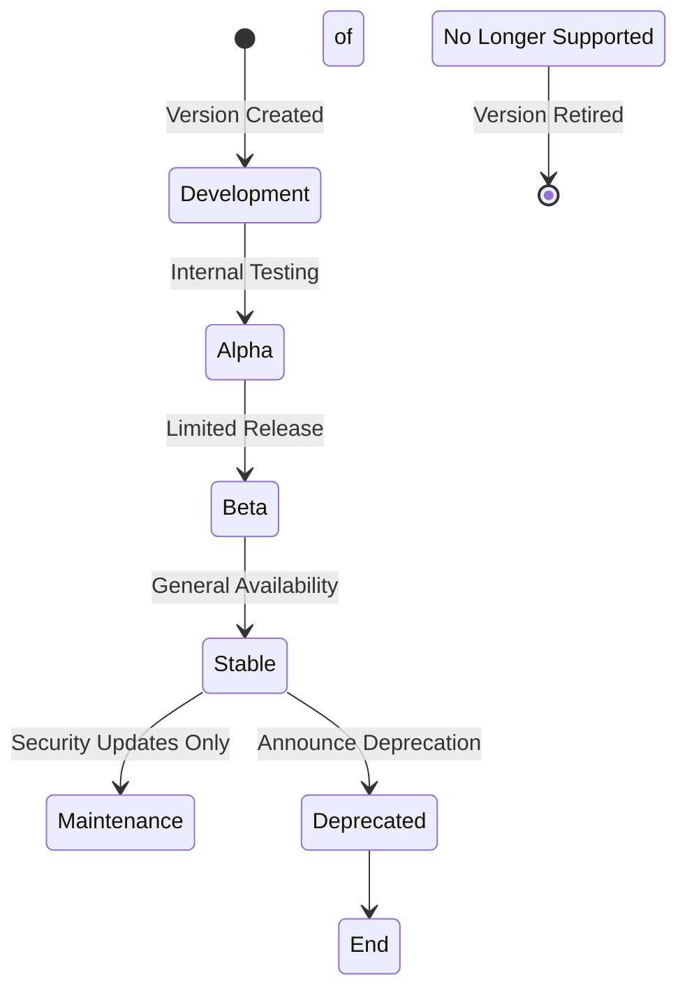
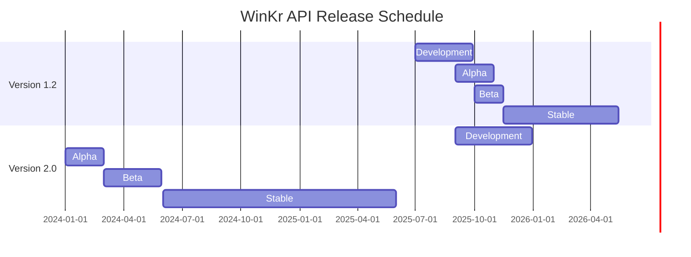
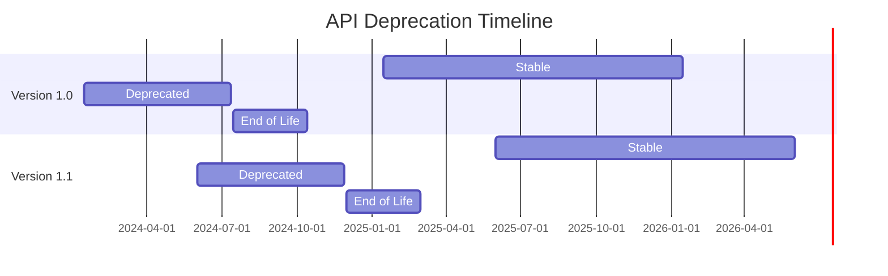

# WinKr API - Versioning Strategy

## Overview

The WinKr API follows a comprehensive versioning strategy designed to provide backward compatibility, enable smooth migrations, and support multiple client versions simultaneously. This guide covers our versioning approach, migration paths, and best practices.

## Table of Contents

1. [Versioning Philosophy](#versioning-philosophy)
2. [Version Format](#version-format)
3. [Supported Versions](#supported-versions)
4. [Version Lifecycle](#version-lifecycle)
5. [Migration Guide](#migration-guide)
6. [Backward Compatibility](#backward-compatibility)
7. [Version Selection](#version-selection)
8. [Deprecation Policy](#deprecation-policy)
9. [Code Examples](#code-examples)
10. [Best Practices](#best-practices)

## Versioning Philosophy

### Core Principles

1. **Semantic Versioning**: Follow [Semantic Versioning 2.0.0](https://semver.org/)
2. **Backward Compatibility**: Maintain compatibility within major versions
3. **Gradual Evolution**: Introduce changes incrementally
4. **Clear Communication**: Provide advance notice for breaking changes
5. **Long Support Cycles**: Support older versions for extended periods

### Versioning Strategy

| Change Type | Version Impact | Example |
|-------------|----------------|---------|
| **Bug Fixes** | Patch version (X.Y.Z) | 1.2.3 → 1.2.4 |
| **New Features** | Minor version (X.Y.Z) | 1.2.3 → 1.3.0 |
| **Breaking Changes** | Major version (X.Y.Z) | 1.2.3 → 2.0.0 |
| **API Changes** | Major version (X.Y.Z) | 1.2.3 → 2.0.0 |

### Compatibility Matrix

| From/To | 1.0.x | 1.1.x | 1.2.x | 2.0.x |
|----------|--------|--------|--------|--------|
| **1.0.x** | ✅ | ⚠️ | ❌ | ❌ |
| **1.1.x** | ✅ | ✅ | ⚠️ | ❌ |
| **1.2.x** | ✅ | ✅ | ✅ | ⚠️ |
| **2.0.x** | ❌ | ❌ | ❌ | ✅ |

Legend: ✅ Compatible, ⚠️ Partial Compatible, ❌ Incompatible

## Version Format

### URL Structure

```
https://api.winkr.com/v{major}/endpoint
```

Examples:
- `https://api.winkr.com/v1/auth/login` (Version 1.x)
- `https://api.winkr.com/v2/auth/login` (Version 2.x)

### Header Specification

```http
Accept: application/vnd.winkr.v1+json
Accept: application/vnd.winkr.v2+json
X-API-Version: 1.2.3
X-Client-Version: 1.2.3
```

### Response Versioning

```http
API-Version: 1.2.3
Content-Type: application/vnd.winkr.v1+json
Vary: Accept, X-API-Version
```

## Supported Versions

### Current Versions

| Version | Status | Release Date | End of Life | API Base URL |
|---------|--------|--------------|--------------|---------------|
| **1.0.x** | Stable | 2025-01-15 | 2024-12-31 | `https://api.winkr.com/v1` |
| **1.1.x** | Stable | 2025-06-01 | 2025-06-30 | `https://api.winkr.com/v1` |
| **1.2.x** | Stable | 2025-10-15 | 2025-12-31 | `https://api.winkr.com/v1` |
| **2.0.x** | Beta | 2024-01-01 | 2026-12-31 | `https://api.winkr.com/v2` |

### Version Features

#### Version 1.0.x
- Basic authentication
- Profile management
- Photo upload
- Simple discovery
- Basic messaging

#### Version 1.1.x
- Enhanced authentication with MFA
- Advanced profile features
- Photo moderation
- Improved discovery algorithm
- Message read receipts

#### Version 1.2.x
- Ephemeral photos
- Advanced filtering
- Real-time notifications
- Payment integration
- Analytics endpoints

#### Version 2.0.x
- Redesigned authentication flow
- GraphQL support
- Advanced matching algorithms
- Real-time collaboration features
- Enhanced security

## Version Lifecycle

### Version States



### Timeline

| Phase | Duration | Description |
|--------|----------|-------------|
| **Development** | 2-4 months | Active development and internal testing |
| **Alpha** | 1-2 months | Limited internal testing with partners |
| **Beta** | 2-3 months | Public beta testing with early adopters |
| **Stable** | 12-18 months | General availability and full support |
| **Maintenance** | 6-12 months | Security updates and critical fixes only |
| **Deprecated** | 6-12 months | No new features, security fixes only |
| **End of Life** | After deprecation | No support, API may be disabled |

### Release Schedule



## Migration Guide

### Migration Types

#### Automatic Migration

For non-breaking changes within the same major version:

```javascript
// Client that automatically handles version updates
class AutoMigratingClient {
  constructor(apiKey, version = '1.0.0') {
    this.apiKey = apiKey;
    this.version = version;
    this.baseURL = 'https://api.winkr.com/v1';
  }

  async request(endpoint, options = {}) {
    const response = await fetch(`${this.baseURL}${endpoint}`, {
      headers: {
        'Authorization': `Bearer ${this.apiKey}`,
        'Accept': `application/vnd.winkr.v1+json`,
        'X-Client-Version': this.version,
        ...options.headers
      },
      ...options
    });

    // Check for version upgrade recommendations
    const serverVersion = response.headers.get('api-version');
    const latestVersion = response.headers.get('x-latest-version');
    
    if (this.shouldUpgrade(serverVersion, latestVersion)) {
      console.log('New version available:', latestVersion);
      this.promptUpgrade(latestVersion);
    }

    return response;
  }

  shouldUpgrade(current, latest) {
    const [currentMajor] = current.split('.').map(Number);
    const [latestMajor] = latest.split('.').map(Number);
    return latestMajor > currentMajor;
  }

  promptUpgrade(newVersion) {
    // Show upgrade notification to user
    if (confirm(`New API version ${newVersion} available. Upgrade now?`)) {
      window.location.reload(); // Simple reload for web apps
    }
  }
}
```

#### Manual Migration

For breaking changes requiring code updates:

```javascript
// Migration helper for major version changes
class VersionMigrator {
  static migrations = {
    '1.0_to_2.0': {
      description: 'Migrate from v1.0 to v2.0',
      upgrader: this.migrateV1ToV2
    },
    '1.1_to_2.0': {
      description: 'Migrate from v1.1 to v2.0',
      upgrader: this.migrateV1ToV2
    },
    '1.2_to_2.0': {
      description: 'Migrate from v1.2 to v2.0',
      upgrader: this.migrateV1ToV2
    }
  };

  static async migrate(fromVersion, toVersion) {
    const migrationKey = `${fromVersion}_to_${toVersion}`;
    const migration = this.migrations[migrationKey];
    
    if (!migration) {
      throw new Error(`No migration path from ${fromVersion} to ${toVersion}`);
    }

    console.log(`Starting migration: ${migration.description}`);
    
    try {
      const result = await migration.upgrader();
      console.log('Migration completed successfully');
      return result;
    } catch (error) {
      console.error('Migration failed:', error);
      throw error;
    }
  }

  static async migrateV1ToV2() {
    // Step 1: Migrate authentication
    const newAuth = await this.migrateAuthentication();
    
    // Step 2: Migrate data structures
    const newProfile = await this.migrateProfileData();
    
    // Step 3: Update API endpoints
    const newClient = this.createV2Client();
    
    // Step 4: Test migration
    await this.validateMigration(newClient);
    
    return {
      auth: newAuth,
      profile: newProfile,
      client: newClient
    };
  }

  static async migrateAuthentication() {
    // Migrate from v1 auth to v2 auth
    const oldToken = localStorage.getItem('winkr_token');
    
    if (!oldToken) {
      throw new Error('No v1 authentication token found');
    }

    // Exchange v1 token for v2 token
    const response = await fetch('https://api.winkr.com/v2/auth/migrate', {
      method: 'POST',
      headers: {
        'Authorization': `Bearer ${oldToken}`,
        'Content-Type': 'application/json'
      },
      body: JSON.stringify({
        from_version: '1.x',
        to_version: '2.0'
      })
    });

    if (!response.ok) {
      throw new Error('Token migration failed');
    }

    const data = await response.json();
    
    // Store new v2 token
    localStorage.setItem('winkr_v2_token', data.token);
    
    return data;
  }

  static async migrateProfileData() {
    // Migrate profile data structure
    const oldProfile = await this.getV1Profile();
    
    // Transform to v2 format
    const newProfile = {
      id: oldProfile.id,
      basic_info: {
        name: oldProfile.first_name + ' ' + oldProfile.last_name,
        age: oldProfile.age,
        location: oldProfile.location
      },
      preferences: {
        discovery: oldProfile.preferences,
        privacy: this.migratePrivacySettings(oldProfile)
      },
      photos: oldProfile.photos.map(photo => ({
        id: photo.id,
        url: photo.url,
        metadata: {
          uploaded_at: photo.created_at,
          primary: photo.is_primary
        }
      }))
    };

    return newProfile;
  }

  static createV2Client() {
    return new WinKrAPIClientV2({
      baseURL: 'https://api.winkr.com/v2',
      version: '2.0.0'
    });
  }

  static async validateMigration(client) {
    // Test critical functionality
    try {
      await client.getProfile();
      await client.getDiscoveryUsers();
      console.log('Migration validation successful');
    } catch (error) {
      throw new Error(`Migration validation failed: ${error.message}`);
    }
  }
}
```

### Migration Checklist

#### Pre-Migration

- [ ] Backup current data
- [ ] Review breaking changes documentation
- [ ] Test migration in development environment
- [ ] Update dependencies and SDKs
- [ ] Plan rollback strategy

#### During Migration

- [ ] Monitor API responses for errors
- [ ] Log migration progress
- [ ] Validate data integrity
- [ ] Test critical user flows
- [ ] Monitor performance impact

#### Post-Migration

- [ ] Verify all functionality works
- [ ] Update monitoring and alerting
- [ ] Communicate changes to users
- [ ] Update documentation
- [ ] Monitor for issues

## Backward Compatibility

### Compatibility Guarantees

#### Within Major Versions

- **Additive Changes**: New fields are optional
- **Non-Breaking**: Existing functionality preserved
- **Default Values**: New fields have sensible defaults
- **Graceful Degradation**: Handle missing optional fields

#### Breaking Changes Protocol

1. **Advance Notice**: 6 months minimum before breaking changes
2. **Migration Path**: Clear upgrade instructions provided
3. **Parallel Support**: Old version supported for 12 months
4. **Feature Flags**: New features behind flags when possible

### Compatibility Examples

#### Additive Changes (Compatible)

```json
// Version 1.0
{
  "id": "user123",
  "name": "John Doe",
  "email": "john@example.com"
}

// Version 1.1 (additive change)
{
  "id": "user123",
  "name": "John Doe",
  "email": "john@example.com",
  "phone": "+1234567890", // New optional field
  "avatar_url": "https://example.com/avatar.jpg" // New optional field
}
```

#### Breaking Changes (Incompatible)

```json
// Version 1.x
{
  "user": {
    "id": "user123",
    "name": "John Doe",
    "preferences": {
      "age_range": { "min": 25, "max": 35 }
    }
  }
}

// Version 2.x (breaking change)
{
  "user": {
    "id": "user123",
    "profile": { // Restructured
      "basic_info": {
        "name": "John Doe"
      },
      "preferences": {
        "discovery": {
          "age_range": { "min": 25, "max": 35 }
        }
      }
    }
  }
}
```

## Version Selection

### Client Version Negotiation

#### HTTP Accept Header

```javascript
// Preferred version order
const preferredVersions = [
  'application/vnd.winkr.v2+json',
  'application/vnd.winkr.v1+json',
  'application/json'
];

const negotiateVersion = (acceptHeader) => {
  const acceptedTypes = acceptHeader.split(',').map(t => t.trim());
  
  for (const preferred of preferredVersions) {
    if (acceptedTypes.includes(preferred)) {
      return preferred;
    }
  }
  
  return 'application/json'; // Fallback
};

// Usage
const acceptHeader = 'application/vnd.winkr.v1+json, application/json';
const version = negotiateVersion(acceptHeader);
```

#### API Version Header

```javascript
// Explicit version specification
const apiClient = axios.create({
  baseURL: 'https://api.winkr.com/v1',
  headers: {
    'X-API-Version': '1.2.3',
    'X-Client-Version': '1.2.3',
    'X-Preferred-Version': '2.0' // Request specific version if available
  }
});
```

#### URL-Based Versioning

```javascript
class VersionedAPIClient {
  constructor(version = '1') {
    this.version = version;
    this.baseURL = `https://api.winkr.com/v${version}`;
  }

  async request(endpoint, options = {}) {
    const url = `${this.baseURL}${endpoint}`;
    
    // Add version to request for debugging
    options.headers = {
      ...options.headers,
      'X-API-Version': this.version
    };
    
    return fetch(url, options);
  }

  // Method to upgrade version
  upgrade(newVersion) {
    this.version = newVersion;
    this.baseURL = `https://api.winkr.com/v${newVersion}`;
    
    // Clear any cached data that might be version-specific
    this.clearVersionCache();
  }

  clearVersionCache() {
    // Clear version-specific cached data
    Object.keys(localStorage).forEach(key => {
      if (key.startsWith(`winkr_v${this.version}_`)) {
        localStorage.removeItem(key);
      }
    });
  }
}
```

### Version Detection

```javascript
// Detect server version and capabilities
class VersionDetector {
  static async detectVersion() {
    try {
      const response = await fetch('https://api.winkr.com/v1/version', {
        headers: {
          'Accept': 'application/json'
        }
      });

      const versionInfo = await response.json();
      
      return {
        version: versionInfo.version,
        capabilities: versionInfo.capabilities,
        deprecationWarnings: versionInfo.deprecation_warnings,
        migrationRequired: versionInfo.migration_required
      };
    } catch (error) {
      console.error('Failed to detect version:', error);
      return null;
    }
  }

  static checkCompatibility(clientVersion, serverVersion) {
    const [clientMajor, clientMinor, clientPatch] = clientVersion.split('.').map(Number);
    const [serverMajor, serverMinor, serverPatch] = serverVersion.split('.').map(Number);

    if (serverMajor > clientMajor) {
      return {
        compatible: false,
        reason: 'Server requires newer major version',
        action: 'upgrade_required'
      };
    }

    if (serverMajor === clientMajor && serverMinor > clientMinor) {
      return {
        compatible: true,
        warning: 'New features available',
        action: 'upgrade_recommended'
      };
    }

    return {
      compatible: true,
      action: 'current'
    };
  }
}
```

## Deprecation Policy

### Deprecation Timeline



### Deprecation Process

1. **Announcement** (6 months before deprecation)
   - Email notifications to all registered developers
   - In-app notifications for active applications
   - Documentation updates with migration guides
   - Blog posts and community announcements

2. **Warning Period** (3 months before deprecation)
   - Response headers with deprecation warnings
   - Console warnings in development tools
   - Dashboard notifications in admin panel

3. **Deprecation** (Date specified)
   - Version marked as deprecated
   - No new features or bug fixes
   - Security updates only
   - Reduced support priority

4. **End of Life** (6 months after deprecation)
   - Version no longer supported
   - API endpoints may return 410 Gone
   - Documentation moved to archive

### Deprecation Headers

```http
X-API-Deprecated: true
X-API-Deprecation-Date: 2024-01-15
X-API-Sunset-Date: 2024-07-15
X-API-Migration-Guide: https://docs.winkr.com/api/migration/v1-to-v2
X-API-Recommended-Version: 2.0.0
```

### Handling Deprecation

```javascript
class DeprecationHandler {
  static handleResponse(response) {
    const deprecationHeaders = {
      deprecated: response.headers.get('x-api-deprecated'),
      deprecationDate: response.headers.get('x-api-deprecation-date'),
      sunsetDate: response.headers.get('x-api-sunset-date'),
      migrationGuide: response.headers.get('x-api-migration-guide'),
      recommendedVersion: response.headers.get('x-api-recommended-version')
    };

    if (deprecationHeaders.deprecated === 'true') {
      this.showDeprecationWarning(deprecationHeaders);
    }

    return response;
  }

  static showDeprecationWarning(headers) {
    const message = `
      API Version Deprecated!
      
      This API version will be deprecated on ${headers.deprecationDate}.
      Support ends on ${headers.sunsetDate}.
      
      Please migrate to version ${headers.recommendedVersion}.
      Migration guide: ${headers.migrationGuide}
    `;

    console.warn(message);
    
    // Show user-friendly notification
    if (typeof window !== 'undefined') {
      this.showNotification(message, 'warning');
    }
  }

  static showNotification(message, type = 'info') {
    // Implementation depends on your UI framework
    // Example for web:
    const notification = document.createElement('div');
    notification.className = `api-notification api-notification-${type}`;
    notification.innerHTML = `
      <div class="notification-content">
        <p>${message}</p>
        <button onclick="this.parentElement.remove()">Dismiss</button>
      </div>
    `;
    
    document.body.appendChild(notification);
    
    // Auto-remove after 10 seconds
    setTimeout(() => {
      if (notification.parentElement) {
        notification.remove();
      }
    }, 10000);
  }
}
```

## Code Examples

### Version-Aware API Client

```javascript
class VersionAwareAPIClient {
  constructor(config = {}) {
    this.config = {
      version: '1.2.3',
      baseURL: 'https://api.winkr.com/v1',
      autoUpgrade: true,
      migrationPath: null,
      ...config
    };
    
    this.versionDetector = new VersionDetector();
    this.deprecationHandler = new DeprecationHandler();
    this.migrator = new VersionMigrator();
    
    this.initialize();
  }

  async initialize() {
    // Detect server version
    const serverInfo = await this.versionDetector.detectVersion();
    
    if (!serverInfo) {
      console.warn('Could not detect server version');
      return;
    }

    // Check compatibility
    const compatibility = this.versionDetector.checkCompatibility(
      this.config.version,
      serverInfo.version
    );

    // Handle different compatibility scenarios
    switch (compatibility.action) {
      case 'upgrade_required':
        await this.handleRequiredUpgrade(serverInfo);
        break;
        
      case 'upgrade_recommended':
        this.showUpgradeRecommendation(serverInfo);
        break;
        
      case 'current':
        console.log('Running latest compatible version');
        break;
    }

    // Check for deprecation warnings
    if (serverInfo.deprecationWarnings?.length > 0) {
      this.handleDeprecationWarnings(serverInfo.deprecationWarnings);
    }
  }

  async handleRequiredUpgrade(serverInfo) {
    if (this.config.autoUpgrade) {
      try {
        console.log('Auto-upgrading to latest version...');
        const migrationResult = await this.migrator.migrate(
          this.config.version,
          serverInfo.version
        );
        
        // Update client configuration
        this.config.version = serverInfo.version;
        this.config.baseURL = `https://api.winkr.com/v${serverInfo.version.split('.')[0]}`;
        
        console.log('Upgrade completed successfully');
        return migrationResult;
      } catch (error) {
        console.error('Auto-upgrade failed:', error);
        this.showManualUpgradeInstructions(serverInfo);
      }
    } else {
      this.showManualUpgradeInstructions(serverInfo);
    }
  }

  showManualUpgradeInstructions(serverInfo) {
    const instructions = `
      Manual Upgrade Required
      
      Current version: ${this.config.version}
      Latest version: ${serverInfo.version}
      
      Please update your client to continue using the API.
      Migration guide: ${serverInfo.migrationGuide}
    `;
    
    alert(instructions);
  }

  showUpgradeRecommendation(serverInfo) {
    const recommendation = `
      New Version Available
      
      Your version (${this.config.version}) is compatible but outdated.
      Latest version: ${serverInfo.version}
      
      Consider upgrading for new features and improvements.
    `;
    
    console.info(recommendation);
  }

  handleDeprecationWarnings(warnings) {
    warnings.forEach(warning => {
      console.warn(`Deprecation Warning: ${warning.message}`);
      
      if (warning.action_required) {
        this.showDeprecationActionRequired(warning);
      }
    });
  }

  showDeprecationActionRequired(warning) {
    const actionMessage = `
      Action Required: ${warning.title}
      
      ${warning.description}
      
      Deadline: ${warning.deadline}
      Action: ${warning.required_action}
    `;
    
    alert(actionMessage);
  }

  async request(method, endpoint, data = null, options = {}) {
    const url = `${this.config.baseURL}${endpoint}`;
    
    const response = await fetch(url, {
      method,
      headers: {
        'Authorization': `Bearer ${this.config.apiKey}`,
        'Accept': `application/vnd.winkr.v${this.config.version.split('.')[0]}+json`,
        'X-Client-Version': this.config.version,
        'X-Preferred-Version': '2.0',
        ...options.headers
      },
      body: data ? JSON.stringify(data) : null,
      ...options
    });

    // Handle deprecation headers
    this.deprecationHandler.handleResponse(response);

    return response;
  }
}
```

### Version Testing Framework

```javascript
class VersionCompatibilityTester {
  constructor() {
    this.testSuites = {
      'v1_compatibility': {
        description: 'Test v1 client against v1 server',
        clientVersion: '1.2.3',
        serverVersion: '1.2.3'
      },
      'v1_to_v2_migration': {
        description: 'Test v1 client migration to v2 server',
        clientVersion: '1.2.3',
        serverVersion: '2.0.0',
        migrationRequired: true
      }
    };
  }

  async runTestSuite(suiteName) {
    const suite = this.testSuites[suiteName];
    console.log(`Running test suite: ${suite.description}`);
    
    const results = {
      suite: suiteName,
      timestamp: new Date().toISOString(),
      tests: []
    };

    // Test authentication
    results.tests.push(await this.testAuthentication(suite));
    
    // Test basic API calls
    results.tests.push(await this.testBasicAPI(suite));
    
    // Test error handling
    results.tests.push(await this.testErrorHandling(suite)));
    
    // Test version-specific features
    results.tests.push(await this.testVersionFeatures(suite)));

    // Generate report
    this.generateReport(results);
    
    return results;
  }

  async testAuthentication(suite) {
    const test = {
      name: 'Authentication',
      passed: false,
      details: null
    };

    try {
      const client = new VersionAwareAPIClient({
        version: suite.clientVersion,
        baseURL: `https://api.winkr.com/v${suite.serverVersion.split('.')[0]}`
      });

      // Test login
      const loginResult = await client.request('POST', '/auth/login', {
        email: 'test@example.com',
        password: 'testpassword'
      });

      test.passed = loginResult.ok;
      test.details = `Status: ${loginResult.status}`;
    } catch (error) {
      test.details = `Error: ${error.message}`;
    }

    return test;
  }

  async testBasicAPI(suite) {
    const test = {
      name: 'Basic API Calls',
      passed: false,
      details: null
    };

    try {
      const client = new VersionAwareAPIClient({
        version: suite.clientVersion,
        baseURL: `https://api.winkr.com/v${suite.serverVersion.split('.')[0]}`
      });

      // Test profile endpoint
      const profileResult = await client.request('GET', '/me/profile');
      
      // Test discovery endpoint
      const discoveryResult = await client.request('GET', '/discovery/users');
      
      test.passed = profileResult.ok && discoveryResult.ok;
      test.details = `Profile: ${profileResult.status}, Discovery: ${discoveryResult.status}`;
    } catch (error) {
      test.details = `Error: ${error.message}`;
    }

    return test;
  }

  generateReport(results) {
    const report = {
      summary: {
        total: results.tests.length,
        passed: results.tests.filter(t => t.passed).length,
        failed: results.tests.filter(t => !t.passed).length
      },
      details: results.tests,
      recommendations: this.generateRecommendations(results)
    };

    console.log('Test Report:', JSON.stringify(report, null, 2));
    
    // Save report for analysis
    this.saveReport(report);
  }

  generateRecommendations(results) {
    const recommendations = [];
    
    const failedTests = results.tests.filter(t => !t.passed);
    
    failedTests.forEach(test => {
      if (test.name === 'Authentication') {
        recommendations.push({
          type: 'authentication',
          priority: 'high',
          message: 'Authentication flow needs update for new version',
          action: 'Review authentication migration guide'
        });
      }
    });

    return recommendations;
  }

  saveReport(report) {
    const filename = `compatibility-test-${Date.now()}.json`;
    const blob = new Blob([JSON.stringify(report, null, 2)], {
      type: 'application/json'
    });
    
    const url = URL.createObjectURL(blob);
    const a = document.createElement('a');
    a.href = url;
    a.download = filename;
    a.click();
    
    URL.revokeObjectURL(url);
  }
}
```

## Best Practices

### For API Consumers

1. **Version Pinning**: Pin to specific API versions for stability
2. **Graceful Upgrades**: Implement non-disruptive upgrade mechanisms
3. **Testing**: Test new versions in staging before production
4. **Monitoring**: Monitor deprecation warnings and upgrade notifications
5. **Fallbacks**: Implement fallback behavior for version mismatches

### For API Providers

1. **Clear Communication**: Provide advance notice of breaking changes
2. **Migration Support**: Offer tools and guides for version migration
3. **Parallel Support**: Support multiple versions simultaneously
4. **Documentation**: Maintain version-specific documentation
5. **Testing**: Provide comprehensive testing tools and environments

### Development Practices

1. **Feature Flags**: Use feature flags for gradual rollouts
2. **Backward Compatibility**: Design changes to maintain compatibility
3. **Version Testing**: Automated testing across all supported versions
4. **Documentation**: Keep documentation synchronized with code
5. **Monitoring**: Track version usage and compatibility issues

---

For additional versioning support or questions, contact our development team at api-support@winkr.com.